Hongyu LIU  
InGen Dynamics - ML & NN Analyst Intern, August 2026

---

**Scope:** six model families over three evaluation panels, anchored on Aido Rover sensor data, with secondary tasks on Fari, Senpai and Aido Humanoid, and the full PIC 2.0 model-class map.  
**Protocol:** Rover classification uses the canonical block split with seven fold rotations; Fari and Senpai use 70/15/15 stratified splits; trajectory regression uses five training seeds; reinforcement learning uses five training seeds evaluated on ten fixed world seeds.  
**Deployment gates:** Aido Rover ≤100 ms streaming, with a ≤10 ms breach-detection tier · Aido Humanoid ≤50 ms · Fari ≤35 ms · Senpai ≤100 ms.  
**Per-model artefacts:** this report reproduces the confusion matrices, per-class rates and training curves that carry a decision. The complete per-model set, including every model's confusion matrix, per-class precision and recall table, learning curves and per-fold columns, lives in the eight weekly reports and the model ledger that accompany it.  
**Measurement convention:** all latencies are single-sample figures from `timeit` at batch size 1, measured on the CPU of the development machine, a 13th Gen Intel Core i9-13900H under Linux, with the full deployed inference path timed including any scaler and projection step. Per-family chapters quote the measurement taken when that family was trained, and Ch. 10 quotes the Week-7 refit that re-measured every model in one session. The two sessions disagree by up to a factor of three on the sub-millisecond models, which is the spread of a microbenchmark at that scale rather than a difference between models. No gate verdict in this report turns on that spread, and the one case where the margin is small enough to matter is stated explicitly in Ch. 10.

## 1. Executive Summary

Eight weeks of work produced six model families on a shared synthetic Aido Rover sensor stream, three secondary task datasets covering Fari, Senpai and the Aido Humanoid, a Gymnasium patrol environment tied to that same stream, and a running ledger of accuracy against inference latency for every trained model. Three findings carry the programme.

**Representation moved the result further than architecture did.** Two engineered cross-channel features, the dispersion of torque across the four wheels and the ratio of mean wheel torque to achieved displacement, raise Rover anomaly F1 from 0.5528 to 0.8225 on the same protocol. That gap of 0.27 is about five times the ±0.05 fold-to-fold spread that the steadiest models in the panel carry, and twice the 0.125 that separates the best of the six architectures later trained on the enriched matrix from the worst. The fault mechanisms are defined by one wheel behaving differently from the others, so a per-channel view cannot express them however deep the model is. Chapter 9 closes the loop from the attribution side: the same two features carry the top of the ranking for the forest, for the multilayer perceptron (MLP) and, in its observation-space form, for the reinforcement-learning alert pathway.

**Apparent architecture wins dissolve under capacity matching and paired testing.** Ranked on raw fold means, the Transformer encoder leads the Rover panel at F1 0.8289 ± 0.0688. Against the MLP that lead is not significant over the seven paired fold rotations (p = 0.34), and a parameter-matched Transformer sized to the recurrent models falls to 0.7604 and becomes indistinguishable from the GRU (p = 0.76). The defensible reading is one top equivalence class whose membership is explained by parameter count. Selection inside that class then falls to latency, deployment footprint and calibration, all of which favour the MLP.

**On-policy reinforcement learning runs only from a behaviour-cloning warm start, and the choice of selection metric decides the winner.** Trained from scratch on the patrol environment, PPO returns 156 ± 17 and the group-relative variant 214 ± 33, both far below the 3,931 scripted rule policy that any deployment would already have. The same code initialised from a behaviour-cloning policy returns 5,182 to 6,421. Within the warm-started group, PPO leads on the training layout by a margin that does not reach significance against the group-relative variant (p = 0.084), while on all five held-out layouts the group-relative variant wins by 1,286 to 2,300 return. A leaderboard built on the training layout would select the other policy.

**Supervised deployment recommendation: the MLP for Aido Rover anomaly detection.** It holds F1 0.7936 ± 0.0472 over seven fold rotations, the best worst-fold score of any model in the panel at 0.736, the lowest fold variance, and a single-sample latency between 0.04 ms and 0.14 ms depending on measurement run. It also meets the PIC 2.0 STUM calibration target with no calibration layer, at an expected calibration error of 0.025 against a target of 0.031. For the separate ≤10 ms breach-detection tier the full forest consumes most of the budget, and shrinking it to 50 trees at depth 6 cuts the cost to 2.45 ms for 0.021 F1, inside the full model's own fold spread. That shrink is a fallback for a deployment that keeps a tree model for other reasons, since the MLP holds both axes even against the 2.45 ms forest.

**Reinforcement-learning recommendation: adopt the behaviour-cloning warm start as a standing requirement, and adopt none of the fine-tuned policies as they stand.** No single policy earns the recommendation, because the three candidates do not agree on a winner and each ordering belongs to the criterion that produced it. Ranked by return on the training layout it is PPO at 6,421 ± 659. Ranked by held-out-layout return it is the group-relative variant, which wins all five. Ranked by retained navigation it is REINFORCE with a value baseline at 0.82 rerouting. What the three do agree on is worth more than the ranking. Every on-policy run from a random initialisation lands below the rule policy any deployment already has, and the same code from a behaviour-cloning checkpoint clears it by 1,251 to 2,490, so the warm start is a precondition for this method class on this platform.

They also agree on a failure. Fine-tuning trades navigation for alerting in every case: the prior's 0.84 rerouting at 55 false alerts per 1,000 normal steps becomes 0.82 at 104, 0.65 at 89, and PPO's 0.34 at 241. PPO trades the most and gains the most return, though the ordering does not track return throughout, since the group-relative variant gives up more navigation than REINFORCE with a baseline while returning less. At the platform's 10 Hz that last rate is a false alert roughly every 0.4 s of normal patrol, against one every 27 s for the scripted rule policy, so no learned policy here is deployable on alarm load whatever its return. The reward prices a caught fault at +5.0 against a false alert at −1.5, which makes alarm-spam the rational response to it, so the blocking item is the reward's alert pricing and not the choice of algorithm.

The honest summary of the flat, sensor-only policies is that the alert pathway is learnable and route decisions are not, at this interaction budget and decision granularity. Changing the granularity changes that conclusion: a node-level hierarchy reaches rerouting 0.82 and a return of 12,129 ± 121, above the privileged ceiling, though its option controllers read the ground-truth label and it is therefore not yet a deployable candidate.

Every model on every task clears its platform latency gate, the three forests by a factor of 8 to 12 and every other model by two orders of magnitude or more. Latency prices model choice on these tasks rather than constraining it, with the single exception of the Rover's ≤10 ms breach tier discussed in Ch. 10.

## 2. Physical-AI Landscape and the PIC 2.0 Model Classes

InGen's portfolio spans five deployed platforms and one platform-independent model stack. Read from a machine-learning practitioner's position, the platforms differ less in algorithm family than in the shape of their input and the size of their latency budget.

| Platform | Documented ML task | Sensing modality | Documented latency constraint |
| --- | --- | --- | --- |
| Aido Rover | Multi-class classification and anomaly detection across 25 detection types | LiDAR, 4K PTZ, RGB-D and multispectral cameras, thermal, GPS/RTK, IMU, acoustic array, gas, weather station | 10 ms perimeter breach, 50 ms person, 100 ms firearms |
| Sentinel Prime AI | Anomaly detection and multi-class classification over 27 threat and behaviour capabilities | 4K RGB, thermal, LiDAR, acoustic, FMCW radar | 200 ms end to end |
| Fari | Anomaly detection for falls, vital-sign deterioration and atypical behaviour, with emotional-state and alert-severity classification | RGB-D, contact-free heart rate, IR temperature, microphone array, air quality, indoor positioning, wearable and tactile sensing | 35 ms fall detection, 200 ms other on-device safety functions |
| Aido Humanoid | Vision-language-action sequence prediction with policy-gradient fine-tuning, and whole-body predictive control for locomotion | RGB-D and fisheye cameras, LiDAR, tactile and wrist force-torque sensors, IMU | 10 ms whole-body control, 150 ms grasp planning |
| Senpai | Reinforcement learning for an adaptive teaching policy with curriculum sequencing and ability estimation, plus affect classification as an auxiliary input | RGB and IR eye-gaze cameras, ambient light, proximity, noise, microphone array, environmental sensors, touchscreen | 100 ms end to end for conversational interaction |

No row above describes what this report evaluates. Each platform contributes a narrower synthetic proxy sized to an eight-week programme, and the gate each proxy is scored against is named with it. The Rover proxy is a 9-channel sensor stream at 10 Hz with a binary fault label, scored against the 100 ms streaming budget and, in Ch. 10, against the 10 ms breach tier. The Fari proxy is five tabular interaction features with a binary label, scored against the platform's 35 ms fall-detection budget for want of one of its own. The Senpai proxy is five tabular session features with a three-class label, scored against the 100 ms conversational budget. The Humanoid proxy is a waypoint regressor over a 10-step state history, scored against the 50 ms motion-planning budget the programme adopted for a predictor inside a replanning loop, which is neither of the two tiers the platform documents. Sentinel Prime AI carries no experiment at all, and its sensing stack and threat taxonomy are wide enough that the Rover results are not transferred to it.

The six PIC 2.0 model classes map onto the programme's experimental work with differing directness. GRPO corresponds to the policy-gradient work of Ch. 8, and the group-relative baseline implemented there is a runnable instance of the class rather than an analogy. STUM is an uncertainty model that decomposes spatial and temporal uncertainty and gates actions through a three-tier threshold, so the programme's evidence for it is the calibration measurement of Ch. 10 on the score-producing models of Ch. 5 and Ch. 6, where the operative question is whether a probability can be trusted at a threshold and not whether the ranking separates the classes. SEOM embeds safety rules as differentiable penalty gradients that shape training instead of filtering at runtime, and the programme exercises that form twice, through the low-battery penalty of Ch. 8 and through the KL constraint the group-relative implementation carries. AMDC concerns multi-sensor drift and calibration, and connects to the cross-channel feature evidence of Ch. 3 and Ch. 9. HTD-IRL covers the inverse and hierarchical reinforcement learning of Ch. 8. CRL-MRS covers the two-agent cooperative patrol of the same chapter. Chapter 11 returns to all six with a readiness score and the experiment that would raise it.

## 3. Data Generation, Preprocessing and Feature Analysis

**One dynamics core serves both the offline and the online work.** The Rover sensor stream and the reinforcement-learning environments are generated by a single world-dynamics module, so results from Ch. 4 through Ch. 8 describe the same physics. The stream holds 15,000 timesteps at 10 Hz, which is 25.0 minutes of patrol, across nine sensor channels: GPS latitude and longitude, LiDAR distance, battery state of charge, four wheel torques and ambient temperature. Faults are a causal mechanical process inside the simulator rather than an injected label. A slip fault spikes one wheel's torque while the other three shed load and reduces achieved displacement. A stuck fault raises all four torques together and collapses displacement. Fault severity is drawn per event, so the observable deviation varies while the label does not, and the correlation between fault state and sensor signature is statistical, with shared confounders between fault state and signature. Calibrated at map seed 6, the stream carries 2,258 anomalous rows at 15.1 %, of which 1,369 are slip type and 889 stuck type, distributed over 72 fault events with a mean duration of 3.14 s and a range of 1.0 s to 7.8 s.

  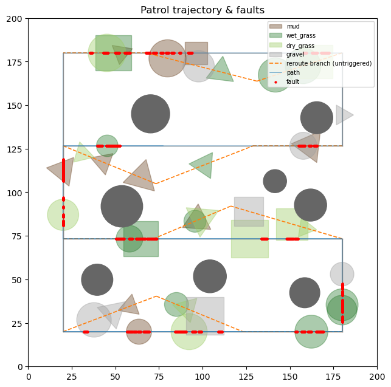

*Figure 1 — The patrol site at map seed 6, with the traversed path and every labelled fault step. The main coverage cycle is a boustrophedon loop of 960 m over eight edges, inset 20 m from the 200 m site boundary. Dashed branches are the per-sweep detours, untriggered here because blockages are disabled for the detection stream. Grey discs are the eight static obstacles, which the generator places clear of every route and detour edge, and the coloured patches are the four terrain types. Red marks are fault steps, and their appearance as short runs along the path rather than isolated points is the temporal clustering the split design has to respect.*

**Spectral features are computed only where the signal has high-frequency content.** Torque anomalies show as sustained high-frequency energy against a near-DC baseline during normal patrol, so five spectral descriptors are computed over a 50-step window at 10 Hz for each of the four torque channels and LiDAR distance: dominant frequency, spectral centroid, bandwidth, total power and peak-to-mean ratio. Battery state of charge and ambient temperature are slow drifts whose spectra carry nothing at this window length, and absolute GPS coordinates are replaced by per-step deltas so that position cannot stand in for terrain.

**The cross-channel features are the decisive part of the representation.** Two candidate feature matrices were evaluated under the identical protocol. The first holds 34 dimensions, nine raw channels and 25 spectral descriptors. The second adds six columns built from two physical quantities, the standard deviation of torque across the four wheels at the current step and the ratio of mean wheel torque to displacement magnitude, each taken instantaneously and as a 50-step rolling mean and maximum. The comparison is decisive at the scale of this problem.

| Feature matrix                                  | Test F1 at 0.50  | Test F1 at the tuned threshold | AUC-ROC          |
| ----------------------------------------------- | ---------------- | ------------------------------ | ---------------- |
| 34-D, raw channels and spectral descriptors     | 0.5528           | 0.4991                         | 0.8739           |
| 40-D, adding six cross-channel physical columns | **0.8225** | **0.8471**               | **0.9796** |

The mechanism explains the size of the gap. Slip is defined by one wheel diverging from the other three, and stuck by high effort against absent motion. Both are relations between channels, and neither has a signature in any single channel's amplitude or spectrum. The ablation was re-verified with a leakage-safe formulation, replacing a data-derived normaliser in the stall ratio with a fixed floor, and reproduced the effect at 0.5528 to 0.8389, so the gain is not an artefact of how the denominator was scaled. Ch. 6 shows the same structure at the level of a single window.

**Blocked splitting is required by the data's serial dependence.** Adjacent rows share up to 49 of the 50 steps in their spectral lookback window, and one fault event spans many rows, so a row-level split places near-duplicate rows from the same event on both sides of the partition and lets a model recognise a training event rather than generalise to a new one. The stream is instead segmented into 23 contiguous blocks, cut at the midpoints of long normal stretches so that all 72 fault events stay intact inside a block. Stratified group k-fold then assigns whole blocks to seven folds, holding each fold at a comparable anomaly rate. Validation and test fold roles were fixed from structural statistics computed before any model was trained, since stratification balances the anomaly rate without balancing event count or duration. The first 50 rows of every block are purged so that no lookback window straddles a block boundary. After purging, the canonical assignment holds 9,734 training, 2,215 validation and 1,901 test rows, a 70.3/16.0/13.7 split carrying about 16 % anomalies in each part. Every classification and sequence model in the programme reads this one assignment.

  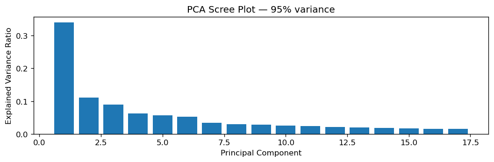
  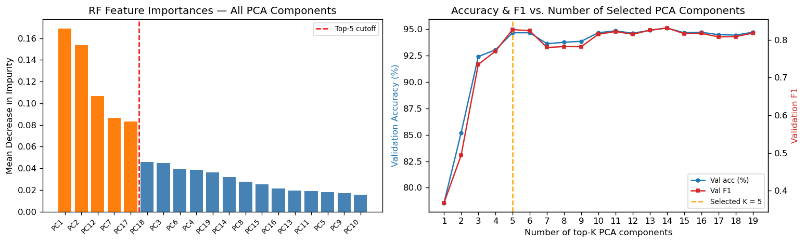

*Figure 2 — Variance structure and the minimal component subset. Left: explained-variance ratio of the 19 principal components retained at the 95 % threshold, fitted on the training split of the 40-dimensional matrix. Right: forest impurity importance over those components with the top-5 cutoff marked, and validation accuracy and anomaly F1 against the number of top-K components retained, with the F1-selected K = 5 marked. Accuracy uses the left axis, F1 the right.*

Principal component analysis on the 40-dimensional matrix retains 19 components at 95.14 % of variance. The first component, loaded on torque spectral centroid, carries the largest single share, which is consistent with the terrain-modulated torque driver shared by both fault mechanisms. The second is topped by the stall ratio followed by raw torque amplitude, giving a physically interpretable axis for the stuck mechanism that is distinct from the spectral-shape information the first captures, and inter-wheel dispersion enters the top loadings of the fifth. The right panel carries a result worth stating plainly: five components reach validation F1 0.8275 against 0.8120 for the full 19, so the compressed subset scores marginally above the full set. The curve is flat from K = 5 onward and the 0.0155 excess is well inside the ±0.048 fold spread this pipeline carries elsewhere, so the honest claim is that the last 14 components add nothing measurable.

**The comparison to the CNC wear-detection project sets the difficulty correctly.** That pipeline reached 97.81 % test accuracy from two raw features of one channel on a near-balanced task, using the same FFT, PCA and forest cascade. The Rover task needs five components and a purpose-built pair of engineered physical features to reach a comparable operating band. The pipelines are the same cascade, so the difference lies in the problems. The CNC task carried no window overlap and no multi-row event structure to leak across a split, and its classes were nearly balanced, while the Rover task is 16 % positive, event-grouped and split under a leakage-proof protocol that removes exactly the shortcut a row-level split would have offered.

## 4. Classical Baseline: Random Forest

**Objective and configuration.** The classical family is a random forest alone, a deliberate reduction from the five classical models the programme originally scoped, so every classical claim in this report is scoped to that one model. The deployed pipeline chains standardisation, principal component analysis retaining 19 components, and a forest with balanced class weights, all fitted inside one scikit-learn pipeline so that no preprocessing statistic is estimated on validation or test rows. Hyperparameters were selected by grid search over 50, 100 and 200 trees crossed with maximum depths of none, 5, 10 and 20, scored by anomaly F1 under five-fold stratified group cross-validation on the training blocks. The winning configuration is 200 trees at depth 10, with a cross-validated F1 of 0.7494. The base random seed is 42 throughout, with the world layout fixed at map seed 6.

**Imbalance is handled at four levels rather than by resampling.** The split keeps each fold near 16 % positive. The forest carries balanced class weights. Anomaly-class F1 is the selection and reporting metric, in place of accuracy, since a classifier that predicts normal everywhere already scores about 84 %. The decision threshold is tuned on validation alone and then applied once to test.

  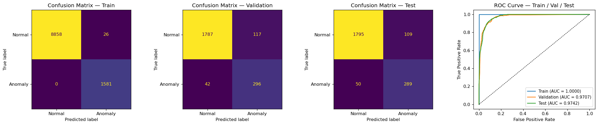

*Figure 3 — Forest confusion matrices and ROC curves at the default 0.50 threshold. Panels left to right: train, validation, test confusion counts with normal as the negative class, then the three ROC curves with their areas. Cell counts are absolute row counts. The test panel holds 1,597 normal and 304 anomalous rows.*

The three panels show the shape of the fit. Training recall is perfect, with zero missed anomalies against 270 false alarms, which is the balanced-weight forest memorising its training events. Recall falls from 1.0000 on train to 0.8588 on validation and 0.7105 on test, and the area under the ROC curve falls from 0.9997 to 0.9730 and 0.9668 across the same three splits. The gap between train and test is the variance profile that Ch. 9's learning curves confirm from the other direction.

| Split      | Rows  | Anomaly share | Precision | Recall | F1     | AUC-ROC |
| ---------- | ----- | ------------- | --------- | ------ | ------ | ------- |
| Train      | 9,734 | 16.4 %        | 0.8488    | 1.0000 | 0.9182 | 0.9997  |
| Validation | 2,215 | 16.0 %        | 0.7696    | 0.8588 | 0.8117 | 0.9730  |
| Test       | 1,901 | 16.0 %        | 0.7633    | 0.7105 | 0.7359 | 0.9668  |

All three rows use the validation-tuned threshold of 0.49, at which the test matrix reads 1,530 true negatives, 67 false alarms, 88 misses and 216 detections. Figure 3 is drawn one step higher, at the default 0.50, which is why its counts sit one row apart from the table and its test F1 is 0.7350 against the table's 0.7359. The threshold move is worth 0.001 F1 on this fold, a useful calibration of how little operating-point tuning buys when the fold happens to be well centred. Chapter 9 shows the same tuning swinging much further on other rotations.

**Fold rotation is the reproducibility mechanism.** Retraining the locked configuration across all seven fold rotations, with the scaler, class weights and decision threshold refitted per rotation, gives F1 0.7492 ± 0.0481 and AUC 0.9595 ± 0.0092. The canonical test fold sits at the 57th percentile of that distribution, so the headline number is representative of it. One bound on what this measures: the hyperparameters stay fixed at the canonical-fold grid-search winner across every rotation, so the spread is evaluation variance under one configuration and not the variance of the whole pipeline under nested cross-validation.

**Latency and feasibility.** The full pipeline, including standardisation and the PCA projection, runs a single-sample prediction in 7.9 ms on the ledger measurement and 9.0 ms on the Week-7 refit. Against the 100 ms streaming gate for a 10 Hz stream the verdict is a clear pass at 11 to 13 times the budget, which is the narrowest margin of any Rover model. Against the ≤10 ms breach-detection tier the same number consumes 79 % to 90 % of the budget, which is the one place in this programme where the latency axis genuinely binds, and Ch. 10 addresses it directly.

## 5. Neural Baselines: Multilayer Perceptron and 1D Convolutional Network

**Objective.** Two neural baselines extend the classical result on the same split and the same 40-dimensional representation, and become the reference the sequence models of Ch. 6 and the policy networks of Ch. 8 are measured against.

**The MLP.** A three-layer network of widths 40, 64, 32 and 2 output logits, with ReLU activations, dropout 0.3 and stochastic gradient descent with momentum 0.9, trained under class-weighted cross-entropy with early stopping at patience 10. Activation, dropout rate and optimiser were each selected by a three-seed ablation on mean validation loss, and the winning margins were narrow enough in every case that each choice is a near-tie. On the canonical fold at a validation-tuned threshold of 0.76 the model reaches precision 0.9082, recall 0.6184, F1 0.7358 and AUC 0.9677. Across the seven fold rotations it holds F1 0.7936 ± 0.0472 and AUC 0.9786 ± 0.0112. That is the lowest fold variance and the best worst-fold score in the Rover panel, and the second-highest mean behind the Transformer of Ch. 6.

  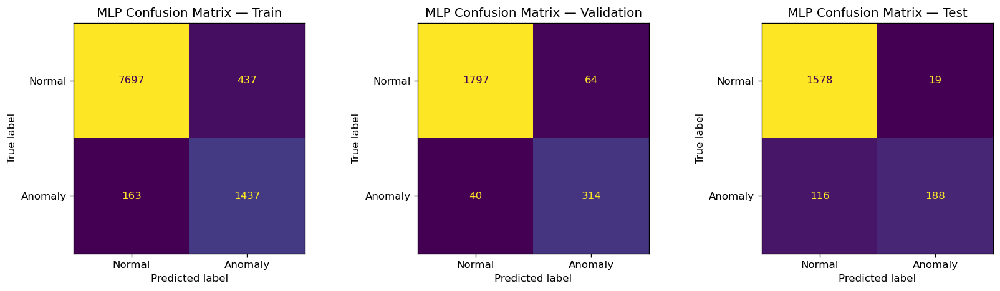

*Figure 4 — MLP confusion counts on the canonical fold at the validation-tuned threshold of 0.76. Panels left to right: train, validation, test. Normal is the negative class. The test panel holds 1,597 normal and 304 anomalous rows.*

The test panel carries a deployment-relevant asymmetry worth reading against the forest of Figure 3. With each model at its own validation-tuned threshold, the MLP raises 19 false alarms against the forest's 67, a reduction of 72 %, while detecting 188 anomalies against the forest's 216. The two error types are not equally priced on a patrol platform, and the natural argument for accepting the trade is that a fault spanning many rows offers many chances to be caught. That argument holds only if misses scatter across rows, and the one model in this programme whose misses were stratified by fault event shows they do not. The Transformer of Ch. 6 detects 0.762 of windows from slip-range faults and 0.395 of windows from stuck-range faults, so its misses concentrate by fault type rather than distributing evenly. No equivalent stratification was run for the MLP, so whether its misses cluster the same way is untested, and the row-level asymmetry above should be read as a reason to prefer this operating point on alarm load and not as evidence that the misses are cheap. The operating point itself remains the fragile part of the pipeline, as Ch. 9 shows from the calibration side.

**The 1D convolutional network.** Two convolutional layers of 32 and 64 channels with kernel size 3 over the 11-channel windowed tensor, followed by a pooling head and two fully connected layers. Kernel size follows from the temporal structure, with no search over it. A kernel of 3 spans 0.3 s at 10 Hz and two stacked layers reach 0.5 s, well short of the 3.14 s mean fault duration, so the convolutions are sized to detect the onset transient while the pooling head integrates that local evidence across the full 5 s window. This is the learned counterpart of the spectral view of Ch. 3, where the same window was described analytically by five descriptors. Concatenating average and maximum pooling was selected over either alone. On the canonical fold it scores 0.8552 ± 0.0200 against 0.8208 ± 0.0344 for maximum pooling and 0.5103 ± 0.0088 for average pooling, so it clearly beats average pooling while sitting inside one standard deviation of maximum pooling. What separated concat from max was stability across the seven fold rotations and not that canonical margin.

Across the seven fold rotations the network reaches F1 0.7307 ± 0.1147, with per-fold scores running from 0.527 to 0.874. Only the LSTM of Ch. 6 is less stable, at 0.7038 ± 0.1590, so the two least reproducible models in the Rover panel are this network and the recurrent baseline. Chapter 9 identifies a second reproducibility problem in the same model, where repeated fits of an identical configuration span 0.683 to 0.738 from library-level nondeterminism alone. Both facts point the same way. The network clears its latency gate and is not disqualified on any measured axis, but it is the least reproducible model in the panel on two independent counts, and nothing in the programme's evidence argues for choosing it over the MLP.

**The convolutional result carries a lesson about selection protocol that recurs three times in this report.** The pooling head was chosen on a seven-fold rotation, where the concatenated head measured 0.7894 ± 0.0588. The optimiser was then chosen on the canonical fold alone, over three seeds, at a margin the comparison itself reported as not significant, and the adopted configuration measures 0.7307 ± 0.1147 once rotated across all seven folds. A decision taken on one fold moved the seven-fold mean by 0.059 and doubled its spread, in a direction the single-fold evidence gave no warning of. The same shape recurs in Ch. 6, where capacity matching reverses an architecture ranking, and in Ch. 8, where the evaluation layout reverses a policy ranking. In all three the model was never the thing under-specified, the selection protocol was.

**A second task tests whether the pipeline transfers off the sensor stream.** The Fari interaction-quality dataset holds 3,000 independent rows with five tabular features and a binary label at 50.3 % positive, split 70/15/15 with stratification. Row independence is what makes a plain stratified split safe here. Because the label is generated from an explicit linear score over z-scored features, the irreducible error is computable and a Bayes rule on the generating score reaches F1 0.7867, which is the ceiling every model is read against.

  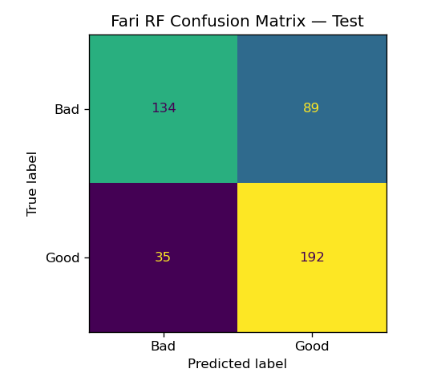
  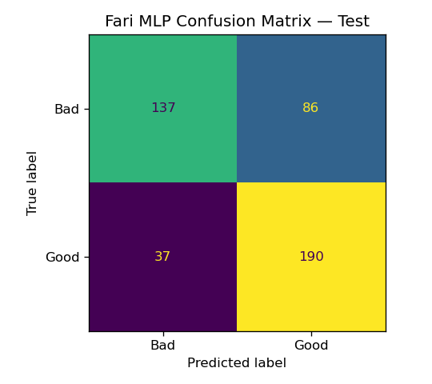

*Figure 5 — Fari test confusion counts, forest (left) and MLP (right), each at its own validation-tuned threshold. Positive class is a good interaction. Each panel covers 450 test rows, 223 bad and 227 good.*

The forest reaches F1 0.7559 at AUC 0.8077 and the MLP F1 0.7555 at AUC 0.8229, so both land within 0.04 of the ceiling and within 0.001 of each other. The two confusion matrices are near-identical in shape as well as in score, with 89 and 86 bad interactions called good against 35 and 37 in the opposite direction. Both models therefore hit the same ceiling by making the same asymmetric error, which is what a task with substantial label noise near the decision boundary produces. Neither pipeline was modified for this task, and none of the Rover feature engineering applies to it, so what transfers here is the methodology alone.

| Model                    | Task             | F1 (7-fold or test)        | AUC              | Latency  | Gate   | Verdict |
| ------------------------ | ---------------- | -------------------------- | ---------------- | -------- | ------ | ------- |
| Random forest            | Rover anomaly    | 0.7492 ± 0.0481           | 0.9595 ± 0.0092 | 7.9 ms   | 100 ms | PASS    |
| MLP                      | Rover anomaly    | **0.7936 ± 0.0472** | 0.9786 ± 0.0112 | 0.14 ms  | 100 ms | PASS    |
| 1D convolutional network | Rover anomaly    | 0.7307 ± 0.1147           | 0.9648 ± 0.0221 | 0.15 ms  | 100 ms | PASS    |
| Random forest            | Fari interaction | 0.7559                     | 0.8077           | 4.26 ms  | 35 ms  | PASS    |
| MLP                      | Fari interaction | 0.7555                     | 0.8229           | 0.136 ms | 35 ms  | PASS    |

The two Fari latencies were measured for this report from the saved checkpoints, each verified to reproduce its published test F1 and confusion matrix exactly before timing. The 35 ms figure is Fari's documented fall-detection budget, adopted here as the platform gate because the interaction-quality task carries none of its own. Against it the forest's 4.26 ms is the narrowest margin in the portfolio at a factor of 8.

## 6. Sequence Models: Recurrence Against Attention

**Objective.** Three sequence architectures are compared on identical windowed inputs, identical fold rotations and identical seeds, to establish whether attention earns its cost on a 10 Hz industrial sensor stream.

**Window length follows from the fault-duration distribution.** The 72 fault events have a mean run length of 3.14 s and a median of 2.75 s, spanning 1.0 s to 7.8 s. A window fully contains 2.8 % of fault runs at 10 steps, 30.6 % at 20 steps and 87.5 % at 50 steps, so only the 5 s window sees most faults whole. All head-to-head results below use 50-step windows over 11 channels, the nine sensors plus the two instantaneous physical features. Rolling statistics are excluded from the sequence view because the network already sees the history a rolling window would summarise.

| Model | Width | Parameters | F1, 7-fold | AUC, 7-fold | Best epoch | Latency at w = 50 |
| --- | --- | --- | --- | --- | --- | --- |
| LSTM | hidden 64 | 19.8 K | 0.7038 ± 0.1590 | 0.9694 ± 0.0137 | 2 of 12 | 0.21 ms |
| GRU | hidden 64 | 14.9 K | 0.7468 ± 0.0818 | 0.9747 ± 0.0062 | 5 of 15 | 0.64 ms |
| Transformer | d_model 64 | 67.8 K | **0.8289 ± 0.0688** | **0.9822 ± 0.0045** | 18 of 28 | 0.72 ms |
| Transformer-S | d_model 32 | 17.5 K | 0.7604 ± 0.0522 | 0.9698 ± 0.0138 | not run | not run |

Latencies in this chapter come from the window sweep below, which measured all three models in one session so that the comparison across window lengths is internally consistent. Best-epoch indices count from one and are quoted as they appear in the training ledger.

**The configurations are matched on width, which is what makes the capacity control necessary.** The LSTM and GRU are single-layer unidirectional cells of hidden size 64 with a final-state head and dropout 0.3, differing only in gate count, so the comparison between them isolates the gate mechanism. The Transformer is a two-layer encoder with four heads, d_model 64, feedforward width 128, dropout 0.1, sinusoidal positional encoding and a mean-pooled readout. Each choice is pinned to something. A d_model of 64 matches the recurrent hidden size and the MLP's first layer, so every model reads the same width. Four heads divide that width into 16-dimensional subspaces, narrow enough to stay individually meaningful on an 11-channel input. Two layers give one attend-then-refine round, which is the depth roughly 9,700 training windows support. The lighter dropout reflects that attention already mixes across all 50 positions as an implicit regulariser. Sinusoidal encoding is preferred to a learned table because the window length is fixed and a learned 50-by-64 table buys no ordering prior the closed form does not already give. Mean pooling replaces a classification token because that device pays off with large-scale pretraining, which this model does not have. No causal mask is applied, since the buffer is complete at classification time. Matching every model on width leaves the Transformer with 67.8 K parameters against the GRU's 14.9 K, which is precisely why the parameter-matched control below is needed to interpret the result.

**The ranking survives paired testing only against the weaker families.** Fold scores are paired across models, so comparisons use paired t-tests over the seven rotations. The full fifteen-pair matrix returns four significant results, all Transformer wins: over the forest at p = 0.011, the convolutional network at p = 0.004, the LSTM at p = 0.047 and the GRU at p = 0.0498. The comparison against the MLP is not among them at p = 0.34, and the MLP holds the better worst fold at 0.736 against 0.690. The parameter-matched control settles the interpretation. Transformer-S at d_model 32 carries 17.5 K parameters, close to the GRU's 14.9 K, and its fold mean falls to 0.7604, statistically indistinguishable from the GRU at p = 0.76. The full Transformer's advantage is therefore attributable to its four-fold parameter budget, and not to attention as a mechanism, and the defensible summary of the Rover panel is a single top equivalence class containing the Transformer and the MLP.

  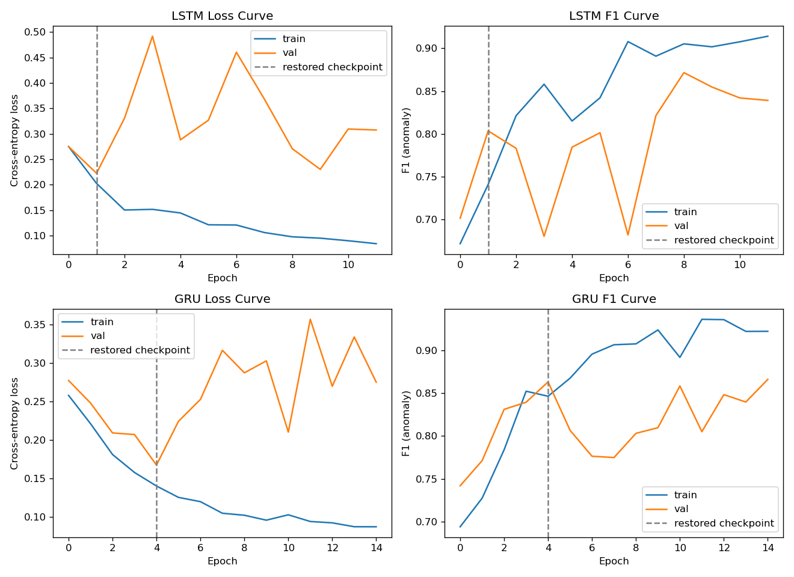

*Figure 6 — Recurrent training dynamics on the canonical fold. Top row LSTM, bottom row GRU. Left column cross-entropy loss, right column anomaly F1, each showing train and validation traces with the restored early-stopping checkpoint marked by the vertical line. The epoch axis counts from zero, so the marked checkpoints are the second and fifth epochs.*

Both recurrent models overfit early and hard. Training loss falls monotonically in each case while validation loss turns upward and then oscillates, and training F1 climbs well clear of validation F1, which swings from epoch to epoch without settling. Both models restore a checkpoint from within their first five epochs, so early stopping is doing most of the regularisation work. At this data scale the LSTM's extra gate is a liability, and the recommendation within the recurrent family is the GRU on detection quality: 0.043 higher F1 at half the fold spread. It does not win on speed, running at 0.64 ms against the LSTM's 0.21 ms at this window length, which is a gap neither model is close to being priced on.

**Convergence cost separates the families more cleanly than accuracy does.** The best validation checkpoints sit at epoch 2 for the LSTM, 5 for the GRU and 18 for the Transformer, so the attention model needs roughly four times the training epochs to reach its checkpoint. On data efficiency the picture reverses in the Transformer's favour: retrained on 25 %, 50 % and 100 % of the training blocks over three seeds it reaches 0.747, 0.821 and 0.777, holding a lead at every fraction, while the GRU is flat at 0.719, 0.727 and 0.719. The Transformer's non-monotonic profile, scoring higher at half the data than at full, is inside the seed spread of those runs and is not read as a real decline.

  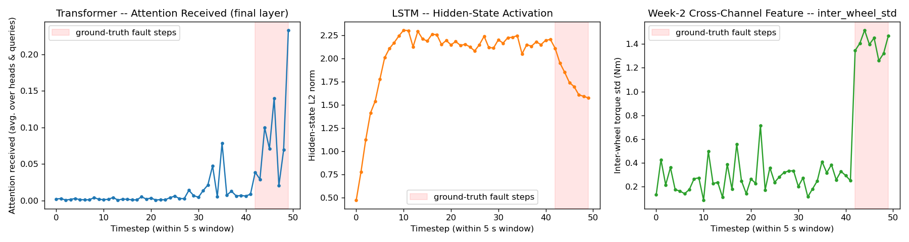

*Figure 7 — Three views of one 50-step anomalous window, sharing a time axis. Left: attention received per timestep, averaged over the final layer's heads and queries. Middle: LSTM hidden-state L2 norm. Right: the engineered inter-wheel torque dispersion in Nm. The shaded band marks the ground-truth fault steps.*

The three panels separate what the two learned models do with the same evidence. Attention stays near zero across the 42 normal steps and rises by an order of magnitude inside the eight fault steps, without ever having been supervised on where the fault sits. The localisation is consistent across the corpus: over 267 eligible anomalous test windows the median fault-to-normal selectivity is 5.3, the ratio exceeds 1 in 98 % of windows, and the per-head maps show all four final-layer heads keying on the same span. The LSTM hidden state instead saturates during normal operation and shifts regime once fault steps arrive, and its per-step state change is barely more concentrated on fault steps than elsewhere at a median ratio of 1.15. A causal recurrent state smears evidence forward, which is why a final-state readout is fragile when the evidence sits mid-window.

The third panel closes the argument of Ch. 3 from the interpretability side. The engineered channel steps from 0.27 Nm across the normal steps to 1.40 Nm across the fault steps, with the jump landing on the onset step. Attention mass concentrates on those same steps, so the two views agree on the fault's location, though since attention operates on the projected embedding rather than on named channels this is temporal co-location with the discriminative feature rather than evidence that the encoder reads that channel specifically. The reason this particular channel is the one that fires is mechanical: the world core redraws which wheel spikes at every step, so a slip fault appears as cross-wheel spread at each instant rather than as any single channel's temporal pattern. In this window the spiking wheel cycles between wheels 2 and 3 and never touches the first, whose fault-step statistics at 25.10 ± 0.44 Nm are indistinguishable from its normal-step statistics at 25.24 ± 0.42 Nm. A per-channel model looking at that wheel would see nothing at all.

**Latency does not separate these models at this platform's scale.** Single-sample inference at the three tested window lengths runs 0.14, 0.16 and 0.21 ms for the LSTM, 0.17, 0.29 and 0.64 ms for the GRU, and 0.61, 3.04 and 0.72 ms for the Transformer. The middle Transformer figure is a scheduling outlier. Attention's cost is quadratic in window length against the recurrent models' linear cost, and fitting each model's measured points to its theoretical scaling puts the crossover with the 100 ms gate at thousands to tens of thousands of steps, which is hundreds of seconds of buffered history. The quadratic term is real and does not bind anywhere near the operating regime of this platform.

## 7. Trajectory Prediction for the Aido Humanoid

**Objective and task.** Given eight state features over ten timesteps, covering position, velocity, heading and obstacle distances, predict the next five waypoints as (x, y) pairs. The dataset holds 5,000 synthetic motion sequences built from smooth quadratic paths with noise and obstacle-avoidance adjustments, split 70/15/15 by sequence. Four regressors are compared against a constant-velocity extrapolation baseline that carries no learned parameters and establishes what the geometry alone provides. The three neural regressors run under five training seeds each, while linear regression is closed-form and carries no seed variance.

| Model                           | Mean Euclidean error      | h1             | h5             | Latency  | 50 ms gate |
| ------------------------------- | ------------------------- | -------------- | -------------- | -------- | ---------- |
| Constant-velocity extrapolation | 2.77 cm                   | 1.84           | 4.28           | 0.003 ms | PASS       |
| Linear regression               | 1.50 cm                   | **0.73** | 2.56           | 0.087 ms | PASS       |
| MLP                             | 1.63 ± 0.06 cm           | 1.12           | 2.43           | 0.033 ms | PASS       |
| LSTM                            | **1.44 ± 0.04 cm** | 0.95           | **2.18** | 0.338 ms | PASS       |
| Transformer seq2seq             | 1.60 ± 0.15 cm           | 1.17           | 2.32           | 0.513 ms | PASS       |

  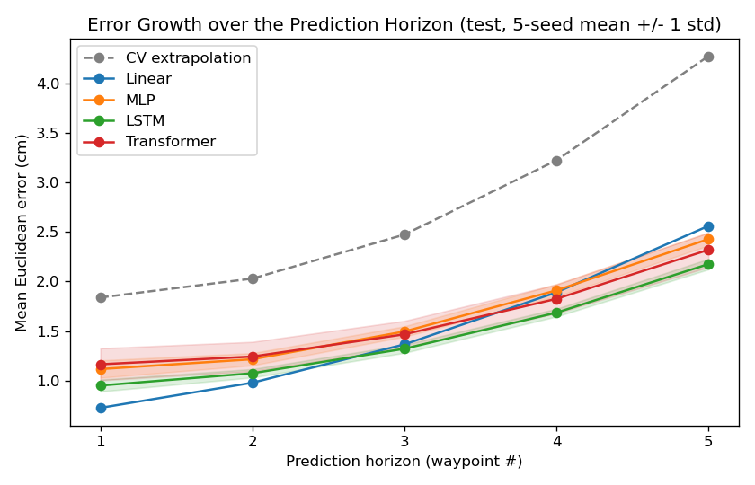

*Figure 8 — Mean Euclidean error against prediction horizon, test set, five-seed mean with a ±1 std band. The dashed grey trace is the constant-velocity baseline. Bands are narrow enough to be hidden by the markers for the deterministic models.*

**Error grows superlinearly with horizon for every model, and the ranking changes along the way.** Linear regression is the most accurate model at the first waypoint by a clear margin at 0.73 cm and the worst of the four learned models by the fifth at 2.56 cm, growing 3.5 times across the horizon. The LSTM starts higher at 0.95 cm and grows only 2.3 times, drawing level by the third waypoint and clearly ahead at the fourth and fifth. Two different error sources produce the crossover. Near-horizon error is dominated by the gait sway and noise floor, a 1 cm to 3 cm oscillation sitting on top of a 6.4 cm mean step displacement, and closed-form least squares is an optimal linear filter for that around a quadratic path, which no network trained by gradient descent matches on the same sub-problem. Far-horizon error is dominated instead by unanticipated velocity change, where curvature and avoidance steering compound quadratically in time.

Splitting the test set by whether avoidance steering was active isolates the nonlinear part directly. On the 273 avoidance episodes of 750 the LSTM reaches 2.86 cm at the fifth waypoint against linear regression's 3.52 cm, a gap of 0.66 cm. On the 477 clean episodes the same comparison is 1.86 cm against 2.01 cm, a gap of 0.15 cm. The recurrent model's advantage is therefore concentrated almost entirely in the episodes where the path is not a smooth quadratic, which is the sub-problem the linear filter cannot represent. A deployment that consumes only the immediate next waypoint should therefore read the table at h1.

  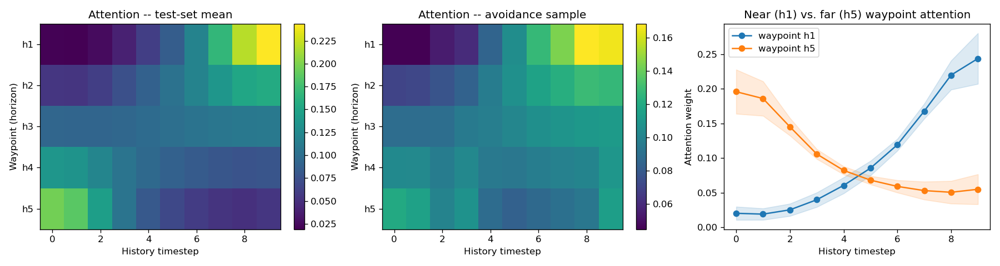

*Figure 9 — Where the Transformer reads from when predicting near against far waypoints. Left: mean attention weight over the test set, rows are the five predicted waypoints and columns the ten history timesteps. Middle: the same map for a single obstacle-avoidance sequence. Right: the h1 and h5 rows drawn as profiles with a ±1 std band.*

The attention centre of mass over the ten-step history moves monotonically earlier as the horizon grows, sitting at step 6.7 for the first waypoint and step 3.1 for the fifth. The near waypoint concentrates about 0.24 of its weight on the final step and the far waypoint about 0.20 on the first, so the encoder reads the present for the immediate future and the older history for the distant one. The older steps are where the trajectory's curvature and the approach to an obstacle are legible, while the most recent step mostly fixes the current position and velocity. This is the same division a receding-horizon motion planner makes when it weights the current state for the immediate control action and the longer state history for the shape of the path ahead.

**The Transformer's accuracy gain over the LSTM does not exist on this task.** It is the slowest of the five models at 0.513 ms, less accurate than the LSTM at every horizon, and carries the widest seed spread at ±0.15 cm against the LSTM's ±0.04 cm. There is no axis on which it wins, which resolves the programme's stated question about whether attention justifies its latency here in the negative. The deployable recommendation is the LSTM at 1.44 cm and 0.338 ms, with linear regression as a defensible minimal-footprint alternative wherever the motion context is known to be obstacle-free. Every model clears the 50 ms motion-planning gate by at least two orders of magnitude.

## 8. Reinforcement Learning for Patrol and Anomaly Response

**Environment.** The patrol problem is formalised as a Markov decision process over the same world core that generated the offline stream. The observation holds nine continuous features summarising the last 50 steps: torque mean, maximum and standard deviation, mean LiDAR distance, state-of-charge slope, current state of charge, and three position terms giving route progress and the distances to the next main-route and branch blockages. Absolute GPS is excluded because terrain is fixed across episodes and coordinates would let a policy memorise fault locations. The action set holds five discrete choices: continue, slow, reroute, raise alert and return to base. Episodes end on a return-to-base decision, on battery depletion, or on an unresolved full blockage after a stuck timeout, and random rollouts confirm all three paths are reachable before any training.

**Reward.** Productive patrol earns +1.0 per step and idling at an unresolved blockage −0.5. Under an active fault, raising an alert earns +5.0 and slowing +1.5, while continuing costs −5.0. Slowing outranks rerouting under a fault because reducing speed lowers the fault-trigger probability inside the simulator, whereas rerouting has no effect on a mechanical self-fault. A false alert costs −1.5 and every step costs −0.05 in energy. Returning to base below 20 % state of charge earns a +2.0 shaping term, matching the auto-dock threshold in the platform documentation. That term is documented as insufficient on its own. Against a discounted value near +95 for continuing to patrol, a one-off return-to-base payoff of about −1.05 is never the best action in any state, and return-to-base usage is zero for every Week-5 agent trained on the unmodified reward. A behaviour-cloning warm start lifts it only to 26 % of episodes. The Week-6 low-SoC penalty discussed with the SEOM class in Ch. 11 is the term that takes docking to all of them. The discount is 0.99, inside the 0.975 to 0.995 range the PIC 2.0 GRPO configuration documents.

**Validation before training.** Random-policy rollouts reach all three termination paths, and the return distribution over 60 episodes clusters near −350. The scripted expert returns +3,180 over the same horizon, so the reward signal is learnable. A bit-exact replay gate ties the environment to the offline transition table: across 5,931 replayed transitions the reward matches to 2.8 × 10⁻¹⁷ and the next state to 1.5 × 10⁻⁵, which is float32 rounding.

**Evaluation protocol.** Every family is trained under five seeds and evaluated on ten fixed world seeds, with the paired vector taken as the per-world mean across training seeds and every comparison decided by a two-sided Wilcoxon signed-rank test over the ten common worlds. Ten worlds rather than five is a deliberate choice, since the test cannot return a p-value below 2/2ⁿ, which puts the floor at 0.0625 for five pairs and makes significance unreachable in principle, against 0.002 for ten. Training truncates episodes at 2,400 steps, surfaced so that the learner bootstraps the value at the cap instead of treating it as terminal, while evaluation runs the deterministic full 9,600-step loop, which is the horizon every return in this chapter is measured over. Two fixed reference policies bracket every result, a scripted label-blind rule policy at 3,931 that navigates without ever alerting, and a label-aware expert at 11,575 that reads the ground-truth fault flag. Week-5 results quoted below use an earlier five-world protocol and are marked where they appear.

**Reward shaping changes behaviour before it changes return.** Sweeping the energy-penalty weight over 0.0, 0.05 and 0.2 across five seeds, under the Week-5 five-world protocol, gives returns of 1,208 ± 673, 1,563 ± 517 and 1,545 ± 679, differences inside seed variance. The behavioural effect is visible where the return is not, with the share of steps spent slowing moving from 39.4 % at the canonical weight to 51.3 % with the penalty removed, while terminal state of charge stays flat near 81 % throughout. The term buys a change of style at this weight range rather than a change of competence.

  

*Figure 10 — Full-loop return by policy, with the two fixed reference policies in grey, behaviour cloning and the runs warm-started from it in green, and the from-scratch runs in blue. Bars and spreads are taken over ten evaluation worlds crossed with five training seeds. The dashed lines mark the 3,931 deployable floor and the 11,575 privileged ceiling.*

**Value-based methods stay below the rule policy any deployment already has.** DQN on the full observation returns 2,651 ± 480 at 80 k steps and 2,048 ± 648 at 250 k with a slower exploration anneal, a difference that does not reach significance at p = 0.084. Its failure is legible in behaviour before it is legible in return. It almost never reroutes, choosing that action on 1.2 % to 8.7 % of blockage encounters against 1.00 for the scripted rule, while raising 165 to 319 false alerts per 1,000 normal steps against the rule policy's 3.7 on the same protocol. Under the earlier five-world protocol the same behaviour reads as 56 % of anomalies caught at 213 false alerts per 1,000. Tripling the budget with a slower exploration anneal moved the paired return by −603 at p = 0.084 while roughly doubling the false-alarm rate, and lifted rerouting from 0.012 to 0.087 with almost all of that coming from a single seed at 0.297. Tripling the budget barely moved rerouting, and what movement there is comes almost entirely from one seed, so the navigational failure reads as structural and not as a matter of training time. Tabular Q-learning on a 96-state discretisation returns −320 ± 735 under the Week-5 protocol and serves as intuition only.

**Behaviour cloning is the strongest offline result and is best described as distillation.** Trained on the scripted transition table and retrained for the ten-world protocol, it returns 4,892 ± 577 from a single training seed, above the 3,931 rule floor and well below the 11,575 ceiling, which is about an eighth of the distance between them. Its teacher is the label-aware expert, so what it achieves is converting a policy that required the ground-truth fault flag into one that runs on sensors alone. The behaviour it inherits matters as much as the return, because it reroutes on 0.84 of blockages at only 55 false alerts per 1,000 normal steps, which is the best navigational profile of any learned policy in this chapter.

Fitted Q iteration on the same table reaches 1,394 ± 525 under the Week-5 protocol at 60 iterations, and the diagnosis of why it needs that many is the useful part. At 12 iterations the mean maximum Q value reaches only 35 against a full-horizon value near 95, and rerouting is chosen in zero test states, because the return from a detour lands outside the effective horizon the truncated iteration can see. Extending to 60 lifts the mean to 146 and recovers rerouting in 520 states, which identifies horizon truncation as the mechanism rather than distributional shift. The deployment argument for offline learning is that an early online policy on a patrol rover is close to random and an unmitigated fault during exploration carries real operational cost, so learning from logged operation is the realistic entry point.

**On-policy policy gradients require the warm start.** Trained from scratch, PPO returns 156 ± 17 and the group-relative variant 214 ± 33, with episodes collapsing to roughly 310 steps. Plain REINFORCE reaches 1,579 ± 789 and REINFORCE with a learned value baseline 1,329 ± 694. The two methods that collapse are the two carrying a clipped surrogate and a bootstrapped critic, while DQN is protected by replay and ε-greedy exploration. Initialised from the behaviour-cloning checkpoint, the same three implementations return 5,182 ± 585 for the group-relative variant, 5,969 ± 692 for REINFORCE with a value baseline and 6,421 ± 659 for PPO.

| Comparison                                                     | Δ return | p      | Verdict                          |
| -------------------------------------------------------------- | --------- | ------ | -------------------------------- |
| PPO, warm start, against behaviour cloning                     | +1,530    | 0.037  | significant                      |
| REINFORCE with baseline, warm start, against behaviour cloning | +1,078    | 0.0020 | significant                      |
| Group-relative, warm start, against behaviour cloning          | +291      | 0.193  | not significant                  |
| PPO against group-relative, both warm started                  | +1,239    | 0.084  | not significant                  |
| PPO, warm start, against DQN at 250 k                          | +3,960    | 0.0020 | significant, wins all ten worlds |
| PPO at γ = 0.99 against γ = 0.999                            | +317      | 0.492  | not significant                  |

**PPO buys its return by trading navigation for alerting.** The return column ranks the warm-started three, and the behaviour columns reverse that ranking. Fine-tuning takes PPO's rerouting from the behaviour-cloning prior's 0.84 down to 0.34 and its false-alarm rate from 55 to 241 per 1,000 normal steps, while lifting alert recall from 0.21 to 0.85. REINFORCE with a value baseline keeps rerouting at 0.82 and alerts at 104 per 1,000 for 452 less return, a gap the paired table does not test, and the group-relative variant, whose implementation carries a KL penalty to the frozen behaviour-cloning reference, keeps 0.65 at 89 per 1,000. All three optimise this chapter's reward function faithfully, and that function prices a caught fault at +5.0 against a false alert at −1.5, so alerting hard is the correct response to it.

Converting those rates to the platform's clock shows how far the correct response to the reward sits from a usable one. At 10 Hz, 1,000 normal steps are 100 s of patrol. On the ten-world protocol the two reference policies are indistinguishable on this axis, the scripted rule policy at 3.7 and the label-aware expert at 3.6, both about one false alert every 27 s. The rule policy's alerts come from its blockage rules and not from fault detection, which it never performs, so 3.7 is the alarm load a deployment already tolerates from a policy that catches no faults at all. The behaviour-cloning prior raises one every 1.8 s and PPO one every 0.4 s. Every learned policy in this chapter, including the prior they all start from, runs 15 to 65 times the reference alarm rate. That is a property of the reward rather than of any algorithm, and it makes re-pricing the alert terms the precondition for reading any of these returns as a deployment result.

**The group-relative baseline and the variance question.** The implementation samples a group of trajectories per update and uses the group mean return as the baseline, standardising the advantage within the group and dispensing with a critic. On the training layout it neither beats PPO significantly nor separates from the behaviour-cloning prior it started from. The gradient instrumentation explains the mechanism behind the ranking: REINFORCE's half-batch gradient disagreement is 0.23 in units of the mean gradient norm, adding a learned value baseline halves it to 0.11 while leaving advantage variance unchanged at about 2.9, and the group-relative variant runs at 1.79 with an advantage variance of 1.00. That last number is a definition rather than a measurement, since group standardisation sets it, and the informative quantity is the pre-standardisation spread of the eight group returns, which averages 6.0. The value-baseline instrumentation measures REINFORCE's critic and not PPO's, because the library implementation of PPO exposes no per-update hook.

  

*Figure 11 — Return on the training layout, left of the divider, and on five layouts the policies never saw. Every bar is that family's seed-0 policy. The map-6 bar is its mean over the ten canonical worlds and each held-out bar its mean over five worlds, so the whole chart sits at one aggregation level.*

**The selection metric decides which policy wins.** On the training layout the two are statistically tied, PPO at 5,170 and the group-relative variant at 5,157. On every one of the five held-out layouts the group-relative variant leads by 1,286 to 2,300 return, and on four of the five it scores above its own training-layout result of 5,157, while PPO loses between 2 % and 38 % of its canonical 5,170. DQN does not transfer at all, falling from 1,463 to between −316 and 539. A leaderboard built on the training layout would select PPO and would be selecting the policy that generalises worse.

The mechanism follows from the behaviour trade above. PPO's canonical advantage is bought by alerting hard, and an alert policy tuned to 241 false alarms per 1,000 normal steps is tuned to where the faults sit on this particular terrain, which is exactly the part that does not travel. The group-relative variant carries the navigational behaviour its prior gave it onto terrain it has never seen. Two scope limits belong with the figure. It covers one training seed per family and one evaluation per layout, so it establishes a consistent direction and not an effect size, and re-running it across all five training seeds is the priority experiment recorded for the GRPO class in Ch. 11. The sweep also covers five held-out layouts and not six, because the Week-2 generator could not calibrate one candidate map into the 14 % to 16 % anomaly band.

  

*Figure 12 — Decision budget crossed with discount at the option level, five training seeds per arm. Left: full-loop return with the hand-written option policy marked as a dashed reference. Right: probability of rerouting given a single blockage, with the best flat-MDP policy marked as a dotted reference. Error bars are ±1 std across seeds.*

**Hierarchy lifts routing competence sharply, inside a privileged bracket and without beating the hand-written reference.** Wrapping the environment in a node-level semi-Markov decision process, where the agent chooses an option at each route node instead of an action at each of ten steps per second, changes the picture the flat models produced. One boundary has to be stated before the numbers. The low-level option controllers alert on the ground-truth fault label, so every option-level result belongs in the same privileged bracket as the 11,575 expert and none of these policies is deployable as it stands. That is why the hierarchy does not appear on the deployment frontier of Ch. 10, and why the priority experiment for the HTD-IRL class in Ch. 11 is to replace the option controllers' alert rule with the Week-3 sensor-window classifier. A second boundary matters just as much for reading the numbers. The controllers also embed the hand-written rule policy's competence, so a high option-level score shows that the binding constraint sat above the controller level and not that the learned layer discovered how to navigate.

Read inside that bracket, both factors in the budget-by-discount design are significant on the paired ten-world test and close to additive. The discount is worth +1,232 return at the small budget (p = 0.014) and +1,478 at the large one (p = 0.002), while the budget is worth +608 at γ = 0.99 (p = 0.027) and +853 at γ = 1.0 (p = 0.037). The best arm returns 12,129 ± 121, above the 11,575 privileged ceiling that the flat expert sets on the same ten worlds. Its +1,276 over the hand-written option policy at 10,853 does not reach significance (p = 0.065), so the learned hierarchy matches that reference rather than beating it. Rerouting competence is the clearer signal, rising from 0.49 to 0.82 across the design against 0.34 for the best flat policy and 0.04 to 0.09 for DQN. The seed spread collapses along the same axis, from ±2,066 in the weakest arm to ±121 in the strongest, so the strong arm is also the reproducible one. The undiscounted objective wins because an option spans many low-level steps, and at γ = 0.99 the accumulated discount over an option of that length is of order 10⁻⁸, which flattens the semi-Markov backup back onto the flat objective it was meant to escape.

**Inverse reinforcement learning recovers a useful policy from a poorly recovered reward.** Maximum-entropy inverse reinforcement learning on a tabular discretisation, fitted to logged expert trajectories with privileged features, recovers a reward correlating with the true reward at Pearson 0.458 and Spearman 0.309. A positive control fitted to a soft-optimal demonstrator on the same machinery reaches Pearson 0.947, which shows the optimiser works and locates the limitation in the demonstrations. The observation-only variant fails outright at Pearson −0.023. The result worth carrying forward is that the policy optimal under the weakly recovered reward returns 11,285 ± 2,267, covering 96 % of the range between the deployable floor and the privileged ceiling. Reward recovery and policy recovery are separate objectives, and this task is one where the second succeeds while the first does not. A second observation cuts against the obvious diagnostic: converging the feature-expectation match harder makes the correlation worse, from Spearman 0.49 at a matching error of 0.105 down to 0.31 at 0.022, so tighter feature matching is not a proxy for a better reward here.

**Multi-agent coordination produces a structural null.** Two rovers on a cooperative patrol task were trained as independent learners under two credit-assignment schemes, a shared team reward and a difference reward. The two are indistinguishable on every metric measured: return 3,819 ± 434 against 3,840 ± 430, loop coverage 0.735 ± 0.012 against 0.733 ± 0.015, redundantly covered edges 1.30 against 1.18, and identical proximity-violation counts. The diagnosis matters more than the tie. At roughly nine node-level decisions per episode, one million environment steps yield about 30 policy updates, so neither learner accumulates enough attributed outcomes for the schemes to differ. Coverage does sit well above a random policy's 0.425 and below the scripted policy's 0.825, so the learners are doing something. Two environment configurations were also compared, one carrying the flat environment's stuck timeout and one without it, returning 3,819 against −2,522. A rover that commits onto a blocked edge without a timeout stands halted at −0.5 per step to the horizon, so termination semantics dominated algorithm choice at this budget by a wide margin.

**Policy inference latency is not a constraint.** Measured with `timeit` over 2,000 calls at batch size 1 on CPU, the scripted rule and tabular option lookups run at 0.001 ms, the policy-gradient networks at 0.027 ms, the behaviour-cloning network at 0.028 ms, DQN at 0.066 ms, PPO at 0.115 ms and the two-rover configuration at 0.19 ms for both forward passes. Every path clears both the 100 ms patrol gate and the 50 ms motion-planning gate by three to five orders of magnitude. A trained policy is a small feedforward network at inference time, so the Phase-B latency conclusions carry over unchanged and the entire cost of reinforcement learning sits in training.

## 9. Explainability Across Model Families

**Objective and protocol.** Every attribution below runs on a model refit from the saved configuration and verified against its published metrics before it is explained. The forest is a pipeline chaining standardisation, principal component analysis and the trees, so its Shapley values are computed exactly in the 19-component space by the tree explainer over the full 1,901-row canonical test fold, with an additivity residual of 3 × 10⁻¹⁵. The MLP is explained by the deep explainer in its native 40-dimensional standardised space against a 200-row background sample, with a residual of 2 × 10⁻⁶ on the anomaly logit. Attention maps serve as the interpretability lens for the Transformer and input-gradient saliency for the reinforcement-learning policy.

**The classical attribution reproduces the Week-2 selection exactly.** The five components carrying the largest mean absolute Shapley value are the same five the Week-2 forest selected, in the same order, and the Shapley ranking correlates with impurity importance at Spearman 0.919 across all 19 components (p = 3 × 10⁻⁸). The agreement carries information beyond a pipeline check. Impurity bias and the variance ordering of the components both point toward the leading components, so an artefact of either would have selected PC1 through PC5. The set actually selected skips PC3 to PC6 and PC8 to PC11 to reach components carrying 2.1 % and 1.4 % of the variance, and a second attribution method with no impurity bias reproduces that out-of-order set independently.

  

*Figure 13 — Perceptron attribution in the 40-dimensional feature space, top 10 features. Left: per-row Shapley values on the anomaly logit, one point per test row, coloured by that row's feature value from low in blue to high in red. Right: mean absolute Shapley value for the same features. Computed over the full 1,901-row canonical test fold.*

The MLP's top three are the engineered inter-wheel dispersion followed by two raw wheel torques, and the beeswarm shows why the first of them ranks where it does: its high-value rows form a long tail on the anomaly logit while its low-value rows sit slightly negative, so the relationship is monotone across the range. The two model families work in different spaces and their rankings cannot be compared directly. A formal comparison through a loading projection gives Spearman 0.18, which is not significant, though that projection is magnitude-only and spreads mass, so it bounds what the comparison can show instead of contradicting the agreement visible at the top of both rankings. Taken at that top, both families put the engineered cross-channel quantity of Ch. 3 first.

**Where a ground truth exists, the attribution recovers it.** Fari's label comes from a known linear generator, so the true importance ordering is available. Both the forest and the MLP recover it exactly, at Spearman 1.0 with an exact permutation p of 0.017 over the five features, and their attribution shares track the true weight shares closely: 0.351 and 0.309 against a true 0.289 for topic coherence, 0.256 and 0.252 against 0.237 for sentiment score, 0.216 and 0.217 against 0.211 for latency. This is the calibration check that licenses reading the Rover attributions, where no ground truth exists.

Both tasks carry exactly five features, so the table below is a complete ranking and not the top of a longer list. Fari's attributions are reported as a share of the total against the true weight share on the same normalised scale, which its known generator makes available. Senpai has no such truth and is reported as mean absolute Shapley value in probability units, per class, ordered by the across-class mean.

| Rank | Fari feature | RF / MLP / true share | Senpai feature | mean abs. SHAP, beginner / intermediate / advanced |
| --- | --- | --- | --- | --- |
| 1 | `topic_coherence` | 0.351 / 0.309 / 0.289 | `correct_rate` | 0.145 / 0.118 / 0.150 |
| 2 | `sentiment_score` | 0.256 / 0.252 / 0.237 | `hint_requests` | 0.123 / 0.071 / 0.081 |
| 3 | `latency_ms` | 0.216 / 0.217 / 0.211 | `response_time_mean` | 0.074 / 0.064 / 0.070 |
| 4 | `follow_up_rate` | 0.150 / 0.156 / 0.184 | `session_duration` | 0.031 / 0.032 / 0.032 |
| 5 | `response_length` | 0.028 / 0.066 / 0.079 | `topic_switch_count` | 0.014 / 0.018 / 0.015 |

The top three carry 82 % of Fari's forest attribution and 86 % of Senpai's, so both tasks concentrate their signal in three of five features. The reasons differ. Fari's generator gives all five a non-zero weight and `response_length` merely the smallest of them, which both models recover. Senpai's `topic_switch_count` was built to be uninformative, and the attribution finds nothing there in any class.

**The Senpai task extends the check to three classes.** The dataset holds 2,000 rows and five features generated under a fixed-difficulty item-response scenario, with a class prior of 21.4/64.3/14.3 % over beginner, intermediate and advanced, split 1,400/300/300. Labels come from the generating latent ability rather than from feature thresholds, so irreducible error exists by construction and a Bayes rule on the latent variable reaches accuracy 0.812 and macro-F1 0.764. A forest of 200 trees at depth 10 reaches macro-F1 0.667, which is about 87 % of the information the features carry, at per-class F1 of 0.685, 0.750 and 0.566. The weakest class is the smallest at 43 test rows. Inference runs at 8.7 ms against the platform's 100 ms conversational gate, a clear pass. The attribution is led by correct rate, hint requests and mean response time, which together carry 86 % of the total, and hint requests attribute nearly twice as strongly for the beginner class at 0.123 as for the intermediate class at 0.071. Topic switching attributes almost nothing anywhere, which matches how it was generated.

**Learning curves separate the two Rover families by failure mode.** Both curves are grown by whole blocks, since row-level growth would admit a partially included block, and the full protocol including standardisation, class weights, early stopping and threshold tuning is refitted at every size. The MLP's validation F1 rises monotonically through the final doubling, from 0.745 at 1,800 rows to 0.858 at 9,700, with a small train-to-validation gap. That is a low-variance, moderate-bias profile on a curve that has not flattened, so more blocks would still buy performance. The forest instead carries a persistent gap of 0.10 to 0.13 at every size, which is the variance-dominated profile, and its full-data validation score of 0.81 is what the MLP reaches with half the blocks. At 18 % of the training blocks the MLP is already within 0.11 of its full-data score, which echoes the compressibility observed on the CNC project along a different axis: there most of the signal lived in a small fraction of the features, here in a small fraction of the data.

  

*Figure 14 — Attention selectivity on stuck-type windows by detection outcome, on a log scale with the no-selectivity line at 1. Selectivity is the ratio of mean attention on fault steps to mean attention on normal steps, and points are coloured by fault episode. The 99 eligible windows tile only two independent episodes, one detected 90 % of the time and one missed entirely, so the two boxes are very nearly those two episodes and not two populations.*

**The residual misses are not localisation failures, which is the programme's most surprising explainability result.** Stuck-type faults carry the recall ceiling, at 39.5 % of windows caught against 76.2 % for slip, and the question is whether the encoder fails to find those faults or the head fails to act on what it finds. The figure answers it on the episode the classifier missed entirely: every one of its 49 windows carries attention selectivity above 1, at a median of 8.7, while the head calls all 49 normal. What the figure cannot support is a ranking between the detected and missed groups, because consecutive windows share 49 of their 50 rows and the 99 eligible windows tile only two independent episodes, so a difference between the group medians compares episode identity. The one-sided claim carries the conclusion on its own. The encoder finds the fault span and the head discards it, which makes the stuck-type recall ceiling a property of the decision head under the training distribution and not of the encoder. More capacity in the attention stack is therefore the wrong fix, and the readout and the operating point are where the remaining recall lives.

**The reinforcement-learning policy reads one channel well and another not at all.** Tracing the critic along an episode, the value function holds between 50 and 85 during normal patrol, falls as the main route blocks, and settles near −57 in the dead end. Event-conditioned means give 69.7 on normal steps where the modal action is continue at 74 %, 34.6 on anomaly steps where the modal action is raise alert at 90 %, −39.8 on blockage approach and −56.8 in the dead end, where the modal action is still continue. The critic prices the blocked state correctly and the actor barely answers it, with reroute mass appearing late and never dominating.

  

*Figure 15 — Input-gradient sensitivity of two action logits to each of the nine observation features, in absolute units so the two series are comparable. Red: the raise-alert logit measured on 698 anomaly steps. Green: the reroute logit measured on 813 blockage-approach steps.*

The two profiles could hardly differ more. The alert logit is dominated by peak wheel torque, which carries 43 % of that logit's total gradient and makes the alert pathway close to a torque-surge detector. Peak torque does move sharply on fault steps, from 21.5 Nm to 44.1 Nm with a point-biserial correlation of 0.49, so the policy has found the real signal. The reroute logit has no dominant feature at all: its largest channel carries 16 % of the gradient against the 11 % a uniform profile would give. The behaviour-cloning prior holds a balanced sensitivity on normal patrol, about 27 % each to peak torque and blockage distance. Fine-tuning raises torque to 46 % on normal steps and 42 % on anomaly steps, and drops blockage distance below 9 % until the obstacle is already inside sensor range, where it recovers to 23 %. The fine-tuned policy has not stopped reading the blockage channel, it has stopped reading it early, and lead time is what a detour decision needs. This is the attribution-level form of the behaviour trade in Ch. 8, where the same fine-tuning took rerouting from 0.84 to 0.34. The two policies choose the same greedy action on only 61.7 % of steps. Across the value trace, the saliency shares and the per-logit view, the same conclusion holds: alerting is the learnable part of this task and routing is the hard part, which is exactly what the hierarchical result of Ch. 8 then fixes by changing the decision granularity.

**Two reproducibility limits are worth recording alongside the attributions.** Validation-tuned decision thresholds swing between 0.36 and 0.95 across the seven fold rotations while the area under the ROC curve stays within 0.963 to 0.994, so discrimination is stable and the operating point is not. Threshold-dependent F1 is accordingly treated as the noisier of the two headline metrics throughout this report. Separately, the convolutional network cannot be refit bit-identically: repeated fits of one configuration span F1 0.683 to 0.738 from library-level nondeterminism alone, which is half its already wide fold spread and a second reason it is not recommended.

## 10. Deployment Feasibility: Pareto Frontier, Optimisation and Calibration

**Objective.** Every trained model is placed on a latency-against-score plane for its platform, the non-dominated set is identified per panel, and one near-frontier model that misses a constraint is optimised.

  

*Figure 16 — Single-sample latency on a log axis against task score, one panel per platform task, with ringed markers denoting the non-dominated set and the dashed vertical line the platform gate. Top: Rover anomaly F1 over seven fold rotations, higher better, error bars ±1 fold std. Middle: Humanoid trajectory error in cm, lower better, axis inverted so that better is higher, error bars ±1 std over five seeds. Bottom: Rover patrol return normalised so that the scripted rule floor is 0 and the privileged expert ceiling is 1, error bars ±1 std over ten worlds.*

**Rover classification.** The non-dominated set holds the MLP at 0.794 F1 and 0.041 ms and the Transformer at 0.829 F1 and 0.345 ms. Every other model is dominated, the forest doubly so at mid-pack F1 and 13 to 220 times the latency of the neural models. The frontier is read as a two-member equivalence class instead of a ranking because the paired test of Ch. 6 puts the two within noise of each other, and the overlapping fold spreads in the top panel are the same fact drawn. Within that class the recommendation is the MLP, on latency, on the better worst fold, on the lowest fold variance and on the calibration result below. The Transformer is retained as the interpretability alternate, since Ch. 9 shows its attention maps carrying diagnostic information no other model in the panel provides.

**Humanoid trajectory.** The non-dominated set holds four points, the constant-velocity baseline at 2.77 cm and 0.003 ms, the MLP at 1.63 cm, linear regression at 1.50 cm and the LSTM at 1.44 cm and 0.109 ms. The Transformer is the one dominated point in the panel, beaten by the LSTM on both axes at once. The recommendation is the LSTM.

**Rover patrol policy.** The non-dominated set holds PPO at 0.326 normalised return and REINFORCE with a value baseline at 0.267, both behaviour-cloning initialised. DQN sits below zero, meaning its return is under the deployable rule policy any patrol platform would already run, which is the clearest statement of the value-based result. The panel ranks by return on the canonical layout, which puts PPO on top, and Ch. 8 gives two reasons not to read that as a deployment recommendation: the ordering reverses on every held-out layout, and PPO's margin is bought at an alarm load no operator could run. This is the one panel of the three where the frontier does not settle the choice.

**Latency prices model choice on these tasks rather than constraining it.** The tightest margin in the three panels is the forest's, at about 11 times the 100 ms gate, and every other model in them clears by two orders of magnitude or more, so the gate never eliminates a candidate. The one exception is the Rover's ≤10 ms breach-detection tier, where the deployed forest at 8.7 ms to 9.0 ms consumes most of the budget and leaves no room for the rest of a detection stack.

  

*Figure 17 — Test F1 at the validation-tuned threshold against single-sample latency for eight depth-and-width-reduced forests, labelled by tree count and maximum depth. The dashed line marks the 10 ms breach-detection tier. All eight configurations use the identical pipeline and split as the deployed model.*

**The optimisation experiment.** Depth and width reduction was applied to the forest, the portfolio's slowest model and the one relevant to the breach tier. Sweeping tree count against maximum depth over eight configurations gives a frontier whose useful point is 50 trees at depth 6.

| Configuration                 | Test F1          | AUC    | Latency           | Share of the 10 ms tier | Shapley top-5 overlap |
| ----------------------------- | ---------------- | ------ | ----------------- | ----------------------- | --------------------- |
| 200 trees, depth 10, deployed | 0.7359           | 0.9668 | 8.73 ms           | 87 %                    | reference             |
| **50 trees, depth 6**   | **0.7153** | 0.9573 | **2.45 ms** | **25 %**          | 5 of 5                |
| 25 trees, depth 10            | 0.6957           | 0.9653 | 1.44 ms           | 14 %                    | 5 of 5                |

The reduction costs 0.021 F1 for a 3.6-fold speed-up, and that cost sits inside the deployed model's own fold spread of ±0.048, so the two configurations are not distinguishable on the evidence available. The attribution ranking is unchanged, with the same five leading components in all eight configurations, so the shrunken forest explains itself with the features the full one used.

The two factors do not act alike, and the figure shows the depth effect changing sign with forest size. Tree count sets latency almost on its own, moving the eight configurations from 1.4 ms to 8.7 ms while depth barely shifts them, so the cheap axis is the number of trees. On accuracy the pattern is not monotone in depth. At 25 trees, reducing depth from 10 to 6 to 4 costs F1 at every step, 0.696 to 0.686 to 0.674. At 50 and at 100 trees the shallower forest is the better one, 0.715 against 0.703 and 0.708 against 0.700. The selected configuration sits on that second pattern, so reading depth as a quantity that only costs accuracy would have ruled out the configuration this experiment picked. The trade is acceptable on both framings, and it does not change the deployment recommendation, which the MLP holds on both axes even against the 2.45 ms forest.

**Calibration is where the STUM class target actually bites.** Expected calibration error was measured for the two score-producing models on the frontier, before and after temperature scaling fitted on validation.

| Model       | ECE, raw | Fitted temperature | ECE, scaled | STUM target 0.031                  |
| ----------- | -------- | ------------------ | ----------- | ---------------------------------- |
| MLP         | 0.025    | 1.07               | 0.024       | met without any calibration layer  |
| Transformer | 0.041    | 1.16               | 0.032       | met only after scaling, and barely |

The MLP meets the target with no calibration layer at all, and the fitted temperature of 1.07 shows there was little to correct. The Transformer misses it raw and lands just above it after scaling, so temperature scaling recovers about a quarter of its miscalibration. The target is tight enough to separate the two members of the top equivalence class, which makes calibration the tie-breaker that accuracy could not provide. The more serious calibration problem on this data is not marginal reliability but transfer of the operating point between blocks, as the 0.36 to 0.95 threshold swing of Ch. 9 shows.

## 11. PIC 2.0 Model-Class Readiness

Each class below carries the experimental finding that determines its score, a readiness score from 1 to 5, and the single experiment that would raise it. Scores measure what the evidence in this report supports for a deployed platform, and carry no comparison to the state of the literature.

| Class   | Readiness | Finding that sets the score                                                                                                                                                                                                                                                                                                                                       | Priority next experiment                                                                                                                                                          |
| ------- | --------- | ----------------------------------------------------------------------------------------------------------------------------------------------------------------------------------------------------------------------------------------------------------------------------------------------------------------------------------------------------------------- | --------------------------------------------------------------------------------------------------------------------------------------------------------------------------------- |
| GRPO    | 3         | The warm start is a precondition rather than an optimisation, and training-layout leaderboards select the wrong policy: the group-relative variant ties PPO on the training layout at p = 0.084 and wins all five held-out layouts by 1,286 to 2,300                                                                                                              | Re-run the layout sweep with all five training seeds per family and adopt held-out-layout return as the selection metric                                                          |
| SEOM    | 3         | A training-time penalty delivers the safety property outright, taking battery depletion from 26 % of episodes to zero, docking from 26 % to 100 % and time below the 20 % threshold down by 70 %, but it costs most of the return, 5,190 ± 729 falling to 998 ± 669 at penalty weight 1.5, and only these two weights were run, so whether an intermediate weight buys the safety property at a smaller return cost is untested | Sweep the low-state-of-charge penalty weight between 0 and 1.5 and report the depletion-rate against return frontier, which is the curve the deployment choice actually needs     |
| HTD-IRL | 3         | Reward recovery is bounded by the demonstrations at Spearman 0.31 from logged expert data against 0.97 from a soft-optimal demonstrator, while hierarchy moves rerouting from 0.34 to 0.82 with both factorial effects significant                                                                                                                                | Replace the option controllers' privileged alert rule with the Week-3 sensor-window classifier and re-run the factorial                                                           |
| STUM    | 3         | The deployment-recommended MLP already meets the internal calibration target at 0.025 against 0.031, and the exposure is transfer rather than level, with thresholds swinging 0.36 to 0.95 while AUC stays within 0.03                                                                                                                                            | Fit the calibration layer on one fold rotation and measure ECE on the other six                                                                                                   |
| AMDC    | 2         | Cross-channel engineered features carry the attribution mass in every model family, worth 0.27 F1 in Ch. 3, three of five selected components, the top of the MLP ranking and 43 % of the RL alert logit's gradient, yet no drift or miscalibration has been injected                                                                                             | Inject per-sensor gain and offset drift at documented magnitudes, measure F1 degradation with and without recalibration, and check whether the attributions move                  |
| CRL-MRS | 1         | Node-level coordination gives about 30 policy updates per million steps, which leaves the shared and difference reward schemes indistinguishable on every metric, and LiDAR mutual visibility spans only 2.6 % of the loop                                                                                                                                        | Insert a decision level between the 10 Hz control step and the route node, or raise the interaction budget by an order of magnitude, then re-run shared against difference reward |

The six scores are not independent. They form a dependency chain. AMDC sits low because the sensor-fusion evidence in this report is all from a clean simulator, and every score above it inherits that assumption, since a model whose attributions rest on two engineered cross-channel features is exposed to exactly the drift that has not been tested. CRL-MRS sits lowest because its result is a structural null rather than a measurement, and the experiment that would change it is a change to the environment's decision granularity and touches no algorithm.

## 12. Limitations and Future Work

**One synthetic world topology underlies every Rover result.** All offline data and all reinforcement-learning training in this report come from a single procedurally generated map at one seed, with faults produced by one simulator's mechanical model. Within that scope the results are internally consistent and leakage-controlled. Outside it, the cross-layout experiment of Ch. 8 is a direct warning: changing the map alone reversed which policy-gradient method should be selected, without changing any algorithm or hyperparameter. The route out is to treat layout as an evaluation factor instead of a fixed background, which for the policies means the held-out-layout selection metric recorded in Ch. 11. Whether the supervised results carry the same exposure is untested, since no classification model in this report was ever evaluated on a stream from a second map seed.

**The multi-agent result is data-limited, and not negative.** At roughly nine node-level decisions per episode, a million environment steps produce about 30 policy updates, which is too few for any credit-assignment scheme to differentiate itself. Reporting it as evidence that difference rewards do not help would misread a null caused by the experimental design. The mitigation is the intermediate decision level named in Ch. 11, and its price is that macro-actions of about 100 steps discard the fine-grained control the flat environment allows, so the comparison would answer a slightly different question than the one originally posed.

**Calibration transfer is untested and is the largest exposure on the deployed model.** Expected calibration error was measured on one fold rotation, and the recommended MLP passed the STUM target there. The 0.36 to 0.95 threshold swing across rotations shows that the operating point does not transfer between blocks, and nothing in this report measures whether a calibration layer fitted on one block rotation holds on another. Until that experiment runs, the deployment recommendation should be read as covering the model and not the threshold, and a deployed system should re-tune its operating point on recent data instead of inheriting one.

**The residual misses are a decision-layer problem, and the obvious fix does not address them.** Chapter 9 established that the attention encoder localises faults in the windows it misclassifies as well as in those it gets right. Enlarging the encoder, lengthening the window or adding heads therefore addresses a component that is already working. The productive direction is the pooled readout and the operating point, and specifically an event-level decision rule in place of the row-level one, since misses concentrate inside whole stuck-type episodes. That change also requires an event-level evaluation metric, which this programme did not define and which would have to be agreed before the comparison could be scored.

**The patrol reward prices alerting in a way no deployment could accept, and that blocks the RL recommendation.** A caught fault earns +5.0 and a false alert costs −1.5, so a policy maximising return should alert freely, and every warm-started policy does. Converted to the platform's clock the mildest of them raises a false alert about once a second of normal patrol and PPO about once every 0.4 s, against once every 27 s for the scripted rule policy. Within the scope of this reward the results stand and the comparisons between policies are sound. Outside it, none of these policies is deployable on alarm load, which is why Ch. 1 recommends the warm start as a method and no policy as a product. The route out is to re-price the alert terms against an operator-supplied cost of a false alarm and re-run the warm-started three, and the cost of that route is that every return in Ch. 8 is measured against the current reward and would have to be re-measured.

**Three experiments would move the readiness table furthest.** Sensor-drift injection is first, because the entire attribution story of this report rests on two engineered features whose robustness to gain and offset drift is unmeasured, and because AMDC sits at the head of the dependency chain so every class above it inherits the clean-sensor assumption. Held-out-layout selection is second, because Ch. 8 already shows a live instance of a training-layout leaderboard selecting the policy that generalises worse, and because the sweep that showed it used one training seed per family and needs all five before it can carry a selection rule. A decision level between the control step and the route node is third, because it converts the multi-agent null into a measurable comparison and because the same change has already been shown, in the hierarchical result of Ch. 8, to lift rerouting competence from 0.34 to 0.82 where three flat algorithms could not move it.
