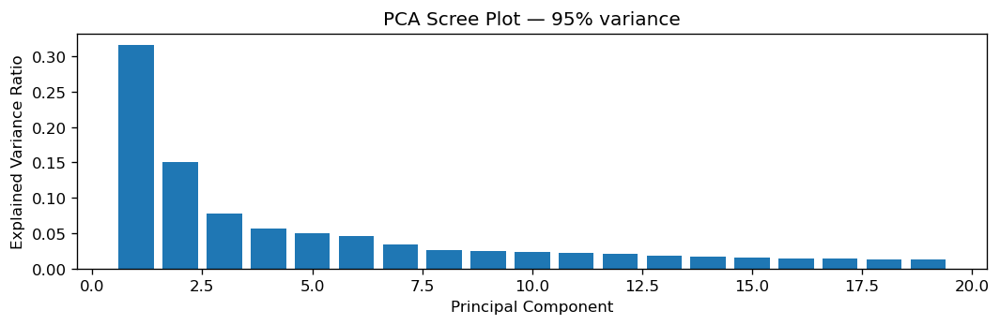
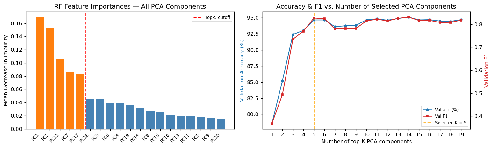
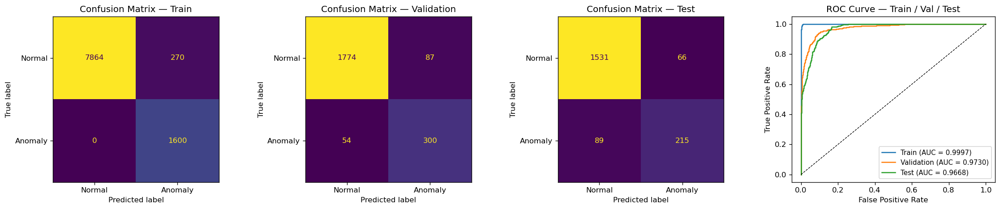

Hongyu LIU
InGen Dynamics - ML & NN Analyst Intern, June 2026

---

## 1. Dataset Overview

A synthetic Aido Rover patrol dataset was generated by a world core to mirror realistic deployment. The dataset captures 15,000 timesteps (25 minutes of continuous operation) across nine sensor channels.

| Property            | Value                                                                        |
| ------------------- | ---------------------------------------------------------------------------- |
| Total samples       | 15,000                                                                       |
| Sampling rate       | 10 Hz                                                                        |
| Duration            | 25.0 min                                                                     |
| Sensor channels     | 9 (gps_lat, gps_lon, lidar_distance, battery_soc, torque_0–3, ambient_temp) |
| Anomaly class       | 15.1% (2,258 samples)                                                        |
| Normal class        | 84.9% (12,742 samples)                                                       |
| Anomaly composition | 1,369 slip-type + 889 stuck-type samples                                     |

**Anomaly generation logic:** Anomalies are a causal mechanical self-fault, not an injected burst. Two fault mechanisms share one binary label: **slip** (one wheel's torque spikes while the other three shed load, so displacement is reduced by `v·(1−0.7·s)`) and **stuck** (all four wheel torques rise together and displacement collapses to `v·(1−s)`). A latent severity `s ~ Beta(2,5)` scales the deviation amplitude for every event, and any active fault is labeled 1 regardless of severity — weak events sink into the noise floor, which is what makes the detection task non-trivial. Torque and battery both respond to the same terrain-driven demand, so the fault↔signal correlation is statistical rather than hardcoded (rough terrain alone also raises torque and drains the battery faster), avoiding label leakage into the feature set.

## 2. Data Quality & Cleaning

0.5% random missingness was injected across the nine sensor channels (simulating random sensor data missing in real world). Forward-fill then backward-fill was applied; the label column was not imputed.

| Metric                         | Value         |
| ------------------------------ | ------------- |
| Missing values before cleaning | 718 (0.53%)   |
| Missing values after cleaning  | 0             |
| Duplicate rows                 | 0             |
| Timestamp gaps                 | 0             |
| Torque outliers (>3 std)       | 0 per channel |
| LiDAR outliers (>3 std)        | 298           |

Only `lidar_distance` produces 3σ outliers, and they correspond to the LiDAR's 200 m no-return dropout spikes (`DROPOUT_P=0.02` in the world core), not to faults. The four torque channels show **zero** 3σ outliers: terrain already spreads torque over a wide, bimodal range (asphalt/gravel low vs. wet-grass/mud high), so a slip/stuck event's added deviation is usually absorbed inside that natural spread rather than pushing past 3 standard deviations. This is the expected consequence of the statistical (not deterministic) fault↔terrain coupling, and it is why a simple 3σ threshold cannot separate faults from rough-terrain driving — the FFT/PCA/RF pipeline below is needed instead.

## 3. Stratified Block Split

Every model this week and next — RF, MLP, 1D-CNN and (Week 3) the RNN/Transformer family — evaluates on one canonical row-level split (`data/rover_stratified_block_split.csv`), built once here and reused by every downstream notebook.

**Why a plain random split does not work:** the 50-step FFT lookback window means adjacent rows share up to 49/50 steps of the same underlying data, and a single fault event (mean duration 31 steps, min 10) spans many rows. A random split — stratified or not — scatters near-duplicate, event-correlated rows across train/val/test, letting a model "recognize" a training event rather than generalize to a new one.

**Method:**

1. **Block segmentation.** The timeline is cut into contiguous blocks at the midpoint of normal-only stretches at least 100 steps long, targeting ~375-step blocks; any block that ends up under 300 steps is merged into a neighbor. This guarantees every fault event sits fully inside exactly one block. Result: 23 blocks (lengths 385–1,346 steps), 0 of 72 fault events split across a block boundary.
2. **Blocks assigned to 7 folds** with `StratifiedGroupKFold`, which balances each fold's row-level anomaly rate while keeping every row of a block on the same side.
3. **Fold roles (val/test/train) chosen from structural statistics, before any model is trained.** `StratifiedGroupKFold` only balances the anomaly *rate*; with just 72 fault events spread across 7 folds, folds still differ in event *difficulty* (duration, count) — an axis the row-level stratification cannot see. Per-fold statistics, computed before any role is assigned:

   | Fold        | Events | Mean duration | Anomaly rate | Duration deviation | Rate deviation | Combined deviation        |
   | ----------- | ------ | ------------- | ------------ | ------------------ | -------------- | ------------------------- |
   | 0           | 12     | 24.4          | 16.8%        | 6.94               | 1.76 pp        | 0.338                     |
   | **1** | 11     | 32.2          | 14.7%        | 0.82               | 0.40 pp        | **0.052 (min)**     |
   | **2** | 9      | 33.8          | 14.8%        | 2.42               | 0.23 pp        | **0.092 (2nd-min)** |
   | 3           | 8      | 40.1          | 14.3%        | 8.76               | 0.76 pp        | 0.330                     |
   | 4           | 9      | 33.7          | 14.0%        | 2.31               | 1.09 pp        | 0.146                     |
   | 5           | 11     | 25.8          | 12.5%        | 5.54               | 2.50 pp        | 0.343                     |
   | 6           | 12     | 33.3          | 18.9%        | 1.89               | 3.83 pp        | 0.315                     |

   (Overall: mean event duration 31.4 steps, anomaly rate 15.05%; deviations are relative to these.)

   **val** is assigned the most representative fold (fold 1) — decisions made on val (early stopping, hyperparameters, decision thresholds) propagate to every downstream model with no correcting mechanism, so it should be the most structurally typical fold available.
4. **test** is assigned the next-most representative fold (fold 2) — its single-fold number carries a little more residual sampling noise. train includes all remaining folds (0, 3, 4, 5, 6 — including the most extreme ones)  , where an unusual fold (very long events, an elevated or depressed anomaly rate) is a diversity asset, not a liability. This selection uses only pre-training structural statistics.
5. **Purge:** the first 50 rows of every block (`WINDOW_MAX=50`, the largest lookback window used anywhere this week or next) are excluded from every model's row set. This guarantees no lookback window — at any window size — ever reaches across a block boundary into a different split.

| Split         | Anchor rows | Normal | Anomaly | Anomaly % |
| ------------- | ----------- | ------ | ------- | --------- |
| Train (70.3%) | 9,734       | 8,134  | 1,600   | 16.4%     |
| Val (16.0%)   | 2,215       | 1,861  | 354     | 16.0%     |
| Test (13.7%)  | 1,901       | 1,597  | 304     | 16.0%     |

Row proportions land close to 70/15/15 . A 7-fold rotation of this same block partition is used in `W02_RF_Benchmark.ipynb`  to check how much a single test fold's score varies given only 72 fault events to draw from.

## 4. Feature Engineering: FFT + Cross-Channel Physical Features

To capture the spectral signature of torque anomalies (sustained high-frequency energy during bursts vs. near-DC content during normal patrol), FFT features were computed over a 50-step sliding window (5 s at 10 Hz) for five channels. All feature-engineering logic (FFT extractor, physical-feature formulas, the full tabular-matrix assembly) lives in `shared_modules/features.py`, imported by this notebook, `W02_Sequence_and_RL_Scaffolding.ipynb`, and `W03_Neural_Network_Baseline.ipynb`, so the formula cannot drift between them.

**Channels transformed:** `torque_0`, `torque_1`, `torque_2`, `torque_3`, `lidar_distance`

**FFT features per channel (5):**

| Feature          | Description                                              |
| ---------------- | -------------------------------------------------------- |
| `dom_freq`     | Frequency of maximum spectral magnitude (Hz)             |
| `centroid`     | Spectral centroid — energy-weighted mean frequency (Hz) |
| `bandwidth`    | Spectral bandwidth — spread around centroid (Hz)        |
| `total_power`  | Sum of squared magnitudes (energy proxy)                 |
| `peak_to_mean` | Ratio of peak to mean spectral magnitude (peakedness)    |

GPS is fed as **per-step deltas** (`gps_dlat`, `gps_dlon`) rather than absolute coordinates: on a fixed map, absolute position is a memorized shortcut to "which spot on the loop", not a transferable fault signal, whereas the slip/stuck mechanism is causally a displacement collapse — exactly what the delta captures.

**Cross-channel physical features.** Both fault mechanisms are defined by a relationship *between* channels — slip is one wheel's torque diverging from the other three; stuck is torque staying high while displacement collapses toward zero — which a per-channel FFT view cannot express on its own. Two features close this gap directly:

| Feature             | Formula                                                    | Fault signature                                                     |
| ------------------- | ---------------------------------------------------------- | ------------------------------------------------------------------- |
| `inter_wheel_std` | std across`torque_0..3` at the current step              | Slip: one wheel spikes, others shed load → high inter-wheel spread |
| `stall_ratio`     | mean wheel torque ÷ (displacement magnitude + 1e-3 floor) | Stuck: high effort, no motion → high ratio                         |

The `1e-3` floor is a fixed physical constant (not fit from data), sized only to prevent division blow-up when the rover is genuinely stationary at a waypoint. For the **tabular matrix** (RF, MLP), each is included at the current step and as a 50-step rolling mean/max (matching the FFT window), for 6 new columns — the rolling statistics let a model with no memory of its own (RF, or an MLP scoring one row at a time) see the trend. For the **window tensor** (1D-CNN and the Week-3 second-half RNN/Transformer family, `W02_Sequence_and_RL_Scaffolding.ipynb`), only the two instantaneous values are added as extra raw channels (9 → 11) — a sequence model performs its own temporal aggregation over the window, so pre-computed rolling statistics would be redundant there.

**Resulting tabular matrix:** 9 raw + 25 FFT + 6 physical = 40 features. After the block-split purge removes each block's first 50 rows, 13,850 samples remain.

**Design rationale:** The 50-step window matches the state look-back in the MDP schema, so FFT features and RL state features are computed over identical temporal contexts, allowing direct comparison between classical and RL representations in later phases.

## 5. PCA

PCA with 95% variance retention was applied to the 40-feature scaled matrix (fit on the train split only).

| Property            | Value  |
| ------------------- | ------ |
| Input dimensions    | 40     |
| Retained components | 19     |
| Variance explained  | 95.14% |

PC1 (torque spectral centroid) carries the largest single share of variance, consistent with the shared terrain-modulated-torque driver behind both fault mechanisms. PC2's top loading is `stall_ratio`, followed by raw torque amplitude — a direct, physically-interpretable axis for the stuck mechanism, distinct from the spectral-shape information PC1 captures. PC5's top-5 loadings include `inter_wheel_std_roll_mean`, alongside torque spectral bandwidth.

**Principal component interpretation (top-5 loadings):**

| PC  | Top contributors                                                        |
| --- | ----------------------------------------------------------------------- |
| PC1 | torque_0–3 spectral centroid, torque_2 peak-to-mean                    |
| PC2 | `stall_ratio`, torque_0–3 raw amplitude                              |
| PC3 | lidar_distance centroid, peak-to-mean, total_power, dom_freq, bandwidth |
| PC4 | torque_0–3 total_power, ambient_temp                                   |
| PC5 | torque_0–3 spectral bandwidth,`inter_wheel_std_roll_mean`            |

## 6. RF Feature Selection — Analysis Only, Not the Deployed Model

A baseline Random Forest (100 trees, unlimited depth) was trained on all 19 PCA components to compute feature importances. Top-K subsets (K = 1 … 19, same importance-ranked order) were scored on validation under two candidate stopping criteria: **accuracy** (the criterion the CNC precedent and the original plan specify) and **F1** (the metric sensitive to the 16%-minority class accuracy is not — a classifier predicting "normal" for every row already scores ~84%). Both use the "minimal K within 2 percentage points / 0.02 of the full-set score" rule; whichever criterion's resulting K gives the higher validation F1 is reported as the minimal-set finding.

**Full-set baseline:** 94.63% val accuracy, 0.8120 val F1 (19 components).

| Criterion | K | Val accuracy | Val F1 |
| --------- | - | ------------ | ------ |
| Accuracy  | 4 | 93.05%       | 0.7701 |
| F1        | 5 | 94.67%       | 0.8275 |

**F1 is adopted.** Interestingly, the F1-selected 5-component subset (0.8275) slightly *exceeds* the full 19-component baseline (0.8120) — with only 19 components most of them contribute little discriminative signal, and the minimal subset avoids diluting the RF's splits with them.

**Comparison to CNC methodology:** the prior CNC wear-detection pipeline (18-channel multi-sensor data, FFT/PCA/RF cascade) selected 2 raw features (Z1 positional channels), achieving 97.81% test accuracy on a near-balanced task with no window-overlap or event-duration structure to leak across a split. The Rover pipeline needs 5 components and a purpose-built physical-feature pair to reach a comparable band on a 16%-imbalanced, event-grouped, no-leakage split — a harder generalization problem by construction, not a weaker pipeline.

## 7. RF Benchmark Results

`StandardScaler → PCA(0.95) → RandomForestClassifier` as a single `sklearn.pipeline.Pipeline`, so every `GridSearchCV` fold refits the scaler and PCA on only that fold's own training rows — no transform computed on data outside a given CV fold ever informs that fold's evaluation. Grid search over `n_estimators ∈ {50, 100, 200}` × `max_depth ∈ {None, 5, 10, 20}` (12 combinations), `StratifiedGroupKFold` 5-fold CV (`groups=block_id`, so no fold splits a fault event or lookback window across its train/held-out portions), F1 scoring, `class_weight='balanced'`. The deployed model uses **all 19 PCA components retained at 95% variance**, not the §6 minimal subset (see §6 for why these are different questions).

**Best hyperparameters:** `n_estimators=200, max_depth=10`  **CV best F1:** 0.7494

### 7.1 Validation-Tuned Decision Threshold

`predict_proba`'s default 0.5 cutoff is an arbitrary convention. Sweeping the threshold on **validation** (never test) to maximise F1, then applying that fixed threshold once to test:

| Threshold        | Test F1 | Test Precision | Test Recall |
| ---------------- | ------- | -------------- | ----------- |
| 0.50 (default)   | 0.7350  | 0.7651         | 0.7072      |
| 0.49 (val-tuned) | 0.7359  | 0.7633         | 0.7105      |

The tuned threshold gives a marginal F1 improvement here — the default 0.5 cutoff was already close to optimal for this fold, unlike the previous fold assignment where tuning moved precision substantially (0.48 → 0.61). Train, validation and test below are all reported at this val-tuned threshold (0.49), not the default 0.5.

### 7.2 Evaluation: Train / Validation / Test Metrics

**Train Metrics**

| Class    | Precision | Recall | F1     |
| -------- | --------- | ------ | ------ |
| Normal   | 1.0000    | 0.9650 | 0.9822 |
| Anomaly  | 0.8488    | 1.0000 | 0.9182 |
| Accuracy |           |        | 0.9707 |

AUC-ROC (train): 0.9997. Confusion matrix (train): TN=7,849, FP=285, FN=0, TP=1,600.

**Validation Metrics**

| Class    | Precision | Recall | F1     |
| -------- | --------- | ------ | ------ |
| Normal   | 0.9725    | 0.9511 | 0.9617 |
| Anomaly  | 0.7696    | 0.8588 | 0.8117 |
| Accuracy |           |        | 0.9363 |

AUC-ROC (val): 0.9730. Confusion matrix (val): TN=1,770, FP=91, FN=50, TP=304.

**Test Metrics**

| Class    | Precision | Recall | F1     |
| -------- | --------- | ------ | ------ |
| Normal   | 0.9456    | 0.9580 | 0.9518 |
| Anomaly  | 0.7633    | 0.7105 | 0.7359 |
| Accuracy |           |        | 0.9185 |

AUC-ROC (test): 0.9668. Confusion matrix (test): TN=1,530, FP=67, FN=88, TP=216.

### 7.3 7-Fold Block-Rotation Robustness Check

With only 72 fault events across 23 blocks, a single test fold's score reflects real sampling variance as much as pipeline quality. Rotating which fold plays test/val through all 7 folds of the canonical partition (the `fold_id` column of `rover_stratified_block_split.csv`; the same `Pipeline(scaler, PCA, RF)` and hyperparameters, refit per rotation on that rotation's own train fold):

| Metric                   | Mean ± Std      | Range          |
| ------------------------ | ---------------- | -------------- |
| F1 @ 0.5 threshold       | 0.7544 ± 0.0596 | [0.685, 0.851] |
| F1 @ val-tuned threshold | 0.7492 ± 0.0481 | [0.697, 0.845] |
| AUC-ROC                  | 0.9595 ± 0.0092 | [0.950, 0.973] |

The canonical test fold (fold 2) sits at the **57th percentile** of this distribution — close to the middle, a direct result of §3's structural fold-selection criterion. One caveat on scope: hyperparameters stay fixed at the canonical-fold grid-search winner across all rotations (no per-fold re-tuning), so this measures evaluation variance under one configuration, not full nested-CV pipeline variance, and likely slightly understates what per-fold re-tuning could reach on each rotation.

## 8. Generalization Analysis

| Split                                 | Anomaly F1       | AUC-ROC          |
| ------------------------------------- | ---------------- | ---------------- |
| CV (5-fold, group-aware, out-of-fold) | 0.7494           | —               |
| Train (tuned threshold)               | 0.9182           | 0.9997           |
| Validation (tuned threshold)          | 0.8117           | 0.9730           |
| Test (default threshold)              | 0.7350           | 0.9668           |
| Test (val-tuned threshold)            | 0.7359           | 0.9668           |
| Test (7-fold rotation mean)           | 0.7544 ± 0.0596 | 0.9595 ± 0.0092 |

Train, validation and test separate in the expected direction — train highest, test lowest of the point estimates — but the gap between validation (0.812) and test (0.736) is now modest, and the 7-fold rotation mean (0.754) sits almost exactly on top of the canonical single-fold number, both consistent with test now being a structurally representative fold rather than an outlier one.

## 9. Latency & Platform Feasibility

Measured with `timeit`, mean over 100 repetitions, timing the full `Pipeline` (scaler + PCA transform + RF predict), not just the classifier's own compute. Aido Rover real-time constraint: **≤ 100 ms** per sample at 10 Hz streaming.

| Criterion                                | Result         |
| ---------------------------------------- | -------------- |
| Test F1 (anomaly class, tuned threshold) | 0.7359         |
| Test AUC-ROC                             | 0.9668         |
| Single-sample inference latency          | 7.856 ms       |
| 1,000-sample batch total                 | 13.95 ms       |
| Latency constraint (Aido Rover, 10 Hz)   | ≤ 100 ms      |
| Deployment verdict                       | **PASS** |

The FFT-PCA-RF pipeline (200 trees, max depth 10, 19 PCA components) runs at 7.9 ms per decision cycle — comfortably within the 100 ms streaming budget. Detection quality (F1 = 0.736 tuned, 0.754 ± 0.060 across the 7-fold rotation) is now a stronger foundation for the Week 3–4 neural and sequence models evaluated on this same split to build on.
