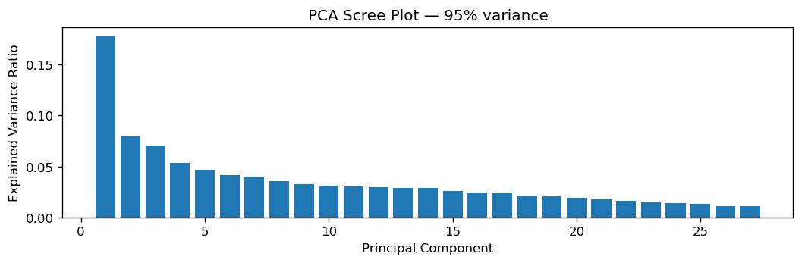
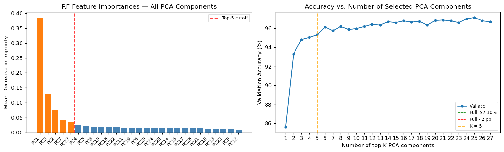
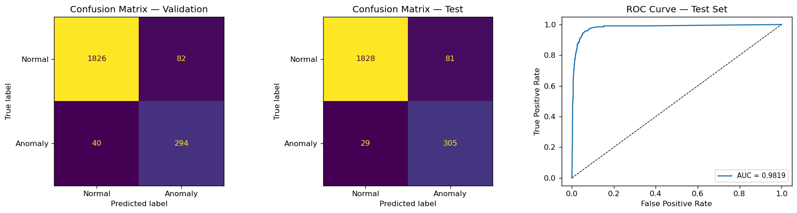

# W02 Feature Analysis Report

Hongyu LIU  
InGen Dynamics - ML & NN Analyst Intern, June 2026

---

## 1. Dataset Overview

A synthetic Aido Rover patrol dataset was generated to mirror realistic deployment conditions at 10 Hz. The dataset captures 15,000 timesteps (25 minutes of continuous operation) across nine sensor channels.

| Property          | Value                                                                        |
| ----------------- | ---------------------------------------------------------------------------- |
| Total samples     | 15,000                                                                       |
| Sampling rate     | 10 Hz                                                                        |
| Duration          | 25.0 min                                                                     |
| Sensor channels   | 9 (gps_lat, gps_lon, lidar_distance, battery_soc, torque_0–3, ambient_temp) |
| Anomaly class     | 14.9% (2,228 samples)                                                        |
| Normal class      | 85.1% (12,772 samples)                                                       |
| Anomaly structure | 30 temporally-clustered bursts, 20–130 steps each (2–13 s)                 |

**Anomaly generation logic:** Anomalous bursts are injected as correlated multi-channel events: wheel torques spike 1.1–1.5 above the 5 Nm baseline , and battery SoC discharges at 0.005 %/step vs. 0.002 %/step in normal operation.

## 2. Data Quality & Cleaning

0.5% random missingness was injected across the nine sensor channels (simulating random sensor data missing in real world). Forward-fill then backward-fill was applied; the label column was not imputed.

| Metric                         | Value                |
| ------------------------------ | -------------------- |
| Missing values before cleaning | 718 (0.48%)          |
| Missing values after cleaning  | 0                    |
| Duplicate rows                 | 0                    |
| Timestamp gaps                 | 0                    |
| Torque outliers (>3 std)       | 128–136 per channel |

The high torque outlier count (128–136 per channel) is expected and informative: these are anomalous burst samples. Clipping them would suppress the primary discriminative signal, so they are retained as-is.

## 3. FFT Feature Extraction

To capture the spectral signature of torque anomalies (sustained high-frequency energy during bursts vs. near-DC content during normal patrol), FFT features were computed over a 50-step sliding window (5 s at 10 Hz) for five channels.

**Channels transformed:** `torque_0`, `torque_1`, `torque_2`, `torque_3`, `lidar_distance`

**Features per channel (5):**

| Feature          | Description                                              |
| ---------------- | -------------------------------------------------------- |
| `dom_freq`     | Frequency of maximum spectral magnitude (Hz)             |
| `centroid`     | Spectral centroid — energy-weighted mean frequency (Hz) |
| `bandwidth`    | Spectral bandwidth — spread around centroid (Hz)        |
| `total_power`  | Sum of squared magnitudes (energy proxy)                 |
| `peak_to_mean` | Ratio of peak to mean spectral magnitude (peakedness)    |

This yields 25 FFT features (5 channels × 5 features), added to the 9 raw sensor values for a 34-dimensional feature matrix covering 14,950 windowed samples (rows 50–14,999 of the cleaned trace).

**Design rationale:** The 50-step window matches the state look-back in the MDP schema , so FFT features and RL state features are computed over identical temporal contexts. This allows direct comparison between classical and RL representations in later phases.

## 4. Train / Val / Test Split

Stratified random splitting was applied to the 34-feature matrix (14,950 samples).

| Split       | Samples | Normal | Anomaly | Anomaly % |
| ----------- | ------- | ------ | ------- | --------- |
| Train (70%) | 10,465  | 8,903  | 1,562   | 14.9%     |
| Val (15%)   | 2,242   | 1,908  | 334     | 14.9%     |
| Test (15%)  | 2,243   | 1,909  | 334     | 14.9%     |

## 5. PCA

PCA with 95% variance retention was applied to the 34-feature scaled matrix.

| Property            | Value  |
| ------------------- | ------ |
| Input dimensions    | 34     |
| Retained components | 27     |
| Variance explained  | 95.73% |

Variance per component (first 10):

| Component | Variance | Cumulative |
| --------- | -------- | ---------- |
| PC1       | 17.78%   | 17.78%     |
| PC2       | 7.98%    | 25.75%     |
| PC3       | 7.04%    | 32.79%     |
| PC4       | 5.36%    | 38.15%     |
| PC5       | 4.64%    | 42.79%     |
| PC6–10   | 18.00%   | 60.79%     |
| PC11–27  | 34.94%   | 95.73%     |

PC1 leads at 17.78%, but variance is more evenly distributed across components compared to a stronger anomaly signal regime. Components PC6–27 capture residual sensor correlations (GPS random walk, temperature seasonality, inter-channel torque covariance) that contribute little discriminative power.

**Principal component interpretation (top-5 loadings):**

| PC  | Top contributors                                                               |
| --- | ------------------------------------------------------------------------------ |
| PC1 | 4 torque total_power, torque_0 centroid                                       |
| PC2 | battery_soc, gps_lon, gps_lat, torque_1, torque_2                              |
| PC3 | 4 torques (raw),  battery_soc                                                |
| PC4 | torque 0,1 bandwidth, ' 'torque 1~3 centroid                                |
| PC5 | lidar centroid, lidar dom_freq, torque 1 bandwidth, torque_2(Raw) ambient_temp |

## 6. RF Feature Selection

A baseline Random Forest (100 trees, unlimited depth) was trained on all 27 PCA components to compute feature importances. Accuracy was then measured for top-K subsets (K = 1 … 27) to find the minimal K within 2 pp of full-set validation accuracy.

**Full-set baseline:**  97.10% val accuracy (27 PCA components)
**2 pp threshold:**  95.10%
**Minimal top-K selected:**  K = 5
**Top-5 val accuracy:**  95.32% (delta = 1.78 pp)

The RF selects the top-5 PCA components — spanning spectral energy (PC1), spatial/battery correlation (PC2), raw torque amplitude (PC3), spectral shape (PC4), and LiDAR/nuisance variation (PC5) — as the minimal sufficient set.

**Comparison to CNC methodology:** In the prior CNC wear-detection pipeline (18-channel multi-sensor data, FFT/PCA/RF cascade), the RF selected exactly 2 features (Z1 positional channels) from a raw feature space, achieving 97.81% test accuracy. The Rover pipeline requires 5 PCA components to achieve 95.32% val accuracy — a wider feature footprint reflecting the subtler and multi-channel nature compared to the CNC positional wear signature.

## 7. RF Benchmark Results

Grid search over `n_estimators ∈ {50, 100, 200}` × `max_depth ∈ {None, 5, 10, 20}` (12 combinations, 5-fold cross-validation, F1 scoring, `class_weight='balanced'`).

**Best hyperparameters:** `n_estimators=50, max_depth=20`  **CV best F1:** 0.8279

**Validation Metrics**

| Class    | Precision | Recall | F1     |
| -------- | --------- | ------ | ------ |
| Normal   | 0.9786    | 0.9570 | 0.9677 |
| Anomaly  | 0.7819    | 0.8802 | 0.8282 |
| Accuracy |           |        | 0.9456 |

AUC-ROC (val): 0.9702

**Test Metrics**

| Class    | Precision | Recall | F1     |
| -------- | --------- | ------ | ------ |
| Normal   | 0.9844    | 0.9576 | 0.9708 |
| Anomaly  | 0.7902    | 0.9132 | 0.8472 |
| Accuracy |           |        | 0.9510 |

AUC-ROC (test): 0.9819

The model achieves high anomaly recall (91.3%) with moderate precision (79.0%), consistent with a class-weighted classifier prioritising detection over false-alarm reduction.

The deployed model operates at 2.11 ms per sample, this headroom is sufficient to accommodate the full preprocessing pipeline (FFT window computation + PCA transform) in the production path.

## 8. Latency & Platform Feasibility

Measured with `timeit`, mean over 100 repetitions. Aido Rover real-time constraint: **≤ 100 ms** per sample at 10 Hz streaming.

| Criterion                              | Result         |
| -------------------------------------- | -------------- |
| Test F1 (anomaly class)                | 0.8472         |
| Test AUC-ROC                           | 0.9819         |
| Single-sample Inference latency        | 2.11 ms        |
| 1,000-sample batch total4.67 ms        | 4.67 ms        |
| Latency constraint (Aido Rover, 10 Hz) | ≤ 100 ms      |
| Deployment verdict                     | **PASS** |

The FFT-PCA-RF pipeline is feasible for real-time Aido Rover deployment. The classifier trained on 5 PCA components achieves F1=0.847 on the anomaly class with AUC-ROC=0.982 while running at approximately 2 ms per decision cycle — comfortably within the 100 ms streaming budget.

