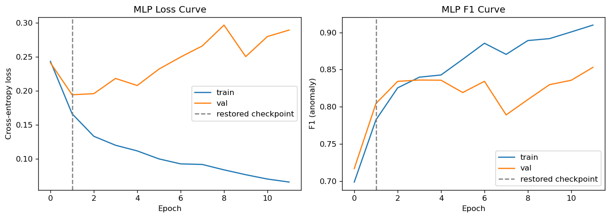
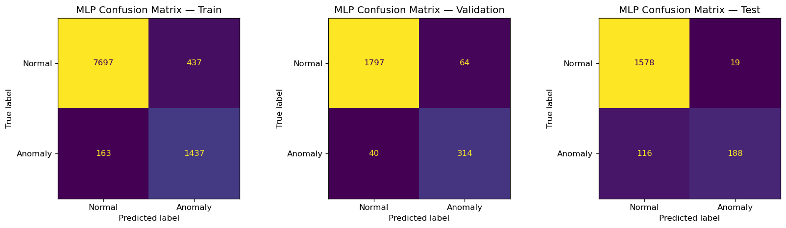
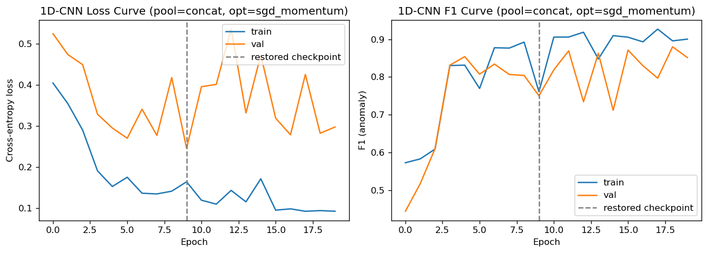
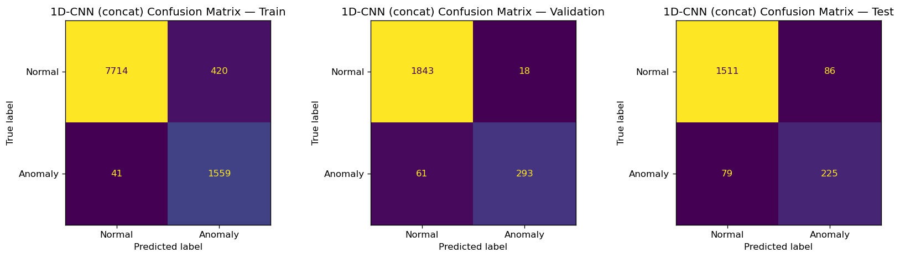
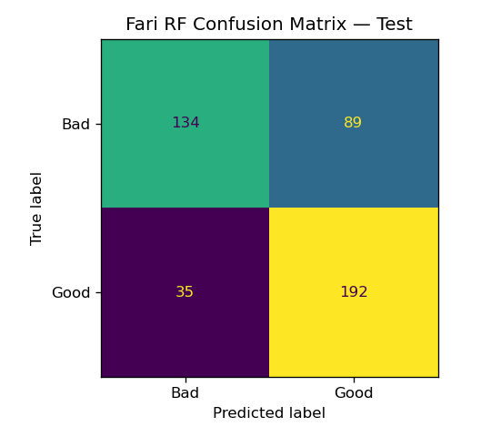
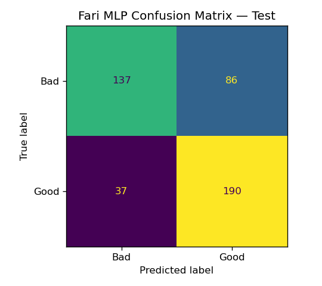

Hongyu LIU
InGen Dynamics - ML & NN Analyst Intern, June 2026

---

## 1. Setup

**Platforms:** Aido Rover (MLP + 1D-CNN anomaly detection) · Fari (MLP + RF interaction-quality, second task)
**Seed:** 42 · **Sampling rate:** 10 Hz (Aido Rover)

The MLP and 1D-CNN both evaluate on the canonical `data/rover_stratified_block_split.csv` (13,850 anchor rows: train 9,734 / val 2,215 / test 1,901, 16.4% / 16.0% / 16.0% anomaly) — the same split `W02_RF_Benchmark.ipynb` uses, so all three model families are compared on identical rows.

The MLP consumes the 40-D raw+FFT+physical feature matrix (`shared_modules/features.py`, no PCA — a network's hidden layers can learn their own nonlinear combinations, so reducing the input through a linear projection chosen for RF would only discard information).

The 1D-CNN consumes the Week-2 windowed tensor (`rover_windows.npz`, 50-step/5 s windows, 11 channels: 9 raw sensor + 2 physical features) — a sequence model aggregates over the window itself via convolution, so the rolling mean/max the tabular matrix needs would be redundant here.

Every model uses class-weighted cross-entropy to compensate the unbalanced anomaly rate without resampling, up to 100 epochs with early stopping (patience 10, restored to the best-val-loss checkpoint), batch size 128. Per the project's fold-evaluation protocol: architecture ablations, early stopping, and threshold tuning stay on this single canonical fold; the final cross-model comparison `model_ledger.csv` retrains the locked config across all 7 canonical fold rotations and compares mean ± std F1/AUC.

## 2. MLP Baseline

**Architecture:** `40 → 64 → 32 → 2` — two hidden layers funnel down from the 40-D feature input to the 2-way output: wide enough at the first layer (64) to combine the raw/FFT/physical features nonlinearly, narrowing (32) before the classification head to keep parameter count modest against the ~9.7K training rows.

### 2.1 Design Choices

| Choice     | Options tested                             | Winner                                    | Rationale                                                                                                                                                                                                                                                                                                                                                                               |
| ---------- | ------------------------------------------ | ----------------------------------------- | --------------------------------------------------------------------------------------------------------------------------------------------------------------------------------------------------------------------------------------------------------------------------------------------------------------------------------------------------------------------------------------- |
| Activation | ReLU / LeakyReLU(0.01)                     | ReLU (difference not significant)         | Standardized inputs are zero-centered (GPS deltas, FFT`dom_freq`/`centroid` can be negative), so a fraction of pre-activations are negative on every pass — LeakyReLU keeps a small gradient flowing there instead of zeroing it (dying-unit risk). The two options' val loss/F1 sit within 1 std of each other (table below), so ReLU is the nominal pick, not a resolved effect. |
| Dropout    | 0.2 / 0.3 / 0.5                            | 0.3 (difference not significant)          | Tuned on validation loss; all three rates land within 1 std of each other.                                                                                                                                                                                                                                                                                                              |
| Optimiser  | Adam(lr=1e-3) / SGD(lr=1e-2, momentum=0.9) | SGD+momentum (difference not significant) | Tuned on validation loss; the two optimisers' val-loss ranges overlap within 1 std.                                                                                                                                                                                                                                                                                                     |
| Loss       | Class-weighted cross-entropy               | —                                        | Compensates the 16.4% train anomaly rate without resampling                                                                                                                                                                                                                                                                                                                            |

Each ablation runs 3 seeds (42, 43, 44) per candidate, selected on mean validation loss, with the resulting std used as the noise floor behind the "not significant" calls above:

| Ablation     | Val loss (mean ± std) | Val F1 (mean ± std) |
| ------------ | ---------------------- | -------------------- |
| ReLU         | 0.1870 ± 0.0181       | 0.8247 ± 0.0159     |
| LeakyReLU    | 0.1877 ± 0.0188       | 0.8265 ± 0.0145     |
| Dropout 0.2  | 0.1905 ± 0.0177       | 0.8289 ± 0.0169     |
| Dropout 0.3  | 0.1870 ± 0.0181       | 0.8247 ± 0.0159     |
| Dropout 0.5  | 0.1888 ± 0.0190       | 0.8225 ± 0.0132     |
| Adam         | 0.1870 ± 0.0181       | 0.8247 ± 0.0159     |
| SGD+momentum | 0.1762 ± 0.0128       | 0.8270 ± 0.0160     |

A finer decision between these near-tied candidates would need the project's 7-fold protocol applied per candidate.

### 2.2 Final Training, Learning Curves, Fit Diagnosis

**Fit diagnosis.** Early stopping restores the checkpoint from epoch 2 (12 epochs run, patience 10). Read as a gradient-dynamics system: SGD's momentum term carries updates along the previous descent direction rather than the instantaneous gradient alone, so loss decays fast at first while train and val move together on the same broad slope, then decouples once further train-loss descent starts fitting train-specific noise. Both curves are read in eval mode (dropout off) for both splits, so the decoupling is a genuine fit signal, not a dropout-in-training-pass artifact.

**Val-loss vs. F1 divergence.** Past the restored checkpoint, val loss climbs (0.19 → 0.30 by epoch 8) while val F1 keeps rising to ~0.85 by epoch 11 — the two curves disagree on when the model stops improving. This is a calibration effect, not a discrimination one: rising val loss after the checkpoint reflects the model's predicted probabilities becoming more extreme (confidently wrong on a growing minority of val rows), while F1 keeps improving because the ranking of anomaly probability continues to sharpen. Checkpoint train F1 0.7823, val F1 0.8043 (gap −0.0220, val above train — consistent with dropout being active during training but off during eval, so a checkpoint this early in training still has some capacity headroom). Because test-time predictions use a val-tuned threshold rather than the raw argmax, which does not depend on absolute calibration, selecting the checkpoint on val F1 instead of val loss would likely have captured more of this later-epoch improvement — a candidate refinement for a future rerun, not applied here since it would change the ablation protocol used to reach this checkpoint.

### 2.3 Evaluation

Test-time predictions use a validation-tuned decision threshold (max F1 on val, applied unchanged to test) rather than the default t=0.50, which is not the operating point a class-weighted loss actually optimises for.

**Val-tuned threshold: 0.76** (val F1 0.8579 vs. 0.8043 at default t=0.50).

| Split      | Precision (anomaly) | Recall (anomaly) | F1 (anomaly) | AUC-ROC |
| ---------- | ------------------- | ---------------- | ------------ | ------- |
| Train      | 0.7668              | 0.8981           | 0.8273       | 0.9833  |
| Validation | 0.8307              | 0.8870           | 0.8579       | 0.9776  |
| Test       | 0.9082              | 0.6184           | 0.7358       | 0.9677  |

**Threshold transfer.** Test confusion matrix: TN=1578, FP=19, FN=116, TP=188. Test F1 at the val-tuned threshold (0.7358) trades a little F1 away versus the default t=0.50 (0.7406) — a much smaller version of the val→test transfer gap the 1D-CNN shows more severely. The test operating point leans precision (0.908 vs. 0.618 recall).

### 2.4 Latency

| Metric                           | Result         |
| -------------------------------- | -------------- |
| Single-sample inference (CPU)    | 0.1351 ms      |
| 1,000-sample batch (CPU)         | 0.1161 ms      |
| Aido Rover constraint (≤100 ms) | **PASS** |

### 2.5 7-Fold Block Rotation

The fixed config (ReLU, dropout 0.3, SGD+momentum) is retrained from scratch across all 7 canonical fold rotations (scaler refit per rotation on that rotation's own train fold only, threshold re-tuned on that rotation's val fold):

| Fold        | F1 @ 0.5         | F1 @ tuned       | Tuned threshold | AUC              |
| ----------- | ---------------- | ---------------- | --------------- | ---------------- |
| 0           | 0.7150           | 0.7770           | 0.86            | 0.9938           |
| 1           | 0.8043           | 0.7567           | 0.36            | 0.9776           |
| 2           | 0.7419           | 0.7537           | 0.39            | 0.9630           |
| 3           | 0.8338           | 0.8134           | 0.67            | 0.9734           |
| 4           | 0.8900           | 0.8606           | 0.95            | 0.9884           |
| 5           | 0.5844           | 0.8581           | 0.83            | 0.9887           |
| 6           | 0.7948           | 0.7358           | 0.95            | 0.9653           |
| Mean ± std | 0.7663 ± 0.0914 | 0.7936 ± 0.0472 | —              | 0.9786 ± 0.0112 |

**Discrimination vs. calibration stability.** AUC is stable across folds (0.963–0.994) — the model's ranking of anomaly probability holds up under a changing data regime — but the val-tuned threshold itself swings from 0.36 to 0.95 fold to fold (fold 5 at t=0.5 scores F1=0.58 despite AUC=0.989). Discrimination is robust; a single fixed operating point is not — any deployment needs the threshold recalibrated on the target distribution rather than carried over from one canonical fold.

## 3. 1D-CNN Baseline

**Architecture:** `Conv1d(11→32, k=3) → ReLU → Conv1d(32→64, k=3) → ReLU → [pooling head] → FC(→32) → ReLU → Dropout → FC(32→2)`.

### 3.1 Kernel-Size

At 10 Hz (0.1 s/step), a `k=3` convolution has a 0.3 s receptive field; two stacked layers give 0.5 s — far shorter than the measured anomaly-duration distribution (mean 3.1 s / 31 steps, median 2.75 s, minimum 1.0 s, from the causal fault generator's run-lengths in `synthetic_rover_data.csv`). This is intentional: `k=3` is sized to detect the local onset transient (a torque-spike edge between adjacent timesteps), not to span the whole multi-second fault; the pooling head then integrates that local edge evidence over the entire 50-step (5 s) window, which does match the anomaly-duration scale, to produce the window-level call. This connects to the Week-2 FFT view: the FFT features computed the same window's spectral signature analytically (dominant frequency, centroid, bandwidth); the CNN instead learns its own bank of local filters over the same temporal window, discovering an equivalent representation rather than being told the basis.

### 3.2 Pooling Head Selection

A short anomaly transient (~3.1 s mean) inside a 5 s window raises a dilution concern for global average pooling — averaging over the full window could wash out a short high-signal segment. Global average, global max, and concat (average + max concatenated) are treated as a first-class architecture choice rather than fixed to the plan's original GAP default, using the same two-phase protocol: 3-seed canonical-fold comparison first, then promoting any pool within 1 std of the winner to a full 7-fold rotation.

**Canonical-fold (3 seeds):**

| Pool      | Val loss (mean ± std) | Val F1 (mean ± std) |
| --------- | ---------------------- | -------------------- |
| Avg (GAP) | 0.4575 ± 0.0101       | 0.5103 ± 0.0088     |
| Max       | 0.3051 ± 0.0309       | 0.8208 ± 0.0344     |
| Concat    | 0.2868 ± 0.0162       | 0.8552 ± 0.0200     |

**GAP dilution confirmed.** GAP is a clear loser (val F1 ≈ 0.51) — the dilution concern is confirmed. Concat and max are within 1 std of each other, so both are promoted to the 7-fold rotation:

| Pool   | 7-fold F1 @ 0.5  | 7-fold F1 @ tuned          | 7-fold AUC       |
| ------ | ---------------- | -------------------------- | ---------------- |
| Concat | 0.7810 ± 0.0789 | **0.7894 ± 0.0588** | 0.9692 ± 0.0112 |
| Max    | 0.7448 ± 0.0628 | 0.6770 ± 0.1655           | 0.9638 ± 0.0154 |

**Stability, not canonical-fold accuracy, decides the winner.** Max's canonical-fold F1 (0.821) looked competitive with concat's (0.855), but its 7-fold std (0.166) is nearly 3× concat's (0.059) — the canonical fold alone would have picked an unstable model. Concat is the final pooling choice, confirmed on the full rotation rather than the single fold.

### 3.3 Ablation — Optimiser (Adam vs SGD+momentum)

Pooling fixed at the §3.2 winner (concat), dropout at 0.3, activation at ReLU. 3 seeds per config (42, 43, 44), selected on mean validation loss — the same protocol as the MLP's §2.1 optimiser ablation, run here to check whether Adam (hardcoded in the CNN's training function, never previously compared for this architecture) is actually the better choice.

| Optimiser    | Epochs (mean) | Val loss (mean ± std)     | Val F1 (mean ± std)       | Winner                                     |
| ------------ | ------------- | -------------------------- | -------------------------- | ------------------------------------------ |
| Adam         | 25.3          | 0.2849 ± 0.0270           | **0.8418 ± 0.0288** | —                                         |
| SGD+momentum | 27.7          | **0.2361 ± 0.0546** | 0.8324 ± 0.0554           | SGD+momentum(difference not significant) |

**SGD+momentum wins on mean val loss and is adopted for the rest of §3.** The 0.0488 gap sits just inside SGD+momentum's own std (0.0546) — a similarly tight margin to the MLP's optimiser ablation.

### 3.4 Final Training, Learning Curves, Fit Diagnosis

**Fit diagnosis.** Early stopping restores the checkpoint from epoch 10 (20 epochs run, patience 10, SGD+momentum). Train loss/F1 improve smoothly and monotonically across all 20 epochs — no overfitting signal on the train side itself. Val loss and F1 are highly oscillatory from around epoch 3 onward rather than following the MLP's single-turning-point shape (§2.2): val loss swings between roughly 0.25 and 0.47 over the remaining epochs instead of climbing monotonically, and the restored checkpoint (epoch 9) lands on one of the lower points of that oscillation — a genuine local val-loss minimum, but not a stable one. Checkpoint train F1 0.7606, val F1 0.7500 (gap +0.0106) — this val F1 also sits in a local dip of the same oscillation (later epochs reach val F1 ~0.85–0.88 at a higher val loss), the same val-loss-vs-F1 divergence the MLP shows in §2.2, more pronounced here because of the larger oscillation amplitude. The CNN receives the same two physical-feature channels (`inter_wheel_std`, `stall_ratio`) as the MLP, but only as instantaneous per-timestep values; it must learn both that they matter and how to aggregate them over the window through convolution and pooling, whereas the MLP gets that aggregation for free from the hand-engineered rolling mean/max — a plausible driver of any remaining CNN-vs-MLP gap on top of the pooling and optimiser choices.

### 3.5 Evaluation

**Val-tuned threshold: 0.78** (val F1 0.8812 vs. 0.7500 at default t=0.50).

| Split      | Precision (anomaly) | Recall (anomaly) | F1 (anomaly) | AUC-ROC |
| ---------- | ------------------- | ---------------- | ------------ | ------- |
| Train      | 0.7878              | 0.9744           | 0.8712       | 0.9897  |
| Validation | 0.9421              | 0.8277           | 0.8812       | 0.9667  |
| Test       | 0.7235              | 0.7401           | 0.7317       | 0.9585  |

**Threshold transfer.** The val-tuned threshold helps test F1 here (0.7317 vs. 0.6993 at default t=0.50) — the tuning transfers cleanly, unlike the MLP where tuning trades a little F1 away. The test operating point leans recall (0.740 vs. 0.724 precision) — the opposite lean from the MLP's precision-heavy operating point.

### 3.6 Latency

| Metric                           | Result         |
| -------------------------------- | -------------- |
| Single-sample inference (CPU)    | 0.1516 ms      |
| 1,000-sample batch (CPU)         | 4.7824 ms      |
| Aido Rover constraint (≤100 ms) | **PASS** |

### 3.7 7-Fold Block Rotation

| Fold        | F1 @ 0.5         | F1 @ tuned       | Threshold | AUC              |
| ----------- | ---------------- | ---------------- | --------- | ---------------- |
| 0           | 0.6847           | 0.7254           | 0.83      | 0.9566           |
| 1           | 0.8736           | 0.8736           | 0.50      | 0.9609           |
| 2           | 0.4994           | 0.6205           | 0.68      | 0.9165           |
| 3           | 0.8458           | 0.5270           | 0.94      | 0.9866           |
| 4           | 0.8488           | 0.8600           | 0.84      | 0.9778           |
| 5           | 0.7436           | 0.7631           | 0.80      | 0.9813           |
| 6           | 0.8162           | 0.7456           | 0.84      | 0.9737           |
| Mean ± std | 0.7588 ± 0.1226 | 0.7307 ± 0.1147 | —        | 0.9648 ± 0.0221 |

**A large, unstable spread across folds.** 7-fold F1@tuned mean 0.7307 ± 0.1147 — a std more than double the MLP's (§2.5, 0.0472), and larger than any fold-to-fold gap the MLP's own rotation shows. Fold 3 is the clearest symptom: F1@0.5 = 0.8458 but F1@tuned collapses to 0.5270 at a val-selected threshold of 0.94 — the val fold's own F1-maximizing threshold happened to sit at an extreme operating point that does not transfer to that rotation's test fold, a val→test transfer failure the single-canonical-fold ablation in §3.3 has no way to detect (it only ever compares one val loss/F1 number per config, never a second, independent test fold).

**The canonical-fold ablation under-detects instability.** §3.2 already established that a canonical-fold-only comparison can prefer a choice (there, max pooling) that turns out far less stable once rotated across all 7 folds — the same pattern recurs here for the optimiser: §3.3's 3-seed canonical-fold ablation showed SGD+momentum and Adam within roughly one std of each other, giving no warning of the instability this rotation reveals. A future iteration could extend the §3.2-style stability check (7-fold rotation before committing) to the optimiser choice as well, not just pooling.

## 4. Cross-Model Comparison

`data/model_ledger.csv` records mean ± std F1/AUC over the 7 canonical fold rotations for every Rover model, at each model's fixed, already-selected configuration (no per-fold re-tuning) — the same treatment `W02_RF_Benchmark.ipynb` established for RF:

| Model                         | Latency (ms) | F1 (mean ± std)           | AUC (mean ± std)          | Verdict (≤100 ms) |
| ----------------------------- | ------------ | -------------------------- | -------------------------- | ------------------ |
| RandomForest                  | 7.856        | 0.7492 ± 0.0481           | 0.9595 ± 0.0092           | PASS               |
| MLP                           | 0.135        | **0.7936 ± 0.0472** | **0.9786 ± 0.0112** | PASS               |
| 1D-CNN (concat, SGD+momentum) | 0.152        | 0.7307 ± 0.1147           | 0.9648 ± 0.0221           | PASS               |

**Detection quality.** The MLP now leads clearly: its F1 mean (0.7936) sits about 0.06 above the CNN's (0.7307), a gap larger than either model's own std, and the CNN's std (0.1147) is more than double the MLP's (0.0472). RF trails both models at 0.7492 ± 0.0481.

**Latency margin.** All three latencies clear the 100 ms Aido Rover gate by two to three orders of magnitude — at this sampling rate, detection quality (F1/AUC), not inference latency, remains the binding constraint.

## 5. Fari Interaction-Quality Second Task

**Purpose:** test whether the classical + neural pipeline generalises to a non-sensor, non-time-series tabular task. 3,000 synthetic samples, 5 features (`response_length`, `sentiment_score`, `topic_coherence`, `latency_ms`, `follow_up_rate`), binary label `good_interaction` (50.3% positive). The label is drawn from a logistic function of a weighted, standardized combination of the five features plus Gaussian noise — positive sentiment, high topic coherence, low latency, and a high follow-up rate raise the probability of a "good" interaction; response length carries a smaller positive weight. The noise keeps classes statistically rather than deterministically separable, mirroring the Rover label's design. Rows are independently sampled with no temporal or window structure, so a plain stratified 70/15/15 split is the correct (non-leaking) choice here, unlike the Rover tasks above.

Because the label is a noisy Bernoulli draw of the true generative probability (not the probability itself), no classifier that sees only the 5 features can exceed the F1 of thresholding that true probability at 0.5 — **Bayes-optimal ceiling F1 = 0.7867**, and bounds how much of a sub-ceiling score is noise floor versus room to improve.

| Model                                              | Test F1 (tuned) | Test F1 (default t=0.5) | Test AUC | Val-tuned threshold |
| -------------------------------------------------- | --------------- | ----------------------- | -------- | ------------------- |
| RF (grid search:`n_estimators=100, max_depth=5`) | 0.7559          | 0.7585                  | 0.8077   | 0.43                |
| MLP (`5→16→8→2`, ReLU, dropout 0.3, Adam)     | 0.7555          | 0.7505                  | 0.8229   | 0.40                |

  
  

**Generalisation result.** Both pipelines ran unmodified on this 5-D non-sensor task and land within 0.03 F1 of each other and within 0.03–0.04 of the Bayes ceiling — evidence that the methodology (not just the Rover-specific feature engineering) transfers across domains, and that neither model is meaningfully under-performing given the label's built-in noise floor.
