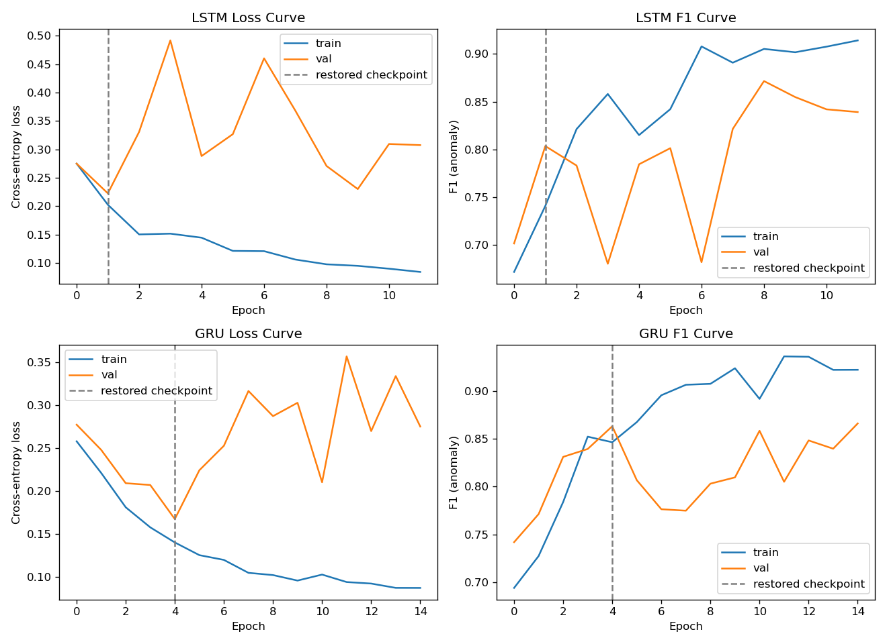
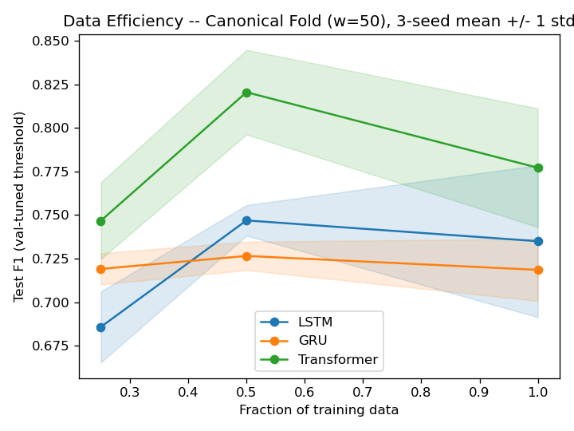
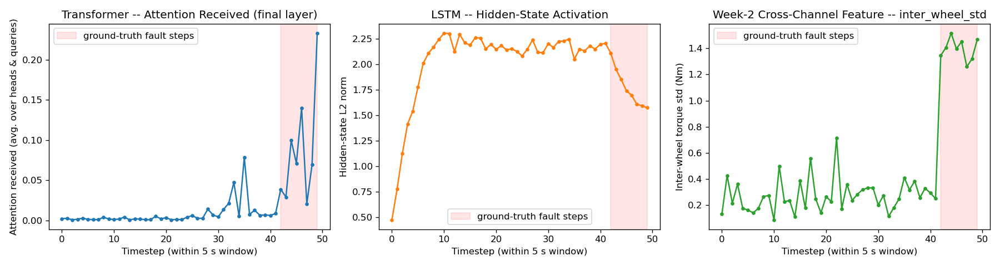
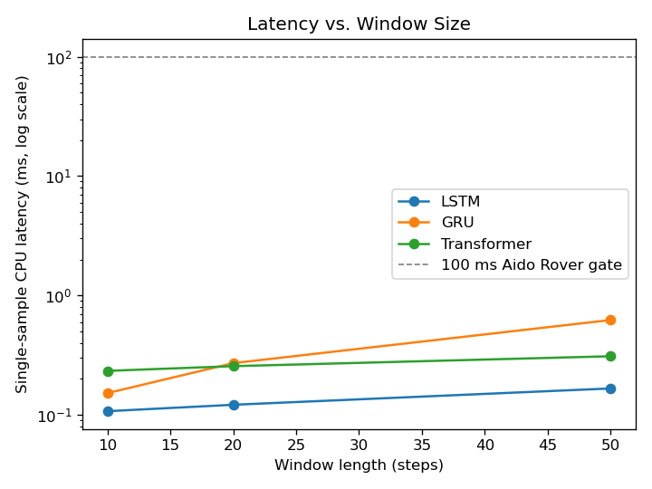

Hongyu LIU  
InGen Dynamics - ML & NN Analyst Intern, July 2026

---

## 1. Setup

**Platform:** Aido Rover (LSTM / GRU / Transformer-encoder anomaly detection)  
**Seed:** 42 · **Sampling rate:** 10 Hz · **Gate:** ≤100 ms single-sample inference

All three sequence models train on the Week-2 windowed tensor (`rover_windows.npz`) over the canonical block split — train 9,734 / val 2,215 / test 1,901 windows (16.4% / 16.0% / 16.0% anomaly), the same rows every other model family uses. Protocol carried over unchanged from the W03 first half: class-weighted cross-entropy, Adam(lr=1e-3), batch 128, early stopping on val loss (patience 10, best checkpoint restored), val-tuned decision threshold applied unchanged to test, and the two-phase fold protocol (design on the canonical fold, locked config retrained across all 7 fold rotations for the ledger).

**Window size — w=50 (5 s), chosen against the measured fault-duration distribution.** Anomaly run-lengths in the stream: n=72, mean 3.14 s, median 2.75 s, min 1.0 s, max 7.8 s. A window fully contains 2.8% of fault runs at w=10, 30.6% at w=20, and 87.5% at w=50 — only the 5 s window sees most faults whole, and even for the 7.8 s tail it still holds 5 s of in-fault evidence, above the mean fault duration. w=10/20 are reused only as latency variables (§5).

**Label semantics.** A window's label is the anchor step's `anomaly_label`, where the anchor is the step immediately after the 50-step buffer — the task is "is the rover in a fault state now, given the preceding 5 s", not "did the buffer contain an anomaly". This matters for interpretation: an anomalous window can hold anywhere from 0 to 50 in-window fault steps depending on where the fault started, and §4 uses exactly that coverage to locate the residual misses.

## 2. Architectures

| Model | Configuration | Params | Rationale in one line |
| --- | --- | --- | --- |
| LSTM | 1 layer, unidirectional, hidden 64, final-state head, dropout 0.3 | 19.8K | width-matched baseline; single forward pass = the streaming deployment form |
| GRU | same, 3-gate cell | 14.9K | isolates the gate-mechanism difference from everything else |
| Transformer | 2 layers, 4 heads, d_model 64, ff 128, dropout 0.1, sinusoidal PE, mean-pool head | 67.8K | one attend-then-refine round, sized to ~9.7K training windows |

**Transformer hyperparameter justification** (chosen narratively at a fixed configuration; a layers/heads/d_model sweep is out of scope for one notebook):

- **d_model=64** — matches the LSTM/GRU hidden size and the MLP's first hidden layer, so every model reads the same width. Equal width is *not* equal parameters, though: a 2-layer attention encoder holds 67.8K weights against the RNNs' 14.9K/19.8K, so a param-matched control (Transformer-S, d_model=32, 17.5K) is run in §3 to separate architecture from capacity.
- **nhead=4** — divides d_model evenly (16 dims/head); more heads on an 11-channel input would leave each head too narrow a subspace to be individually meaningful.
- **num_layers=2** — one attend-then-refine round; ~9.7K training windows do not support a deeper stack without overfitting risk.
- **dim_feedforward=128** — the conventional 2× d_model expansion.
- **dropout=0.1** (vs 0.3 for the MLP/CNN/RNNs) — attention already mixes information across all 50 positions, a strong implicit regulariser, so heavier explicit dropout would bottleneck training without a matching overfitting benefit.
- **Sinusoidal, not learned, positional encoding** — fixed window length and modest data; a learned 50×64 table buys no smooth-ordering prior that the sinusoidal form doesn't give for free.
- **Mean-pooling, not a CLS token** — CLS pays off with large-scale pretraining; for a from-scratch classifier this small, mean-pooling produces the many-to-one vector without an extra learned token.
- **No causal mask** — the buffer is complete at classification time; every position is already in the past.

Bidirectional RNNs were rejected (double the recurrent compute for a modest gain, and it muddies the linear-vs-quadratic cost comparison in §5 — a single forward pass is also the form a streaming deployment runs).

## 3. Head-to-Head Results

**Canonical fold** (val-tuned threshold, test split):

| Model | Threshold | Test P (anomaly) | Test R (anomaly) | Test F1 | Test AUC | Confusion (TN/FP/FN/TP) |
| --- | --- | --- | --- | --- | --- | --- |
| LSTM | 0.49 | 0.638 | 0.714 | 0.6739 | 0.9610 | 1474 / 123 / 87 / 217 |
| GRU | 0.65 | 0.777 | 0.711 | 0.7423 | 0.9733 | 1535 / 62 / 88 / 216 |
| Transformer | 0.87 | 0.952 | 0.658 | 0.7782 | 0.9861 | 1587 / 10 / 104 / 200 |

**7-fold block rotation** (the ledger standard; per-fold standardization and threshold re-tuned per rotation):

| Model | Params | 7-fold F1 (mean ± std) | 7-fold AUC (mean ± std) | Epochs to best (canonical) |
| --- | --- | --- | --- | --- |
| LSTM | 19.8K | 0.7038 ± 0.1590 | 0.9694 ± 0.0137 | 2 (of 12) |
| GRU | 14.9K | 0.7468 ± 0.0818 | 0.9747 ± 0.0062 | 5 (of 15) |
| Transformer (d=64) | 67.8K | 0.8289 ± 0.0688 | 0.9822 ± 0.0045 | 18 (of 28) |
| *Transformer-S (d=32, param-matched control)* | 17.5K | 0.7604 ± 0.0522 | 0.9698 ± 0.0138 | — |
| *(context: MLP)* | — | 0.7936 ± 0.0472 | 0.9786 ± 0.0112 | — |
| *(context: 1D-CNN)* | — | 0.7307 ± 0.1147 | 0.9648 ± 0.0221 | — |
| *(context: RF)* | — | 0.7492 ± 0.0481 | 0.9595 ± 0.0092 | — |

**Detection quality is a near-tie once capacity is controlled.** The single-number ledger ranks the Transformer first (F1 0.8289, AUC 0.9822, tightest AUC spread ±0.0045), but two controls dissolve most of that lead. First, *paired per-fold t-tests* (7 folds as paired samples): the Transformer's F1 edge is **not significant against the MLP** (mean +0.035, p=0.34 — and the MLP holds the better worst fold, 0.736 vs 0.690), only borderline against the GRU (p=0.05), and clearly significant only against the RF (p=0.01). Second, a *param-matched control* (Transformer-S, d_model=32, 17.5K params — GRU/LSTM scale): 7-fold F1 falls 0.8289 → **0.7604** and becomes statistically **indistinguishable from the GRU** (p=0.76) while trailing the MLP. So detection accuracy does not separate these architectures at equal capacity — MLP, GRU, RF and Transformer-S form one near-tie, and only the 67.8K-param Transformer pokes above it, at 4.5× the weights. The latency headroom (§5) makes those extra parameters effectively free to spend, but the ledger's top line is a capacity result, not an attention-mechanism one.

**What attention does bring, independent of capacity, is localisation (§4) — an interpretability asset, not an accuracy one.** Self-attention gives every position direct access to every other timestep in one non-causal pass, so late-window fault evidence reaches the pooled decision vector without surviving 50 steps of sequential state propagation; §4 shows this as attention landing on the true fault span. That property is real and useful (it points an operator at *where* the fault is) but distinct from per-parameter detection quality, which the controls above show it does not have. The full Transformer's canonical operating point is precision-heavy (0.952 precision / 0.658 recall at t=0.87): only 10 false positives per 1,901 windows, with misses concentrated in one fault type (§4).

**Convergence — RNNs converge in epochs, the Transformer needs ~4× longer.** Best-val checkpoints at epoch 2 (LSTM), 5 (GRU), 18 (Transformer). The recurrent inductive bias (sequential integration) fits this task's shape almost immediately; attention has to learn *what* to attend to from scratch, and repays the extra epochs with a higher single-number ceiling — which, per the capacity control above, is bought with 4.5× the parameters rather than by the attention mechanism itself.

**Gate mechanism — GRU beats LSTM decisively on stability.** LSTM is the least fold-stable model in the entire ledger (±0.159): fold-3's val-tuned threshold (0.86) collapses its test F1 to 0.386 while its AUC on the same fold is 0.970 — a threshold-calibration failure, not a discrimination failure, the same val→test transfer fragility the 1D-CNN showed in the first half. The GRU, with 3 gates and no separate cell state, has less to fit on ~9.7K windows and transfers its threshold more consistently (±0.082). Per-fold detail is in `model_ledger.csv` (`fold_0..6`, `auc_fold_0..6`).

**Data efficiency (3 seeds × {25%, 50%, 100%} of the train fold, canonical fold):** Transformer leads at every fraction — 0.747 ± 0.022 at 25%, 0.821 ± 0.024 at 50%, 0.777 ± 0.034 at 100%; LSTM 0.686/0.747/0.735, GRU 0.719/0.727/0.719. No model improves significantly from 50% to 100% (all deltas within ~1 seed-std, including the Transformer's apparent dip — **not significant**): at this data scale the binding factor is what the architecture extracts per window, not window count.

## 4. Attention Interpretability — Anchored to Ground Truth

Each test window's per-step fault mask is reconstructed from the canonical split's anchor rows, so "which timesteps does it attend to" is answered against where the fault actually sits, not by eyeballing a curve.

All three panels share one time axis over the same 50-step window, so the two learned views can be read against the Week-2 engineered channel that carries the fault.

**Attention localises the fault span without per-step supervision.** On the selected onset window (a slip fault occupying the last 8 of 50 steps) attention-received is near-zero for 4.2 s and rises an order of magnitude inside the true fault span. Across all 267 eligible anomalous test windows: median fault/normal attention selectivity **5.3×**, above 1 in **98%** of windows. The per-head maps show all four final-layer heads keying on the same span.

**The LSTM registers the fault as a state-regime shift, not a localised mark.** Its hidden-state norm saturates during normal operation and shifts regime once fault steps arrive, but the per-step state change is barely more concentrated on fault steps than elsewhere (median ratio 1.15, >1 in 57% of windows) — a causal state smears evidence forward, which is precisely why the final-state readout is fragile when evidence sits mid-window.

**The Week-2 cross-channel feature is the reference for where the fault is.** `inter_wheel_std` — one of the 11 input channels, not a post-hoc diagnostic — steps from 0.27 Nm across the 42 normal steps to 1.40 Nm across the 8 fault steps (5.1×), with the jump landing on the onset step itself. Attention mass concentrates on those same steps, so the two agree on the fault's location; because attention operates on the projected `d_model` embedding, this is temporal co-location with the discriminative feature, not evidence that the model reads that channel specifically. The slip mechanism is why the engineered channel is the one that fires: the spiking wheel is redrawn every step (`w = rng.integers(0, 4)` inside the world core's step function), so the fault is visible as cross-wheel spread at each instant rather than as any single channel's temporal pattern — for this window the spiking wheel cycles through wheels 2 and 3 and never touches `torque_0`, whose fault-step statistics (25.10 ± 0.44 Nm) are indistinguishable from its normal-step ones (25.24 ± 0.42).

**Where the residual misses live — stuck-type steady state, not onset scarcity.** Stratifying the canonical Transformer's 304 anomalous test windows two ways — by fault coverage *inside* the 50-step window, and by the *total* run length of the fault (which can exceed the window, up to ~78 steps). Both partitions cover all 304 windows and reconcile to the same 200 detections (recall 0.658).

*By in-window fault coverage:*

| In-window fault steps | n | Detection rate |
| --- | --- | --- |
| 0 | 6 | 0.000 |
| 1–10 | 60 | 0.683 |
| 11–25 | 144 | 0.812 |
| 26–50 | 94 | 0.447 |

*By fault-run length (type proxy):*

| Fault-run length | n | Detection rate |
| --- | --- | --- |
| slip-range (<30 steps) | 80 | 0.762 |
| ambiguous (30–40) | 95 | 0.926 |
| stuck-range (>40) | 129 | 0.395 |

The ambiguous band's 0.926 sits above the slip band not because it is easier by type but because longer runs carry more in-window evidence — the confound that makes the stuck band (>40, the *most* evidence yet only 39.5% caught) the informative result.

Zero-evidence windows (fault starts exactly at the anchor) are undetectable by construction — a ~2% irreducible recall floor. Detection rises with in-window evidence up to 25 steps, then *falls* for nearly-full windows; the run-length proxy resolves the paradox: stuck-type faults (39.5% caught) raise all four torques together with no cross-wheel asymmetry, so once the onset transient scrolls out of the buffer a steady-state stuck fault is nearly indistinguishable from heavy terrain. Slip faults, whose single-wheel spike + torque shedding is exactly what the engineered cross-channel features carry, are caught reliably. This is the concrete recall ceiling for all window models on this task, and the first candidate for Phase-D improvement (terrain-conditioned features or longer context).

## 5. Latency and the 100 ms Gate

| Model | Single-sample (ms) | 1,000-batch (ms) | w=10 / w=20 / w=50 (ms) | Verdict |
| --- | --- | --- | --- | --- |
| LSTM | 0.191 | 15.4 | 0.14 / 0.16 / 0.21 | **PASS** |
| GRU | 0.666 | 31.9 | 0.17 / 0.29 / 0.64 | **PASS** |
| Transformer | 0.519 | 71.6 | 0.61 / 3.04* / 0.72 | **PASS** |

**Latency does not separate these models at this platform's scale.** All three sit 150–500× under the 100 ms gate at the justified window length. Fitting each model's measured points to its theoretical scaling form (linear for the RNNs, quadratic for attention) and extrapolating to the gate puts the crossover at thousands to tens of thousands of steps — hundreds of seconds of buffer, far beyond anything the 3.1 s mean fault duration justifies; at w≤50 the Transformer's measured latency is dominated by fixed per-inference overhead, not the quadratic term (*the w=20 outlier above is CPU-scheduling noise, illustrating why only the order of magnitude is read from these micro-benchmarks). The window-length choice is therefore governed by detection quality alone here — the same horizon-vs-compute tradeoff a real-time motion planner faces, but on the comfortable side of it; the quantitative mapping to the quadrotor thesis planner is deferred to the W04 report's thesis-connection section.

## 6. Verdict

- **Recommended default for rover anomaly detection: MLP** — its F1 (0.7936 ± 0.0472) is statistically indistinguishable from the Transformer's (paired p=0.34), with the better worst-fold F1 (0.736 vs 0.690), the lowest fold variance and the lowest latency of any model (0.14 ms), and the simplest deployment/maintenance footprint. On this evidence it is the most defensible pick.
- **Transformer as a considered alternate — chosen on interpretability, not accuracy.** It posts the best single-number F1/AUC and the tightest AUC spread, but that edge is not significant against the MLP and vanishes at matched parameters (Transformer-S 0.7604, tied with the GRU at p=0.76); it costs 4.5× the parameters and ~4× the latency of the MLP. Its one real differentiator is fault **localisation** (5.3× attention selectivity onto the true fault span, §4) — genuinely valuable on a security rover for pointing an operator at *where* a fault is. Prefer it only where that capability is operationally worth the extra cost.
- **GRU over LSTM** wherever a recurrent model is preferred: same protocol, +0.043 F1, half the fold spread; the LSTM's extra capacity is a liability at this data scale.
- **Known ceiling:** steady-state stuck-type faults (39.5% recall) — a feature/context problem, not an architecture problem, queued for Phase D.
- Ledger updated: LSTM / GRU / Transformer rows with per-fold F1/AUC columns; all six models PASS the 100 ms gate. Param-matched capacity control (Transformer-S) and paired-fold significance tests in §3.
