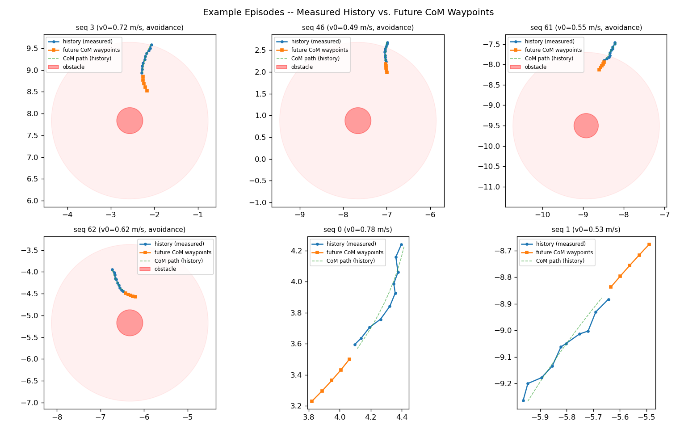
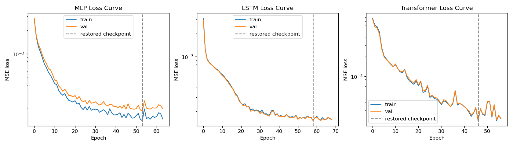
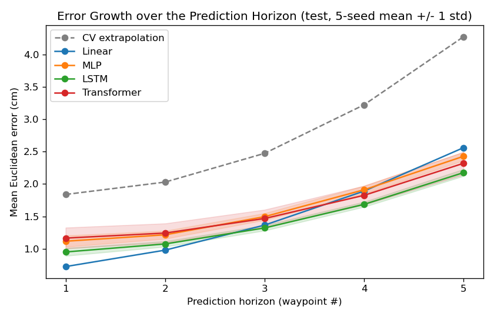
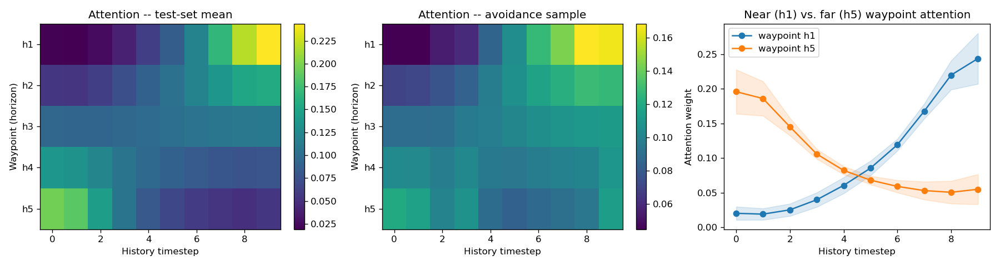
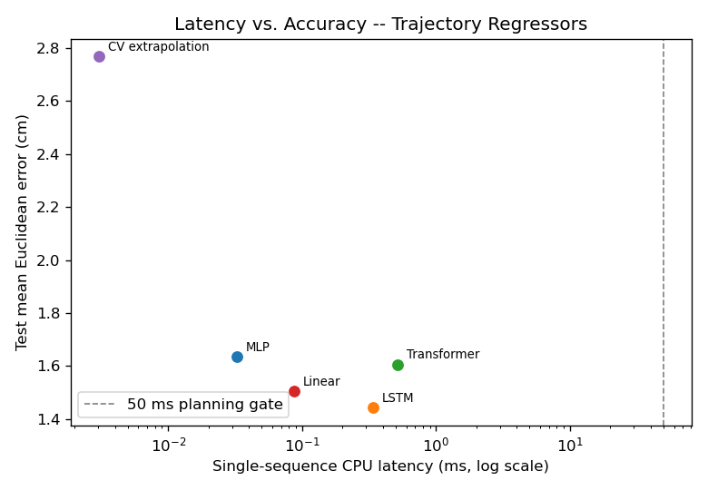

Hongyu LIU  
InGen Dynamics - ML & NN Analyst Intern, July 2026

---

## 1. Setup

**Platform:** Aido Humanoid (trajectory prediction) · Aido Rover (motion context)
**Seed:** 42 (canonical) · 5 training seeds (42–46) for all neural regressors
**Task:** from 10 timesteps of robot state (8 features), regress the next 5 trajectory waypoints (x, y)
**Constraint:** ≤50 ms motion-planning latency — plan-defined (the quadrotor planning-frequency link). The product docs contain no 50 ms figure for the Humanoid (they specify 10 ms whole-body MPC and <150 ms grasp planning); per project convention the plan's number is applied and the discrepancy is recorded here.

Notebook: `W04_Trajectory_Prediction.ipynb`. Data artifact: `data/synthetic_humanoid_motion.csv` (75,000 rows = 5,000 sequences × 15 steps, with the canonical split stored per sequence).

**Reporting-standard mapping for a regression task.** The mandatory standard's confusion matrix and per-class precision/recall/F1 are classification-specific; their full-error-accounting equivalent here is the per-horizon Euclidean error table plus the avoidance/clean stratification (§4). Split sizes, hyperparameters and seeds, learning curves, `timeit` latency, and the feasibility verdict are reported as usual.

## 2. Synthetic Motion Dataset

**Generative design.** Each sequence is 1.5 s of base motion at a 10 Hz planner tick (10 history steps + 5 future steps): the GRPO gait planner replans the base path at roughly this rate on top of the 100 Hz whole-body MPC, and 0.5 s ahead is the scale over which the next footsteps are committed. The motion model composes, per the plan's spec, a smooth quadratic base path plus noise plus obstacle-avoidance adjustments, each grounded in a product parameter:

| Component           | Implementation                                                                                                                                 | Product grounding                                                                       |
| ------------------- | ---------------------------------------------------------------------------------------------------------------------------------------------- | --------------------------------------------------------------------------------------- |
| Quadratic base path | constant world-frame lateral acceleration,\|a\| ≤ 0.4 m/s²                                                                                   | position exactly quadratic in time                                                      |
| Walking speed       | v₀ ~ U(0.2, 0.95) m/s, hard limit 1.1 m/s                                                                                                     | 1.1 m/s nominal walk speed                                                              |
| Obstacle avoidance  | 0.3 m obstacle 1–3 m ahead (~50% of episodes); inside 1.5 m clearance the velocity is*steered* away (≤1.5 rad/s), speed preserved          | turning, not accelerating, is how a walking platform evades; speed limit still enforced |
| Gait sway           | lateral base oscillation at half the step cadence (≈1.4 + 0.4·v steps/s), 1–3 cm amplitude                                                  | ZMP bipedal walking oscillates the base around the CoM path                             |
| Measurement         | position = swaying base + 1 cm noise; velocity = CoM velocity + 2 cm/s noise; obstacle clearance in 3 heading-relative LiDAR sectors, 5 m clip | visual-inertial localisation ≈ cm level; head LiDAR range 5 m                          |

**Targets and frame.** Targets are the next 5 *smooth CoM path* points relative to the last estimated pose — the frame a deployed planner actually has. The models therefore have to filter the gait sway and sensor noise out of the history as well as anticipate curvature and the avoidance manoeuvre; the sway (1–3 cm) is comparable to the horizon-1 displacement (mean 6.4 cm), so near-horizon accuracy is essentially a state-filtering problem while far-horizon accuracy is a dynamics-anticipation problem.

**Split.** Every sequence is an independent episode (own start, speed, curvature, obstacle geometry, sway phase), so rows carry no cross-sequence dependence and a plain i.i.d. 70/15/15 split by sequence (3,500 / 750 / 750) is leakage-free — the group-split machinery the Rover stream needs does not apply here.

**Generation sanity checks** (all in-notebook): speeds span 0.20–1.10 m/s and never exceed the walk limit; 49.6% of episodes carry an obstacle and avoidance actually triggers in 38.1%; minimum obstacle clearance across all avoidance episodes is 0.14 m (no collisions); mean target magnitude grows 6.4 → 31.0 cm from waypoint 1 to 5.

## 3. Models and Protocol

| Model               | Form                                                                                                                                   | Parameters |
| ------------------- | -------------------------------------------------------------------------------------------------------------------------------------- | ---------- |
| CV extrapolation    | last measured velocity carried forward                                                                                                 | 0          |
| Linear Regression   | flattened 80-D history → 10 outputs, closed form                                                                                      | 810        |
| MLP                 | 80 → 128 → 64 → 10, ReLU, dropout 0.1                                                                                               | 19,274     |
| LSTM                | hidden 64, final state → linear head to all 5 waypoints                                                                               | 19,594     |
| Transformer seq2seq | 2-layer encoder (d_model 64, 4 heads, ff 128) + 5 learned horizon queries cross-attending over the encoded history, shared linear head | 84,738     |

The CV floor is the zero-parameter physics baseline every learned model must beat for the learning to mean anything; Linear sets the bar for everything a linear map can capture (constant velocity, average curvature, linear denoising). LSTM hidden size and Transformer d_model stay at 64, capacity-matched to the W03 sequence models. The LSTM head is many-to-one (final state → all 5 waypoints jointly): the future depends on one summary of the whole history, and a 5-step autoregressive decoder would add exposure bias for no capacity gain at this horizon. Dropout is 0.1 rather than the classification models' 0.3 — regression targets are metric coordinates, so heavy activation dropout directly inflates output noise instead of just regularising a decision boundary. The Transformer's horizon-query decoder was chosen over an autoregressive decoder because it keeps the model sized to a 5-point regression and makes per-waypoint attention over the history directly readable (§5).

Training protocol is carried over from W03 unchanged: Adam(lr=1e-3), batch 128, ≤100 epochs, early stopping on val MSE (patience 10, best checkpoint restored); no per-model optimiser tuning, so differences are attributable to architecture.

### 3.1 Learning Curves and Fit Diagnosis (canonical seed)

Canonical-seed best val MSE: MLP 1.85e-4 (epoch 54 of 64), LSTM 1.51e-4 (epoch 59 of 69), Transformer 2.12e-4 (epoch 47 of 57). The three loss curves (log scale) show three distinct training regimes:

**MLP — the only model that overfits.** Train and val separate visibly from ~epoch 15 and the gap widens to ~30% by the end (train keeps descending, val plateaus with wobble around 2.3e-4). A fully-connected map on the flattened 80-D input has no weight sharing to constrain it, so it spends capacity memorising training-set sway/noise realisations — the classic failure mode for this input encoding, held in check only by early stopping.

**Is the MLP's gap fixable? Yes — and fixing it is not worth it.** A controlled regularisation check (§4.1 of the notebook: dropout 0.1→0.3 and Adam weight decay 1e-4/1e-3, 5 seeds, everything else fixed):

| Config                       | Val MSE (×1e-4) | Val−train gap (×1e-4) | Test Euclid (cm)       |
| ---------------------------- | ---------------- | ----------------------- | ---------------------- |
| baseline (dropout 0.1, wd 0) | 1.93 ± 0.11     | 0.47                    | **1.63 ± 0.06** |
| dropout 0.3                  | 2.42 ± 0.07     | 0.32                    | 1.87 ± 0.04           |
| wd 1e-4                      | 2.24 ± 0.07     | 0.13                    | 1.79 ± 0.02           |
| wd 1e-3                      | 7.40 ± 0.25     | −0.02                  | 3.16 ± 0.03           |

Every regulariser that closes the gap raises both validation MSE and test error — monotonically with strength, down to a fully-closed gap that doubles the error (wd 1e-3). The gap is therefore benign capacity, not harmful memorisation: with early stopping selecting the val-loss minimum, the un-regularised MLP's extra capacity is what buys its best achievable fit, and the train/val separation is the price of that capacity rather than a defect to engineer away. The baseline config is kept (also preserving protocol parity); the structural fix for this failure mode is not regularisation but weight sharing — which is exactly the LSTM, already the better model.

**LSTM — train and val move together to the lowest floor.** The two curves are essentially superimposed for all 69 epochs and flatten smoothly from ~epoch 40: weight sharing across timesteps acts as a strong structural regulariser, and the model reaches the best validation floor of the three without any train/val divergence — consistent with it also having the smallest seed variance (±0.04 cm) in §4.

**Transformer — unstable optimisation, not overfitting.** Train and val stay together (no memorisation gap) but the descent is noisy, with loss spikes mid-training and oscillation around the restored checkpoint. The instability is an optimisation-landscape problem — attention layers on 3,500 short sequences under a fixed lr=1e-3 with no warmup — and it foreshadows the 3× seed-to-seed variance in §4: different seeds land on different sides of these oscillations. A tuned schedule could smooth this, but was excluded to preserve protocol parity (§8).

## 4. Results

Test-set mean Euclidean error (cm), 5-seed mean ± std for the neural models (CV/Linear are deterministic):

| Model            | Mean                   | h1   | h2   | h3   | h4   | h5             |
| ---------------- | ---------------------- | ---- | ---- | ---- | ---- | -------------- |
| CV extrapolation | 2.77                   | 1.84 | 2.03 | 2.47 | 3.22 | 4.28           |
| Linear           | 1.50                   | 0.73 | 0.98 | 1.37 | 1.89 | 2.56           |
| MLP              | 1.63 ± 0.06           | 1.12 | 1.22 | 1.50 | 1.91 | 2.43           |
| **LSTM**   | **1.44 ± 0.04** | 0.95 | 1.08 | 1.32 | 1.69 | **2.18** |
| Transformer      | 1.60 ± 0.15           | 1.17 | 1.24 | 1.47 | 1.83 | 2.32           |

**Error grows superlinearly with horizon for every model.** From waypoint 1 to 5 the CV error grows 2.3× and every learned model roughly 2–3.5×: near-horizon error is dominated by the sway/noise floor (the 1–3 cm gait oscillation sits directly on top of a 6.4 cm mean displacement), while far-horizon error is dominated by unanticipated velocity change — curvature and avoidance steering compound quadratically in time, which is exactly the mechanism that makes long planning horizons expensive for any predictive planner.

**The task is mostly linear — and the per-horizon crossover shows where it isn't.** Linear Regression beats the MLP and the Transformer on the aggregate and is the best model of all at waypoints 1–2 (0.73 cm at h1): closed-form least squares is an optimal linear filter for the sway+noise around a quadratic path, and no SGD-trained network matches it on that sub-problem. The ordering inverts at waypoints 4–5, where the LSTM (2.18 cm) and Transformer (2.32 cm) pull ahead of Linear (2.56 cm) — anticipating how the current steering rate unfolds is the nonlinear part of the task.

**The nonlinear gain lives almost entirely in the avoidance episodes.** Splitting the canonical-seed test error by whether avoidance steering was actually active (273 of 750 episodes):

| Model            | Avoidance mean | Avoidance h5   | Clean mean | Clean h5 |
| ---------------- | -------------- | -------------- | ---------- | -------- |
| CV extrapolation | 3.50           | 6.07           | 2.35       | 3.25     |
| Linear           | 1.91           | 3.52           | 1.27       | 2.01     |
| MLP              | 2.14           | 3.48           | 1.31       | 1.82     |
| LSTM             | **1.73** | **2.86** | 1.29       | 1.86     |
| Transformer      | 2.09           | 3.16           | 1.62       | 2.09     |

On obstacle-free episodes Linear and the LSTM are indistinguishable (1.27 vs 1.29 cm); on avoidance episodes at the far horizon the LSTM improves on Linear by ~19% (2.86 vs 3.52 cm) — the sector-clearance features are informative of the future swerve, and only the nonlinear models convert them.

**Significance.** LSTM is the best neural model on every horizon and carries the smallest seed variance; its lead over Linear on the aggregate (1.44 ± 0.04 vs 1.50) is ~1.4 seed-std — thin on aggregate, clear on avoidance-h5. Transformer-vs-MLP and Transformer-vs-Linear differences sit within ~1 seed-std (**not significant**). The Transformer also has ~3× the seed-to-seed variance of the other two networks (±0.15): at 3,500 training sequences of 10 steps, 84.7K parameters of attention machinery are under-determined.

**Capacity control confirms the diagnosis is over-parameterization, not tuning.** A param-matched Transformer-S (d_model=32, 21.9K params — LSTM scale; notebook §5.3) **halves the seed variance** (±0.15 → ±0.07 cm) and nudges the mean to 1.52 cm (within noise of the d=64's 1.60), yet still trails the LSTM (1.44). The variance was a data-scale effect, not a mis-set learning rate. This is the exact inverse of W03, where the *same* d=32 shrink *cost* 0.07 F1: capacity paid off there (50-step windows) and is wasted here (10-step sequences). With only two tasks this length-vs-payoff reading is a consistent pattern, not a proven mechanism — task type and dataset size differ too — but the direction is clear and reproducible.

## 5. Attention over the Horizon

**Near waypoints read the present; far waypoints read the past.** The attention centre-of-mass over the 10-step history moves monotonically earlier as the horizon grows — h1 ≈ step 6.7, h2 ≈ 5.6, h3 ≈ 4.7, h4 ≈ 3.9, h5 ≈ 3.1. Waypoint 1 concentrates on the last two steps (weight ≈ 0.24 at step 9), where the current velocity is essentially the answer; waypoint 5 concentrates on the earliest steps (≈ 0.20 at step 0), which anchor the velocity/curvature *trend* that must be extrapolated 0.5 s out — including how fast the sector clearance was closing in the avoidance episodes. The avoidance sample shows the same structure sharpened. This is the learned analogue of a receding-horizon planner weighting instantaneous state for the immediate control step but trend/context for the tail of its horizon.

## 6. Latency and the 50 ms Gate

Single-sequence CPU inference (deployment shape: one history per planner tick), `timeit`, warm-up excluded:

| Model            | Single (ms) | Batch (full test set, 750) (ms) | ≤50 ms verdict |
| ---------------- | ----------- | ------------------------------- | --------------- |
| CV extrapolation | 0.003       | —                              | **PASS**  |
| MLP              | 0.033       | 0.33                            | **PASS**  |
| Linear           | 0.087       | —                              | **PASS**  |
| LSTM             | 0.338       | 2.67                            | **PASS**  |
| Transformer      | 0.513       | 7.83                            | **PASS**  |

**Reading the latency–accuracy plane.** The frontier is nearly degenerate: with every model 2–4 orders of magnitude left of the 50 ms gate, the x-axis buys nothing. Four of the five models are technically non-dominated (CV → MLP → Linear → LSTM trade a little latency for a little accuracy, all at irrelevant absolute cost); the one model strictly inside the envelope is the Transformer, dominated by the LSTM on both axes. Sub-millisecond CPU readings jitter run-to-run even with warm-up, so only the ordering and orders of magnitude are read from this table — none of the conclusions turn on a tenth of a millisecond.

**Feasibility judgment.** Every regressor clears the plan's 50 ms gate by two or more orders of magnitude, so at this input scale latency does not constrain model choice — accuracy and robustness do. The plan's specific question — does the Transformer's accuracy gain justify its latency — resolves negatively at this data scale: it is the slowest model *and* less accurate than the LSTM with higher seed variance, so there is no axis on which it wins. The deployable recommendation is the LSTM (best accuracy, ~0.3 ms), with Linear Regression as a defensible minimal-footprint alternative wherever the motion context is known to be obstacle-free.

## 7. Limitations and Candidate Refinements

- **Single static obstacle, steering-only avoidance.** No moving obstacles, no SEOM-style slowdown near humans, at most one avoidance manoeuvre per episode. Richer interaction would raise the nonlinear share of the task and likely widen the LSTM/Transformer margin over Linear; the current world deliberately stays at the plan's spec.
- **No per-model hyperparameter tuning.** Protocol parity with W03 was kept so architecture is the only variable. The one capacity variant that was run (Transformer-S, d_model=32, §5.3) does close part of the Transformer's gap — halving its seed variance and reaching 1.52 cm — but still trails the LSTM, so its weakness here is a data-scale issue, not a tuning one. A full learning-rate/schedule sweep is left out to preserve comparability.
- **Frame normalization.** Inputs are translation-normalized but not rotation-normalized; rotating each history into the last-heading frame would remove a nuisance factor at the cost of no longer exposing raw heading to the models. Left as a controlled follow-up.
- **Avoidance-split std.** The §4 avoidance/clean table is canonical-seed; the 5-seed protocol covers the aggregate and per-horizon numbers.
