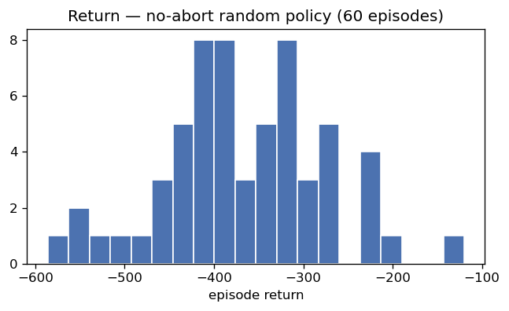
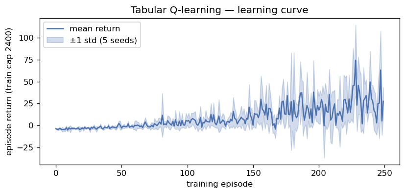
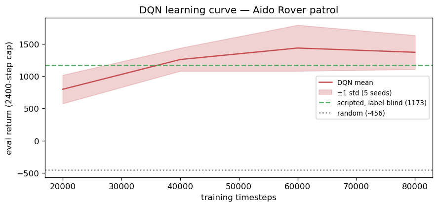
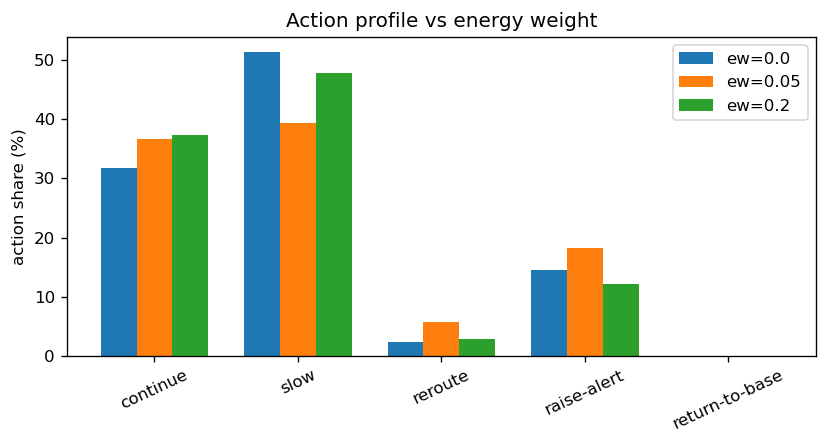
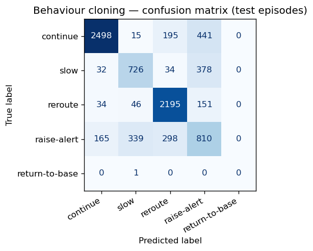
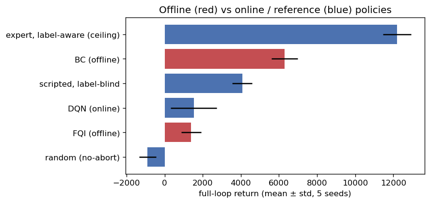
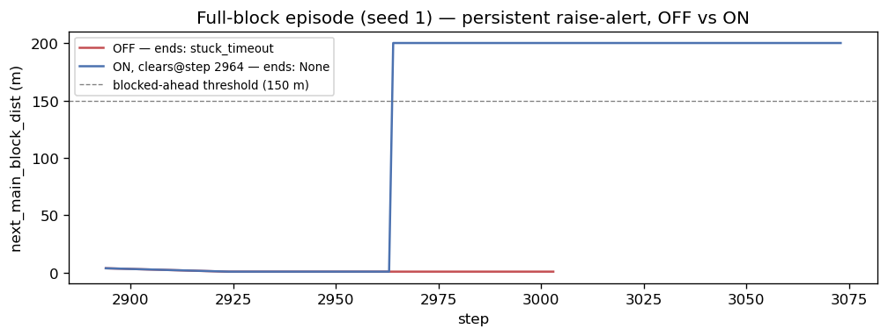

Hongyu LIU  
InGen Dynamics - ML & NN Analyst Intern, July 2026

---

**Platform:** Aido Rover (patrol / anomaly-response policy)  
**Seed:** 42 · **γ = 0.99** · **Deployment gate:** ≤100 ms single-step policy inference

## 1. Overview

Week 5 turns the Week-2 MDP scaffolding into a trainable problem: a Gymnasium environment that wraps the same world core the offline transition table was generated from, value-based agents (tabular Q-learning and DQN) trained to the RL evaluation standard, a reward-shaping ablation, and offline learning (behaviour cloning + fitted-Q) from the fixed Week-2 data. The through-line is that a policy network is an MLP at inference — so the latency findings from the supervised weeks transfer directly — while the hard part moves from model fitting to reward and evaluation design.

**Headline results.**

- The strongest *deployable* policy is behaviour cloning (return 6,287 vs the label-blind rule baseline's 4,072), and the correct framing is privileged-information distillation: BC recovers ~27% of the gap to a label-aware expert (12,199) using sensors alone.
- Both value methods fail in instructive, diagnosable ways — DQN over-alerts (213 false alarms / 1k steps) and never learns to reroute, driving into full-block dead ends; FQI's over-alerting is horizon truncation (mean max-Q 35 at 12 iterations, reroute recovering only once the horizon lengthens), not distribution shift.

## 2. MDP Formulation

The formal specification is `rl/mdp_schema.md`; this section states the choices the Week-5 results depend on. The **state** is the 9-D vector of window statistics over the last 50 steps (torque mean/max/std, LiDAR mean, SoC slope, current SoC) plus a position summary (route progress, distance to the next main-route and branch blockage). Absolute GPS is excluded to prevent position leakage — the terrain is fixed, so faults recur at fixed coordinates and a coordinate feature would memorise them.

The **action** set is discrete: continue, slow, reroute, raise-alert, return-to-base. Two actions have real effects in the world core (slow halves speed and lowers the fault-trigger probability; reroute takes the branch at the next node); raise-alert and return-to-base have no motion effect in the core, with return-to-base ending the episode. The **reward** is a `(label, action)` table conditioned on three context flags (halted, main-route-blocked, rough-terrain) so that the same nominal action can be correct in one context and wrong in another; the full table and its per-cell rationale are in the schema. The **discount** γ = 0.99 is anchored to the PIC 2.0 GRPO product-config range (γ = 0.975–0.995 across InGen platforms).

## 3. Environment & the Offline↔Online Alignment Gate

The environment `rl/rover_env.py` wraps `shared_modules.rover_world.RoverWorld` so the online env and the Week-2 offline table share one dynamics core. The single correctness risk is **reward timing**: the offline generator conditions each reward on the state *before* the action executes (the label, halted flag and block distances are read at `s`, then the world advances to `s'`). The natural Gym implementation — advance the world, then compute the reward from what `step` returned — conditions on `s'` and is silently wrong, because `slow`'s mitigation would lower the fault roll inside the very step whose label the reward reads. The env therefore caches the conditioning variables at reset and after each step and applies them on the next `step(a)` call. The 50-step observation window is warmed up in `reset()` by rolling exactly 50 `continue` steps, matching the offline generator so the world RNG stream stays aligned.

**The alignment gate** replays the offline episode-0 action sequence through the env from the same seed and initial SoC and asserts per-step reward and next-state equality. It passes: across 5,931 replayed transitions the reward matches to machine precision (max |Δ| = 2.8×10⁻¹⁷) and the next-state to float32 precision (max |Δ| = 1.5×10⁻⁵, the env returning a float32 observation while the CSV stored float64). This is the concrete evidence that offline data and online env are the same MDP — a prerequisite for the offline-vs-online comparison in §7 to be meaningful. The environment also passes Stable-Baselines3's `check_env`, and random-policy rollouts confirm all three termination paths (return-to-base, battery depletion, full-block stuck-timeout) are reachable before any training.

*Figure 1 — Return distribution of the no-abort random policy (60 episodes). Returns cluster around −350: random action accrues energy and false-alarm penalties with no compensating patrol discipline, and every episode simply runs to the 2,400-step cap (this policy never chooses return-to-base). It is a sanity floor — the mechanics run and reward accrues sensibly — against which the scripted expert's +3,180 over the same horizon confirms the signal is learnable well above it.*

**Episode horizon.** Training uses a 2,400-step truncation (surfaced as `truncated`, so SB3 bootstraps the value at the cap rather than treating it as terminal) with randomised resets — a fresh world seed and initial SoC ~ U(40, 100) per episode — for blockage-layout and battery diversity; a fixed 100%-SoC start over the full 9,600-step loop would never reach the 20% auto-dock region within one episode, so the agent would never see the low-battery states it must act on. Evaluation uses the deterministic full 9,600-step loop.

## 4. Reward Design and the Patrol / Auto-Dock Tension

One reward property is worth stating because it explains a behaviour common to every agent trained here. Under the base reward, normal patrolling pays +0.95 per step (+1.0 continue − 0.05 energy), so the return-maximising behaviour is to **patrol until the battery forces termination**, not to auto-dock at 20%.

**The size of the gap, quantified.** At the decision point where SoC has just fallen below 20%, return-to-base pays a one-off −1.05 (−3.0 unwarranted-abort + 2.0 low-SoC shaping − 0.05 energy) and then ends the episode, so all subsequent reward is zero. Continuing to patrol pays +0.95 per step, and draining 20% → 0% takes roughly 6,000 steps at this discharge rate, worth about +0.95/(1 − γ) ≈ **+95** discounted. The comparison is −1.05 against +95: the shaping bonus would need to be ~50× larger to flip it.

**Why return-to-base usage is 0% everywhere.** The same domination holds in *every* state, not just the low-SoC one — at high SoC it is −3.05 against +0.95/step, at low SoC −1.05 against +95 — so no state exists where return-to-base is the argmax, and a return-maximising agent correctly never selects it. Three methods converge on this from different directions: DQN and FQI both learn 0% usage, and behaviour cloning cannot learn it either because the scripted expert's own data contains just 5 return-to-base rows in 48,000 (0.01%, test recall 0.00). The 0% is a property of the objective, not a training failure.

**Impact.** The objective conflicts with the platform specification: the Aido Rover product documentation requires auto-docking below 20% SoC (with GRPO replanning below 30%), whereas a policy trained on this reward deliberately runs the battery flat — in deployment that means deep-discharge cell damage, a field-recovery callout, and a patrol gap while the rover is stranded. The root cause is a boundary artifact of the episodic objective: the real costs of a flat battery (recovery, downtime, the missed next patrol) all fall *after* the episode ends and are therefore scored as zero. The gap is currently masked — evaluation episodes terminate at full-block stuck-timeouts around 81% SoC (§6), never reaching the low-SoC region — but it would dominate behaviour as soon as the navigational failure in §5 is fixed and episodes run to full length.

**How to fix it, and one trap.** A terminal penalty on battery depletion alone does **not** work: from the 20% decision point the depletion event is ~6,000 steps away, and γ⁶⁰⁰⁰ ≈ 10⁻²⁶ makes it invisible to the value function — the same discount-horizon failure that defeats reroute in §5. The effective fix is a **per-step low-SoC state penalty** (−c per step while SoC < 20%, with c > 0.95, or a graded −λ·(20 − SoC)), which makes low-battery patrolling immediately net-negative and flips the argmax at the threshold without relying on distant discounted value; the existing +2.0 bonus then serves as positive confirmation of the dock action. Note this cannot be potential-based shaping — that class is *defined* by leaving the optimal policy unchanged, and here changing the optimal policy is the entire point. The alternative, and arguably the more correct deployment answer, is not to learn this at all: implement the <20% auto-dock as an environment-level safety override as the product firmware does, and let RL optimise only within the >20% region — externalising a hard safety constraint rather than hoping a reward weight encodes it, which is precisely the PIC 2.0 SEOM pattern (a constrained-RL penalty shaping the GRPO gradient). Both options are Week-6 ablation candidates, and the state-penalty variant is a cleaner demonstration than the energy-weight sweep in §6, because it changes the argmax rather than nudging it.

## 5. Value-Based Results — Tabular Q-learning and DQN

**Tabular Q-learning** uses a deliberately small 96-state discretisation of the observation (SoC ×3, torque_mean ×2, torque_std ×2, main-blocked ×2, branch-blocked ×2), for intuition rather than performance. The `torque_std` axis is load-bearing: slip faults show up as torque *variability*, not mean (terrain confounds the mean — wet grass baselines above 30 Nm), so without it the table structurally cannot represent *detect → raise-alert*; the split threshold is taken from the offline data (midpoint of the normal vs. anomaly `torque_std` medians). **DQN** (SB3, MlpPolicy [64, 64], γ = 0.99) trains on the full 9-D observation under the 2,400-step truncation, five seeds, with a held-out evaluation every 20k steps to build the seed-banded learning curve.

Full-loop return (mean ± std over 5 seeds; the ± is world-seed variance for the fixed policies and train-seed variance for DQN — not directly comparable across policies with different episode lengths):

| Policy                | Return        | Episode length | Role                                         |
| --------------------- | ------------- | -------------- | -------------------------------------------- |
| random (no-abort)     | −607 ± 239  | 3,942          | floor                                        |
| tabular Q (96-state)  | −320 ± 735  | 3,472          | intuition only, high variance                |
| DQN (5-seed)          | 1,563 ± 517  | 4,644          | learned agent                                |
| scripted, label-blind | 4,072 ± 516  | 9,530          | deployable rule reference (no fault alerts)  |
| expert, label-aware   | 12,199 ± 736 | 9,367          | privileged ceiling (uses ground-truth label) |

**Total return alone is misleading here, so the reactive-vs-navigational split is read from event-conditioned action statistics.** How each policy responds to the situations it actually faces:

| Policy                | P(alert\| anomaly) | false alerts / 1k normal | P(reroute\| single block) | P(slow\| rough) |
| --------------------- | ------------------ | ------------------------ | ------------------------- | --------------- |
| scripted, label-blind | 0.00               | 1.1                      | 1.00                      | 0.91            |
| DQN                   | 0.56               | 213                      | 0.03                      | 0.02            |
| expert, label-aware   | 1.00               | 0.8                      | 0.85                      | 0.61            |

**Tabular Q-learning is a strawman by construction and reads that way** — a 96-state table cannot resolve the patrol decisions finely enough, so it returns −320 ± 735 (worse than the negative floor on some seeds); its value is pedagogical, showing what a hand-discretised value function can and cannot represent, not a competitive number.

**DQN learned to over-alert, not to navigate — and this is the more informative result.** It catches 56% of anomalies but at a false-alarm rate of 213 per 1,000 normal steps, and it almost never reroutes (0.03) or slows (0.02). Because it does not reroute at single blockages, it drives into full-block dead ends the rerouting scripted policy avoids: all five evaluation episodes end via the stuck-timeout at 79–89% SoC. Its learning curve plateaus by 80k steps, so this is a converged local optimum at this budget, not a mid-climb snapshot — but 80k steps is only ~33 training episodes, and blockage encounters are rare events within them, so whether more training or stronger exploration would break out of the over-alert optimum is untested here. The honest reading is a budget-and-exploration-limited result, not evidence of a fundamental value-based limitation. Note that no agent uses return-to-base: at 80% SoC it forfeits +0.95/step of remaining patrol for a one-off penalty, so 0% return-to-base is correct behaviour, not a deficiency (the scripted expert does not use it either).

  
  

*Figures 2–3 — Learning curves (mean ± 1 std over 5 seeds). **Left (tabular Q):** return stays low and the variance band is wide across the whole run — the 96-state table has too little resolution to converge to a useful value function, so the "curve" is mostly seed noise, matching the −320 ± 735 evaluation. **Right (DQN):** the eval return climbs from ~800 to ~1,370 then flattens by 80k (last increment −66), and — critically — it plateaus far below the scripted-expert reference line: the gap is the navigational competence (reroute) DQN never acquires, not a mid-training snapshot. The flat tail is why §5 reads this as a converged local optimum at this budget, while the ~33-episode training count is why that optimum may still be exploration-limited.*

### 5.1 Attribution — which part is reward design, and which is under-training?

The two failures have different causes:

**The alerting bias itself is largely rational under this reward, not a training defect.** For an agent holding belief `p` that the current state is anomalous, the immediate-reward comparison (dropping the −0.05 energy term, which is common to all actions) is EV(alert) = 6.5p − 1.5, EV(continue) = 1 − 6p, and EV(slow) = 1.6p − 0.1. These cross at **p = 0.145** (continue → slow) and **p = 0.29** (slow → alert). The −5.0 missed-anomaly versus −1.5 false-alarm asymmetry is a deliberate safety choice, and its direct consequence is a very low alerting threshold: any agent whose belief exceeds 0.29 on a state *should* alert. An agent with poor perception therefore over-alerts as the *correct* response to its own uncertainty — the defect lies in perception quality, not in the learned decision rule.

**The magnitude of the over-alerting is what reflects under-training.** 213 false alerts per 1,000 normal steps implies the belief crosses 0.29 on roughly 21% of normal windows, while P(alert | anomaly) reaches only 0.56 — a weak detector. On the same torque signal, the Week-3 supervised MLP achieves F1 0.79 / AUC 0.98. The gap is the sample-efficiency cost of learning perception *indirectly*, from a scalar reward through a bootstrapped value chain at a 15% anomaly rate in 80k steps, instead of from labels. This part should improve with budget and is the honest target of a longer run.

**The navigational failure is structural and unlikely to be fixed by more steps alone.** Four effects compound: the reward actively pays the agent to approach the dead end (continue earns +1.0 per step while reroute earns 0.0 when blocked, or −0.3 if tried when clear); the consequence sits outside the discount horizon, since γ = 0.99 gives an effective horizon of 1/(1 − γ) = 100 steps ≈ 10 s, while blockages are typically 600–900 steps ahead and γ⁹⁰⁰ ≈ 10⁻⁴ shrinks the ~95-point stuck-loss to the order of the immediate +1.0 it is competing with; relevant experience is scarce (~33 episodes containing on the order of 30 blockage encounters, with SB3's exploration annealed to 5% after 24k steps); and the curve has plateaued. **The decision-relevant timescale (minutes) exceeds the discount horizon (10 s)** — a control-frequency/γ mismatch, not a tuning error. Distinguishing and addressing it would need a 250k-step run with slower ε-annealing (to test the budget hypothesis), n-step returns or a larger γ (to widen the horizon), or — most directly — a semi-MDP reformulation in which decisions are taken only at route nodes so one step spans a whole edge and the reroute consequence falls back inside the horizon. That last option is the natural entry point to the Week-6 hierarchical / HTD-IRL work.

## 6. Reward-Shaping Ablation — Energy-Penalty Weight

The energy penalty is swept over {0.0, 0.05 (canonical), 0.2}, five seeds each, comparing not just return but the **behavioural** signature: action-usage profile and terminal battery SoC.

| Energy weight | Return       | slow % | reroute % | alert % | Terminal SoC |
| ------------- | ------------ | ------ | --------- | ------- | ------------ |
| 0.0           | 1,208 ± 673 | 51.3   | 2.4       | 14.6    | 81.6%        |
| 0.05 (canon.) | 1,563 ± 517 | 39.4   | 5.8       | 18.2    | 81.9%        |
| 0.2           | 1,545 ± 679 | 47.7   | 2.9       | 12.1    | 81.3%        |

**The return differences are within seed variance and are not significant**, and the action-profile changes are non-monotonic (`slow` is highest at ew = 0, dips at 0.05, rises again at 0.2), so the ablation is suggestive rather than a clean dose-response at five seeds. The one directional reading that holds is that **removing the energy penalty (ew = 0) most shifts observable behaviour**, pushing the policy toward markedly more slowing (51% vs 39% at the canonical weight): with no per-step energy cost, over-cautious slowing is free, so the agent slows more. **Terminal SoC is flat (~81%) across all weights**, and the reason is diagnostic: episodes end at full-block stuck-timeouts, not battery depletion, so terminal SoC reflects where the block sits on the loop, not the energy policy — the energy weight cannot move a quantity the termination mechanism, not the battery, determines.

*Figure 4 — Reward-shaping ablation: action-usage share by energy weight. The visible move is the `slow` bar at ew = 0 (51%) collapsing toward the canonical weight and rising again at ew = 0.2 — the non-monotonic response that keeps this at "suggestive", though the ew = 0 → 0.05 drop in slowing is the one directional effect with a clear mechanism (an energy cost prices out gratuitous slowing). Terminal SoC (ablation table above) stays flat at ~81% across all weights, the signature of episodes ending at full-block stuck-timeouts rather than battery depletion.*

## 7. Offline RL & Behaviour Cloning

Both methods learn from the fixed Week-2 transition table with **no environment interaction**, then are evaluated online. The split is by `episode_id` (whole episodes to train or test) because consecutive rows share the 50-step window and a row-level split would leak — the same window-leakage lesson as Week 2. **Behaviour cloning** is a class-weighted 3-layer MLP mapping state → action (the `continue`-dominated action distribution — 53% continue, 0.01% return-to-base — needs the weighting). **Fitted Q-Iteration** regresses a neural Q toward the Bellman target iteratively.

BC's per-class test metrics (episode-held-out): accuracy 0.75; F1 by action — continue 0.85, reroute 0.85 (recall 0.90), slow 0.63, raise-alert 0.48 (recall 0.50), return-to-base 0.00 (a single test instance). BC reproduces the navigational actions well and recovers roughly half the expert's fault-alerts from the torque signature alone.

*Figure 5 — Behaviour-cloning confusion matrix (held-out test episodes). The diagonal is strong for the observable actions — `continue` and `reroute` are recovered cleanly (the block-distance features make rerouting directly predictable) — while the `raise-alert` row is the diffuse one: alert is confused with `continue` precisely because the anomaly is only weakly readable from the torque window, which is why BC captures about half the faults rather than all of them. This per-action view is what the aggregate 6,287 return abstracts away — BC's shortfall from the ceiling lives almost entirely in the alert row, not in navigation.*

Online full-loop returns (5 world seeds), bracketed by the two references:

| Policy                        | Return                 | Episode length |
| ----------------------------- | ---------------------- | -------------- |
| random (no-abort)             | −894 ± 444           | 5,258          |
| FQI (offline, K = 60)         | 1,394 ± 525           | 3,910          |
| DQN (online)                  | 1,527 ± 1,217         | 3,634          |
| scripted, label-blind (floor) | 4,072 ± 516           | 9,530          |
| **BC (offline)**        | **6,287 ± 689** | 9,478          |
| expert, label-aware (ceiling) | 12,199 ± 736          | 9,367          |

*Figure 6 — Full-loop return by policy (mean ± std), offline-learned policies in red. The two references bracket the field: the label-blind rule floor (4,072) and the label-aware ceiling (12,199). BC is the only learned policy that clears the floor and the only one that completes the loop; DQN and FQI sit near the bottom because both fail to navigate and terminate early. The visual gap between BC's bar and the ceiling is the un-distilled anomaly-response value — the 73% of the floor→ceiling gap BC does not yet recover.*

**BC is the strongest deployable policy** BC's teacher is the label-aware generation expert (return 12,199), which BC sits well below; what BC does is convert a policy that needed the ground-truth label into one that runs on sensors alone, recovering 27% of the deployable→privileged gap (from the label-blind floor at 4,072 toward the 12,199 ceiling) — the label-blind rule policy structurally cannot alert on faults at all, and BC learns to, from the torque window. That it also clears the online DQN says that on this task, imitation of a competent expert is a better use of the logged data than either online value-based RL at this budget or offline value iteration.

**FQI's failure is horizon truncation.** FQI from Q₀ = 0 propagates value one step per iteration, so the iteration budget is the effective planning horizon. At 12 iterations the mean max-Q is only 35 (against a ~+95 full-horizon value) and reroute is chosen in **0** test states — the immediate +5 of `raise-alert` dominates and the purely-long-horizon reroute payoff is invisible, so FQI over-alerts and gets stuck. Extending to 60 iterations lifts mean max-Q to 146 and recovers reroute (chosen in 520 test states), confirming the mechanism directly.

**Why it still over-alerts at K = 60.** Lengthening the horizon restores reroute but leaves alert chosen on 63% of test states, and three residual effects explain it. First, the **same reward asymmetry as §5.1**: p > 0.29 makes alerting immediately optimal, and the anomaly is only weakly observable from the torque window — even supervised BC reaches just F1 0.48 on this action — so genuinely ambiguous states are abundant. Second, **`maxₐ'` over-estimation**: mean max-Q reaches 146, above the ~+95 attainable ceiling, which is systematic optimism; the max operator inflates most where Q-estimates are noisiest, i.e. exactly the ambiguous perception states, pushing alert's share of the argmax up further. Third, and specific to the offline setting, **there is no corrective loop**: an online agent's over-valued action gets refuted by real interaction, whereas FQI's inflated Q on a fixed dataset is never contradicted by the environment. It is worth being precise that this is *not* classical OOD extrapolation — `raise-alert` is 18% of the offline data and is very well supported. The genuinely offline-specific problem is the missing corrective loop, and that is what CQL/BCQ-style conservatism actually targets; in this experiment, however, the dominant lever was the iteration horizon, and conservatism would have been the wrong first fix.

**Why this matters for deployment.** A patrol rover cannot explore freely on real hardware — an early online policy is essentially random, and an un-mitigated fault during exploration is a real operational cost. Offline learning from logged operational data with zero risky interaction is therefore the realistic entry point, and on this task the simplest such method — behaviour cloning of a competent expert — is also the strongest deployable result, with online fine-tuning reserved for once a safe policy exists.

## 8. Deployment Latency

Single-step policy inference (`timeit`, mean over repeats): tabular Q lookup 0.002 ms, DQN 0.071 ms, BC MLP 0.30 ms — all **PASS** the 100 ms Aido Rover patrol gate.

A trained policy is a table lookup (tabular) or a small MLP forward pass (DQN, BC) at inference, so single-step latency is far below the 100 ms Aido Rover patrol gate — the RL cost is entirely in training, not deployment, and the Phase-B latency conclusions carry over unchanged. Results are logged to `rl/rl_results.csv` (a separate ledger from the classification `model_ledger.csv`, since RL return and per-fold F1 do not share a schema; the two are merged only for the Week-7 cross-family Pareto on a task-appropriate score).

## 9. PIC 2.0 Connection — the GRPO Class

GRPO (Group Relative Policy Optimisation) is the PIC 2.0 policy-optimisation class; the rover environment is a concrete testbed for how such a class is evaluated. The product configuration is a group-relative policy-gradient method (N = 16–32 sampled trajectories, γ = 0.975–0.995, learning rate 3×10⁻⁴), and on the Aido Rover it drives coverage-patrol replanning (the docs note GRPO replans below 30% SoC and the platform auto-docks below 20%) — precisely the patrol/energy trade-off this environment encodes. What "good" means for a deployed policy class is three-fold: **sample efficiency** (Week 6 compares DQN's value-based sample cost to policy-gradient methods on this same env), **stability** (the seed-variance bands here are the honest way to report it — a single-seed return is not evidence), and **safety** (the reward already penalises missed anomalies at −5.0; the SEOM class formalises this as a constrained-RL penalty on the GRPO gradient). Week 6 implements a GRPO-style group-relative baseline on this environment to ground the class in a runnable experiment.

## 10. Limitations & Next Steps

**Static blockages.** A genuine full block cannot be cleared in the core, so it is a dead end resolved only by the stuck-timeout abort. The env exposes an optional `alert_clears_block` flag (a simulated operator response that clears the block after sustained alerting), which gives raise-alert a learnable positive effect in full-block episodes; it is off by default so the online dynamics stay identical to the offline table, and the on-variant is reported separately because clearing a block changes the block-distance features and makes that data non-comparable to the offline transitions.

*Figure 7 — Distance to the next main-route blockage on a full-block episode (seed 1), OFF vs ON, under a persistent raise-alert policy. **OFF (red):** the distance pins at ~0 once the rover halts (step 2,914) and stays there — raise-alert has no effect on the core, so the episode ends only via the 80-step stuck-timeout abort. **ON (blue):** after ~50 steps of sustained alerting the operator-response clears the block, the distance jumps back to sensor range, and the rover resumes patrol — the mechanism that gives raise-alert a learnable positive payoff in full-block episodes. The jump in the block-distance feature is exactly why ON-variant data cannot be compared against the offline table.*

**Offline coverage.** The behaviour policy is a competent scripted expert, so the offline data under-represents bad actions — every action except return-to-base is nonetheless well covered, which is why §7 attributes fitted-Q's failure to the iteration horizon rather than to distribution shift; a wider behaviour policy remains the Week-6/7 follow-up for the return-to-base gap.

**One mechanism underlies three of this week's findings.** DQN's failure to reroute (§5.1), the ineffectiveness of a terminal battery penalty (§4), and FQI's K = 12 pathology (§7) are the same mathematical problem seen three times: **a consequence that matters lands outside the effective horizon** — the discount horizon in the first two cases, the iteration horizon in the third. At a 10 Hz control rate, operationally meaningful decisions (detour around a blockage, dock before the battery dies) play out over minutes, while γ = 0.99 gives a 10-second value horizon. This timescale mismatch, rather than any individual hyperparameter, is the strongest argument for the hierarchical / semi-MDP framing where one decision spans a route segment.
