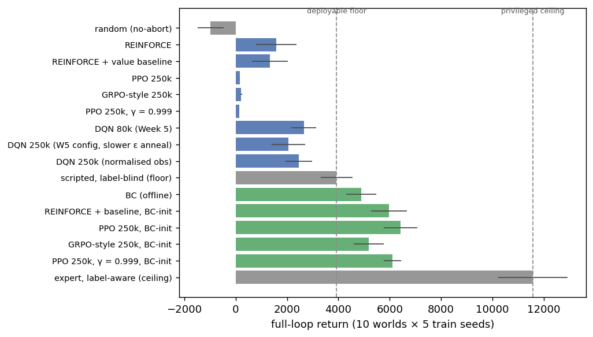
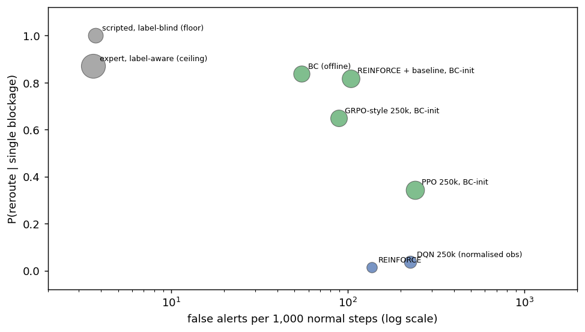
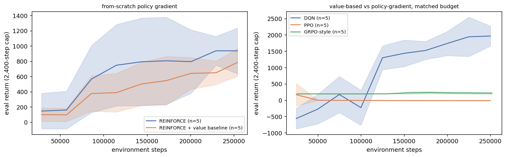
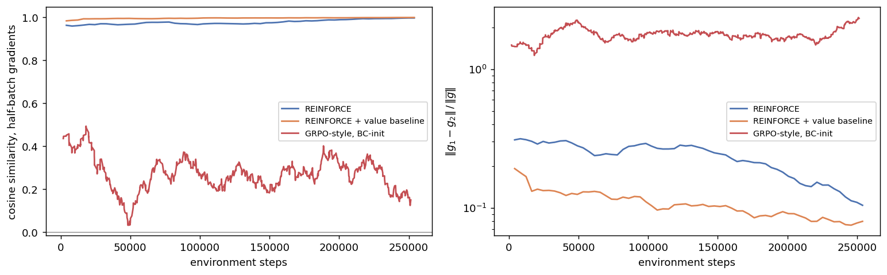
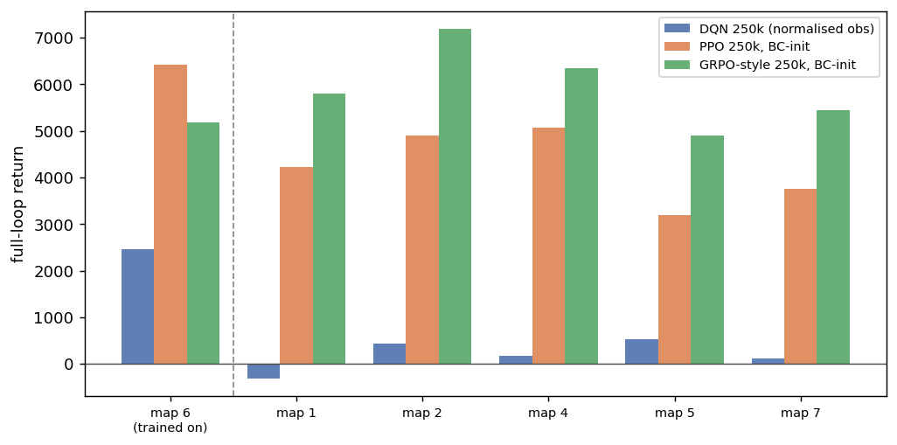
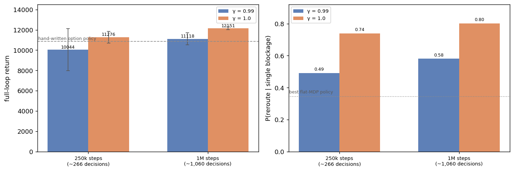
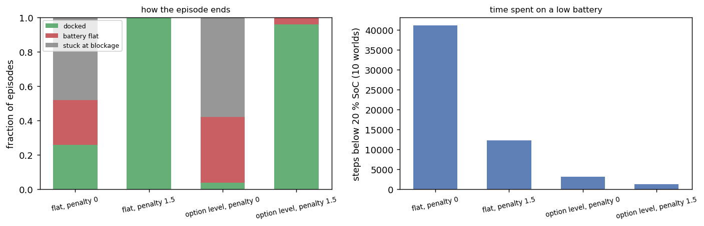
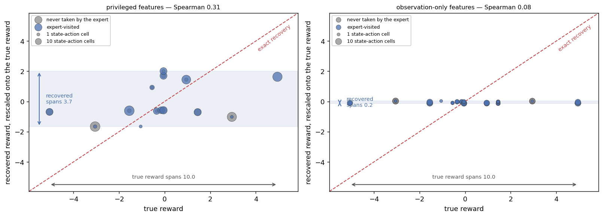
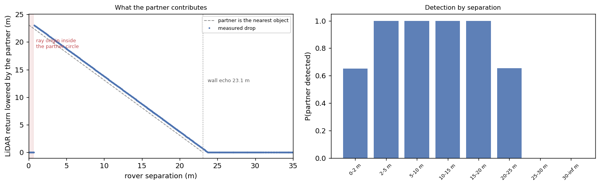
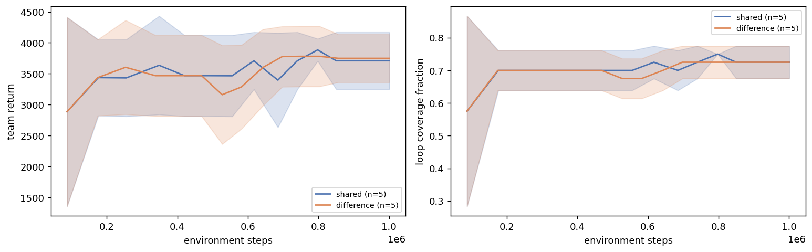

Hongyu LIU  
InGen Dynamics - ML & NN Analyst Intern, July 2026

---

**Platform:** Aido Rover (patrol / anomaly-response policy) · Origami / PIC 2.0   
**Protocol:** 5 train seeds (0–4) × 10 fixed evaluation world seeds · canonical γ = 0.99, with γ = 0.999 and γ = 1.0 as ablation arms    
**Deployment gates:** ≤100 ms patrol inference

## 1. Overview

Week 6 moves from value-based to policy-gradient RL on the Week-5 rover environment, adds the
group-relative variant the PIC 2.0 GRPO class uses, recovers a reward by inverse RL, and extends the
environment to two rovers. Four results carry the week.

| finding                                                               | evidence                                                                                                                 |
| --------------------------------------------------------------------- | ------------------------------------------------------------------------------------------------------------------------ |
| A supervised warm start is a precondition for on-policy training here | every from-scratch on-policy run collapses to a 310-step episode; the same code from a BC checkpoint returns 6,421 (§4) |
| The training layout selects the wrong policy                          | PPO and GRPO tie on map 6 (`p = 0.084`); GRPO wins all five held-out layouts by 1,286–2,300 (§5)                     |
| Week 5's single mechanism was two mechanisms                          | crossing decision budget with discount separates them, both significant, worth +608 to +1,478 return (§6)               |
| IRL identifiability comes from the demonstrations                     | the same code recovers Spearman 0.31 from the logged rule policy and 0.97 from a soft-optimal one (§8)                  |

## 2. Evaluation Protocol

Week 5 reported `mean ± std` over five seeds, mixing world-seed variance for fixed policies with
train-seed variance for DQN, and compared total return across policies whose episodes ran 3,600 to
9,500 steps. Week 6 separates the sources: five **train seeds** per family evaluated on ten fixed
**evaluation world seeds**, with the paired vector taken as the per-world mean across train seeds.

Ten worlds is the minimum that permits a significant result. A two-sided Wilcoxon signed-rank test on
`n` pairs cannot return `p < 2/2ⁿ`, so at `n = 5` the floor is 0.0625 and Week 5's protocol could not
have produced a significant comparison at any effect size. Ten worlds put the floor at 0.002.

The first five worlds are Week 5's own, which gives two reproduction checks. The bracket policies
return 4,072 ± 516 and 12,199 ± 736 on Week 5's subset, and the Week-5 DQN checkpoints return
1,563 ± 517 there, all matching the published figures to the digit. Those brackets lived only as
closures inside two Week-5 notebooks; they are now one definition in `shared_modules/rl_eval.py` with
the reproduction as an assertion.

Episode lengths differ by a factor of three across policies, so a policy that terminates early can
post a return resembling one that completes the loop. Return per step and the event-conditioned rates
lead the tables; total return is reported alongside.

## 3. Where the Methods Land

*Figure 1 — Full-loop return over ten worlds × five train seeds. Grey bars are the fixed references,
green is behaviour cloning together with the policies warm-started from it, blue is trained from a
random initialisation. The dashed lines are the deployable floor (3,931, a rule policy that navigates
but cannot alert on faults) and the privileged ceiling (11,575, the generation expert reading the
ground-truth label).*

The figure splits into three bands. PPO and the GRPO-style variant sit at 135–214, effectively at zero;
plain REINFORCE and its baseline variant reach 1,329–1,579 and the value-based agents 2,048–2,651, all
still below the rule-policy floor. Every warm-started method clears the floor, and the ordering within
that band is the subject of §4 and §5. That the collapse to zero is specific to two of the four
from-scratch methods is the subject of §4.

**Return alone hides what separates the top band**, so Figure 2 plots the two behaviours the platform
actually cares about.

*Figure 2 — False-alarm load against rerouting competence; marker area is return. The two references
sit top-left, catching blockages with almost no false alerts. Warm-started methods spread along a
trade-off: PPO buys its return by alerting hard, the group-relative variant and REINFORCE-with-baseline
keep the navigation the behaviour-cloning prior gave them.*

PPO returns the most and reroutes the least of the warm-started three. Its fine-tuning takes rerouting
from the BC prior's 0.84 down to 0.34 while pushing alert recall from 0.21 to 0.85 and the false-alarm
rate from 55 to 241 per 1,000 normal steps. The GRPO implementation carries a KL penalty to the frozen
BC reference and retains 0.65; REINFORCE with a baseline retains 0.82. The value-based agents occupy
the bottom-right corner, alerting heavily while almost never rerouting.

## 4. The Warm Start Is a Precondition

*Figure 3 — Evaluation return during training, ±1 std over five train seeds. Left: from-scratch
REINFORCE and REINFORCE-with-baseline. Right: the value-based and policy-gradient families at matched
budget. PPO declines to near zero over the first ~50k steps and stays there; the GRPO-style variant is
already at ~200 by its first evaluation and never leaves.*

| method                              | return                 | ep len | P(reroute\|block) | false alerts /1k |
| ----------------------------------- | ---------------------- | ------ | ----------------- | ---------------- |
| PPO, from scratch                   | 156 ± 17              | 309    | —                | 0                |
| GRPO-style, from scratch            | 214 ± 33              | 322    | —                | 27               |
| REINFORCE, from scratch             | 1,579 ± 789           | 3,163  | 0.014             | 137              |
| REINFORCE + baseline, from scratch  | 1,329 ± 694           | 3,430  | 0.077             | 76               |
| GRPO-style, BC warm start           | 5,182 ± 585           | 8,736  | 0.650             | 89               |
| REINFORCE + baseline, BC warm start | 5,969 ± 692           | 8,658  | 0.819             | 104              |
| PPO, BC warm start                  | **6,421 ± 659** | 7,733  | 0.344             | 241              |

PPO and the GRPO-style variant converge to patrolling for ~310 steps and then taking the terminating
action to bank a small positive return; two seeds produce bit-identical trajectories, which is what a
deterministic rule on a deterministic world gives. A random initial policy earns about −1.7 per step
(measured: fresh policy weights, stochastic actions, ten rollouts under training conditions), so ending
the episode is genuinely better than continuing, and once the policy shortens its episodes it stops
collecting the long-horizon patrol data that would overturn that estimate.

**The two methods that fall into this are the two with a clipped surrogate and a bootstrapped critic.**
Plain REINFORCE reaches 1,579, and DQN is immune through replay and ε-greedy. The high-variance
estimator's updates keep the policy moving through the region where terminating looks locally optimal.

The same code from a BC checkpoint reaches 6,421, which rules out an implementation defect. Two
experiments had to be re-run from the warm start for the same reason: the γ = 0.999 probe and the
low-SoC ablation both measure nothing when the agent never survives past 320 steps.

Paired over the ten common worlds:

| comparison                              | Δ return | p      |                                  |
| --------------------------------------- | --------- | ------ | -------------------------------- |
| PPO (BC-init) vs BC                     | +1,530    | 0.037  | significant                      |
| REINFORCE + baseline (BC-init) vs BC    | +1,078    | 0.0020 | significant                      |
| GRPO-style (BC-init) vs BC              | +291      | 0.193  | n.s.                             |
| PPO (BC-init) vs GRPO-style (BC-init)   | +1,239    | 0.084  | n.s.                             |
| PPO (BC-init) vs DQN 250k               | +3,960    | 0.0020 | significant, wins all ten worlds |
| DQN 80k vs the same run at 250k         | −603     | 0.084  | n.s.                             |
| PPO (BC-init) vs the same at γ = 0.999 | +317      | 0.492  | n.s.                             |

**The budget question Week 5 left open closes here.** Tripling DQN's budget with a slower ε anneal
moved the paired return by −603 at `p = 0.084` while roughly doubling the false-alarm rate. Rerouting
rose from 0.012 to 0.087, almost all of it from one seed at 0.297. Week 5's reading of the
navigational failure as structural stands, so its report needs no revision.

**The γ = 0.999 probe is a clean null.** Widening the discount horizon from 100 to 1,000 steps changes
neither return (`p = 0.49`) nor rerouting (0.35 against 0.34). With the route geometry measured rather
than estimated, that is expected: a blockage at the 150 m detection threshold sits 1,500 environment
steps away at 0.1 m per step, beyond a 1,000-step horizon.

### 4.1 What the group baseline does to the gradient

A return curve cannot separate a low-variance estimator from a lucky one, so every update splits its
own transitions into two disjoint halves, computes the policy gradient on each, and records how far
the two vectors agree.

*Figure 4 — Half-batch gradient agreement during training, smoothed over a window proportional to each
method's own update count. Left: cosine similarity between the two half-batch gradients. Right: their
relative L2 difference on a log scale, which is scale-aware and therefore comparable across methods.*

| method                     | updates/seed | cosine | ‖g₁−g₂‖ / ‖ḡ‖ | advantage variance   |
| -------------------------- | ------------ | ------ | --------------------- | -------------------- |
| REINFORCE                  | 62           | 0.977  | 0.23                  | 2.92                 |
| REINFORCE + value baseline | 62           | 0.995  | **0.11**        | 2.98                 |
| GRPO-style, BC warm start  | 126          | 0.265  | 1.79                  | 1.00 by construction |

**The value baseline halves the gradient disagreement without changing the advantage variance.** The
relative L2 difference falls from 0.23 to 0.11 while the marginal variance of the advantage is
unchanged at 2.92 against 2.98. The baseline's benefit therefore shows up as agreement between
independent halves of the same batch, in a direction the marginal spread of `G_t` does not capture.

**GRPO's numbers sit on a different footing and should not be read as three points on one scale.** Its
advantage is group-standardised, so an advantage variance of 1.00 is a definition rather than a
measurement; the informative quantity is the pre-standardisation spread of the eight group returns,
which averages 6.0. Its low cosine follows from the same standardisation: centring within the group
removes the large component every trajectory shares, which is exactly the component that holds
REINFORCE's cosine near 1 while carrying no information about which action was better. A high cosine
on an uncentred estimator is not evidence of a low-variance one.

One gap against the plan. PPO runs through Stable-Baselines3 and carries no per-update instrumentation,
so the comparison above is against REINFORCE's learned value baseline rather than PPO's. The mechanism
is the same, a state-dependent critic subtracted per timestep, but the literal comparison the plan
asked for is not the one measured here.

## 5. Generalisation Across Map Layouts

The Week-2 design report flags a check no week had run: a policy that only works on one procedurally
generated layout is over-fitted to it. Each family's seed-0 policy is re-evaluated without retraining
on the five other layouts the generator validated, five worlds each.

*Figure 5 — Return on the training layout (left of the divider) and on five layouts the policies never
saw. Every bar is the seed-0 policy — the map-6 bar is its own mean over the ten canonical worlds, so
the whole chart sits at one aggregation level. Map seed 3 is absent because the Week-2 generator could
not calibrate its terrain exposure into the 14–16 % anomaly band.*

**The canonical ordering reverses.** PPO and GRPO are statistically tied on map 6, and on all five
held-out layouts the group-relative policy is ahead by 1,286 to 2,300, scoring above its own canonical
result — the seed-0 policy's 5,157 on the training layout — on four of them. PPO's seed-0 policy
loses 2–38 % of its own canonical 5,170 off the training layout. DQN does not transfer at all: its
seed-0 policy falls from 1,463 to between −316 and 539, going negative on one layout.

The ordering follows from Figure 2. PPO's canonical advantage comes from alerting at 241 false alarms
per 1,000 normal steps, which is a policy tuned to where the faults sit on this terrain. The
group-relative variant keeps the navigational behaviour its prior gave it and carries it to terrain it
has not seen. For the PIC 2.0 GRPO class the practical reading is that a leaderboard on the training
layout would have selected the wrong policy.

## 6. Hierarchy

Week 5 attributed three failures to one mechanism, a consequence landing outside the effective horizon.
Building the node-level semi-MDP showed that two effects were being conflated.

The main loop is 960 m over 8 edges and 9,600 steps. A sweep edge is 160 m, which is 1,700–1,900
environment steps; only the 53 m connectors are ~600. The option Bellman backup carries `γᵏ` at that
`k`, of order 10⁻⁸, so **a semi-MDP at γ = 0.99 optimises exactly the flat objective**. What the
hierarchy shortens is the credit-assignment distance: whatever return differential an edge carries
attaches to one backup where the flat learner propagates it through ~1,700 bootstrapped TD steps. The
per-edge differential itself is measured small — pooled over the ten evaluation worlds a clean edge
returns 133.1 in intra-option discounted return against 119.0 with a blockage ahead (1,564 against
1,495 undiscounted), and conditioning on same-length sweep edges thins the sample to 14 against 6
edges, inside which the contrast is not stable. The credit-assignment case therefore rests on the
factorial below, not on the per-edge statistic.

An option spans 600–1,900 environment steps, so 250k steps buy ~266 decisions and 1M buy ~1,060.
Crossing budget with discount separates the two effects.

*Figure 6 — Decision budget crossed with discount, five train seeds per arm. Left: return with the
spread across train seeds, against the hand-written option policy. Right: rerouting, against the best
flat-MDP policy. Within each budget group the discount raises both quantities, and within each
discount the larger budget does too. At γ = 1.0 the seed spread narrows from ±586 to ±121 as the
budget quadruples; at γ = 0.99 it stays wide at both budgets.*

Both effects are significant on the paired ten-world Wilcoxon test and close to additive. The
discount is worth +1,232 at the small budget (`p = 0.014`) and +1,478 at the large one (`p = 0.002`);
the budget is worth +608 at γ = 0.99 (`p = 0.027`) and +853 at γ = 1.0 (`p = 0.037`). The discount
effect growing at four times the budget rules out a sample-efficiency artefact. The best arm's +1,276
over the hand-written option policy is not significant (`p = 0.065`).

**Rerouting separates the two cleanly.** Budget moves it by +0.06 to +0.08, the discount by +0.25 to
+0.27, and both together reach 0.82, against 0.04–0.09 for DQN and 0.34 for the best flat policy.
Rerouting is the decision whose consequence lies furthest ahead, so it is the behaviour most sensitive
to the horizon.

**The discount collapses the seed spread; the budget does not.** At 250k the γ = 0.99 arm splits into
two of five seeds at 7,560 and three above 11,000, a spread of ±2,066; at 1M one of five seeds still
lands at 7,560, for ±1,679 — the bimodality survives four times the decision budget. Every γ = 1.0
seed lands between 10,528 and 12,343, ±586 at 250k narrowing to ±121 at 1M. The discount therefore
acts on reliability as well as on the mean, and its effect (+1,232 and +1,478) is larger than the
γ = 1.0 seed spread rather than buried inside it.

Two boundaries. The option controllers alert on the ground-truth label, so every option-level number
belongs in the privileged bracket and none of these policies is deployable; the best arm's 12,129
should be read against the 11,575 ceiling. And the controllers embed the hand-written rule policy's
competence, so a good score shows the binding constraint sat above the controller level.

**The choice of a semi-MDP over frame-skip is a product constraint.** Frame-skip lowers the decision
rate uniformly and would slow alerting with it, while the Aido Rover's ≤100 ms detection gate requires
the reactive layer to stay at 10 Hz. Options lower only the routing rate.

## 7. Reward Design and Battery Discipline

Week 5 prescribed a per-step low-SoC penalty as the fix for a reward under which no agent ever docks.
Running it exposed a prerequisite the prescription did not state. Discharge is about 0.004 % of SoC per
step, so crossing 20 % from a full battery takes ~19,500 steps against a 9,600-step evaluation loop,
and training resets drawing SoC from U(40, 100) under a 2,400-step cap bottom out near 30 %. Measured
`low_soc_steps` was zero for every flat family. The ablation runs from a dispatch charge of U(18, 30).

*Figure 7 — Left: how each arm's episodes end. Right: environment steps spent below the 20 % threshold,
summed over ten worlds. The penalty converts the red band into the green one at both decision levels.*

| configuration              | return         | docked         | battery flat   | stuck | steps below 20 % |
| -------------------------- | -------------- | -------------- | -------------- | ----- | ---------------- |
| flat, BC-init, penalty 0.0 | 5,190 ± 729   | 0.26           | **0.26** | 0.48  | 41,093           |
| flat, BC-init, penalty 1.5 | 998 ± 669     | **1.00** | **0.00** | 0.00  | 12,257           |
| option level, penalty 0.0  | 7,863 ± 142   | 0.04           | **0.38** | 0.58  | 3,218            |
| option level, penalty 1.5  | 3,350 ± 129   | **0.96** | 0.04           | 0.00  | 1,244            |

The prescription works once the region is reachable, and both decision levels agree. On the flat
environment the penalty eliminates battery depletion entirely and cuts time below the threshold by
70 %; at option level it takes docking from 4 % of episodes to 96 %. Return falls in both arms, which
is the price of a reward that ranks battery safety above patrol continuation, since docking ends the
episode.

The control arm reads as a deployment statement. Without the penalty the warm-started policy spends
62 % of every episode below 20 % SoC and runs one episode in four to actual depletion, which is
deep-discharge cell damage and a field-recovery callout.

Two statistics need care. A per-environment-step docking rate is ~0.001 for every arm, since `dock` is
one decision against thousands of low-SoC steps. The episode-level rate alone is also insufficient: the
from-scratch arms show 1.00 while never reaching the low-SoC region, because their collapse is itself
an early terminating action. It has to be read with the step count.

## 8. Inverse RL

The generating reward is known exactly and is linear in indicator features over
`(label, action, halted, main_blocked, rough, soc < 20)`, so the recovery can be scored. Maximum-entropy
IRL runs on a tabular discretisation of the logged expert (192 cells, 57 visited, 184 of 285
state-action pairs supported), with soft value iteration converged to a Bellman residual of 10⁻⁹ at
every gradient step. A linear reward is identifiable only up to a positive affine transformation;
Pearson and Spearman are invariant under that freedom, so the correlations are unaffected by the
arbitrary scale, and the affine fit serves to place the recovered values on the true reward's scale in
Figure 8 and to report what remains once the free scale and shift are spent.

*Figure 8 — Recovered reward against true reward. The recovered values are rescaled onto the true
reward's scale by an unconstrained least-squares fit; exact recovery then lies on the dashed diagonal.
For the observation-only panel the fitted display slope is negative — flagged on the panel — which is
itself a statement of how little structure that fit recovered. The shaded band is the range the fit actually produces,
against the range it was trying to reproduce. Left: the privileged fit tracks the diagonal weakly and
compresses ten points of true reward into 3.7. Right: the observation-only fit spans 0.2, which is a
constant for every state-action pair the expert took.*

|                            | privileged features       | observation-only | positive control |
| -------------------------- | ------------------------- | ---------------- | ---------------- |
| Pearson vs the true reward | 0.458                     | −0.023          | **0.947**  |
| Spearman                   | 0.309                     | 0.080            | **0.970**  |
| online return, 10 worlds   | **11,285 ± 2,267** | 2,423 ± 1,266   | —               |

**The privileged basis contains the true reward exactly and still fails to recover it.** Handed the
true weights it reproduces `compute_reward` to 2×10⁻¹⁶, so expressiveness is not the constraint. The
logged behaviour policy is a rule with ~3.6 % ε-exploration that alerts on 8,239 of 8,549 anomaly steps
and takes slow, reroute, continue or dock on 101, 114, 94 and 1. Feature-expectation matching has
almost no evidence about actions the expert essentially never takes, so the true reward's 8.0-point
spread over those four collapses into a band 0.75 wide. The `low_soc:return-to-base` weight recovers as
0.011 against a true 2.0 from a dataset holding one low-SoC step and no docks.

The positive control isolates this. Refitting with the expert replaced by the soft-optimal policy under
the true reward, same code and features and MDP, gives 0.947 / 0.970. Converging the optimiser harder
makes the correlation worse (Spearman 0.49 at a feature-expectation error of 0.105, falling to 0.31 at
0.022), which is the signature of an unidentified problem.

**Reward recovery and policy recovery are separate objectives.** The privileged reward correlates 0.31
with the truth, yet the policy optimal under it returns 11,285 against the 11,575 ceiling, covering
96 % of the floor-to-ceiling range.

**The observation-only run falls below the deployable floor** at 2,423. It alerts on 103 of every 1,000
normal steps while catching 12 % of anomalies, and takes the branch on 33 % of single blockages, so its
episodes die on the stuck timeout at 6,009 steps against the floor policy's 9,009. Its alert recall of
0.118 sits well below behaviour cloning's 0.50 on the same information, on 25 parameters against the
privileged basis's 14. Routing sensor evidence through a recovered reward costs more than mimicking the
action directly, which is the quantitative form of Week 5's privileged-distillation finding.

`halted` is not a state column and is reconstructed as `next_main_block_dist < 2.0`, which reproduces
the logged reward on 99.938 % of rows.

## 9. Multi-Agent Patrol

The Week-2 design specified the mechanism: two `RoverWorld` instances on a shared map, each passed as
the other's `dynamic_obstacles` so they see each other on LiDAR. That hook is used unchanged. Four
gaps had to be closed in the wrapper, the fourth of which changed the headline numbers: termination
parity with the flat environment. Without the flat env's stuck-at-full-block timeout, a rover that
committed onto a blocked edge stood halted to the horizon at −0.5 per step, and team returns came out
at −2,522 and −2,386; restoring the timeout puts the same training configuration at +3,819 and
+3,840.

*Figure 9 — The same seeded episode driven twice with the same actions, once with the partner circle
injected and once without. `dynamic_obstacles` consumes no RNG draw, so every difference is the
partner. Left: the amount by which the partner lowers the geometric return. It tracks the dashed line
while the partner is the nearest object and reaches zero at the 23.1 m wall echo; points inside the
shaded band fall to zero because the ray origin lies inside the partner circle. Right: detection
probability by separation band.*

**The visible range is 25 m, against a sensor range of 200 m and a 960 m loop.** `cast_min` returns the
minimum over a forward 120° fan and the site boundary sits 20 m outside the route, so the no-partner
geometric return never exceeds 23.1 m anywhere: the partner stays invisible until it is nearer than
that wall echo. Detection is certain between 2 and 20 m, falls to 0.65 at 20–25 m, and is zero beyond.
Two further properties follow from the same ray-cast. Below `ROVER_RADIUS` = 0.6 m the ray origin lies
inside the partner circle and the intersection is rejected, which is why detection *falls* in the
closest band. And the forward fan makes the exchange asymmetric: the follower sees the leader, and
recording the leader's channel gives a detection rate of zero at every separation.

Twenty-five metres is 2.6 % of the loop, so mutual visibility cannot support a decision about which
rover covers which stretch. The observation therefore carries an explicit partner block (route
progress, SoC, signed loop gap), and the LiDAR channel is left to close-range interaction. Proximity
became a wrapper-level reward term because `halted` is set solely by the blockage table, and coverage
state lives in the wrapper because `RoverWorld` has none.

### 9.1 A null result explained by the decision rate

|                           | shared team reward | difference reward |
| ------------------------- | ------------------ | ----------------- |
| team return               | 3,819 ± 434       | 3,840 ± 430      |
| loop coverage fraction    | 0.735 ± 0.012     | 0.733 ± 0.015    |
| redundantly covered edges | 1.30               | 1.18              |
| proximity-violation steps | 6.4                | 6.4               |
| decisions per episode     | 8.8                | 8.5               |

The ± here is the spread across the five train seeds, matching every other table in this report. The
per-episode spread within a seed is roughly twice as large again, because the ten evaluation worlds
differ more than the seeds do. The proximity row is not read as a coordination signal: the half-loop
starting phase on a shared-speed cycle keeps the rovers apart by construction, so the residual ~6
steps per episode are transient encounters, and the only configuration that ever accumulated
proximity — two rovers standing halted together at a blockage — is the one the stuck-timeout now
terminates.

*Figure 10 — Team return and loop coverage during training, ±1 std over five train seeds. The two
reward schemes trace the same curve inside heavily overlapping bands, and coverage flattens at 0.70
after roughly 0.2M environment steps and never moves again.*

The two credit-assignment schemes are indistinguishable on every coordination metric, and the coverage
curve shows why: it reaches its final value within the first few updates and then stays there for the
remaining 0.8M steps. An option spans roughly 900 environment steps here, so an episode of ~8,200
steps contains ~8.8 decisions per rover; 1M training steps buy ~970 decisions and, at 32 per rollout,
~30 policy updates. A difference reward is a counterfactual on an agent's contribution, and with 30
updates neither learner has a contribution to attribute. Coverage of 0.735 sits between random (0.425)
and scripted (0.825), where a barely-trained learner should be.

This identifies the concrete obstacle for the CRL-MRS direction: at node granularity the coordination
problem has a decision rate three orders of magnitude below its control rate. Progress needs an
interaction budget of a different order or a decision level between the 10 Hz controller and the route
node.

Three structural properties are worth recording. No option emits the alert action, so the
anomaly-response counters are zero by construction. Rovers on a shared directed cycle both traverse
every edge, so the only coordination available is phase separation and the measurable failure is
bunching. And the first parameterisation could not have measured anything: a coverage event at weight 5
was 0.5 % of the ±1,100 per-decision patrol reward, and with the rovers half a loop apart the second
pass over an edge arrives ~4,800 steps later, above the 2,000-step staleness threshold, so the
redundancy penalty never fired.

## 10. Deployment Latency

Single-step inference, `timeit` over 2,000 calls, CPU, batch size 1.

| inference path                               | latency (ms) | 100 ms patrol gate | 50 ms motion gate |
| -------------------------------------------- | ------------ | ------------------ | ----------------- |
| scripted rule policy / tabular option lookup | 0.001        | PASS               | PASS              |
| GRPO-style, REINFORCE policy net (2×64)     | 0.027        | PASS               | PASS              |
| behaviour-cloning MLP (2×128)               | 0.028        | PASS               | PASS              |
| DQN (SB3, 2×64)                             | 0.066        | PASS               | PASS              |
| PPO (SB3, 2×64)                             | 0.115        | PASS               | PASS              |
| hierarchical, both levels in one step        | 0.003        | PASS               | PASS              |
| learned Q-table option selection (per node)  | 0.003        | PASS               | PASS              |
| IRL policy, observation-only                 | 0.023        | PASS               | PASS              |
| two-rover, two forward passes per decision   | 0.19         | PASS               | PASS              |

Every learned policy clears both gates by three to five orders of magnitude, so the Phase-B conclusion
carries over and the RL cost sits entirely in training. The two paths not already known are the
hierarchical one, which runs a high-level selection roughly once a minute plus the 10 Hz controller,
and the two-rover one, which runs two forward passes per decision at 0.19 ms.

## 11. PIC 2.0 Connection

Week 5 argued a deployed policy class is judged on sample efficiency, stability and safety. Each now
has a measurement.

**Sample efficiency did not separate the methods.** Tripling DQN's budget changed nothing significant;
quadrupling the option-level budget was worth less than fixing the discount. What separated
methods was initialisation. On this task the PIC 2.0 configuration starting GRPO from an SFT
checkpoint is what makes on-policy training viable at all.

**Stability reads as generalisation.** Seed spreads across the warm-started methods (±585 to ±692)
support no ranking. The layout sweep separates them decisively, in the opposite direction to the
canonical result.

**Safety favours the constrained variant on both measures taken.** The group-relative baseline runs at
89 false alarms per 1,000 normal steps against PPO's 241, and the per-step low-SoC penalty eliminates
battery depletion. Both required writing the constraint into the objective, which is the SEOM pattern
of a constrained-RL penalty shaping the gradient.

## 12. Limitations and Next Steps

**Option controllers are privileged.** They alert on the ground-truth label, so §6's policies are not
deployable. Sensor-window alerting would move those results into the deployable bracket.

**The multi-agent result is data-limited.** At ~9 decisions per episode and ~30 policy updates per
1M steps, the budget or the decision level has to change before the two schemes can be compared.

**Two ablations needed reconfiguration to be reachable**, and neither configuration is one a deployed
rover would run: the low-SoC region needs a lowered dispatch charge, and the γ = 1.0 option arm relies
on the episode cap for a finite horizon.

**IRL identifiability is bounded by the logged data.** Widening the behaviour policy's exploration
would need a new offline artifact and would break comparability with every Week-5 result.

**The layout sweep used one train seed per family.** It establishes that the ordering reverses off the
canonical layout without pinning the effect size to the precision the canonical numbers carry.

For Week 7 the strongest lever is the **decision level**: the same environment, reward and observation
give a policy that reroutes on 0.04 of blockages at 10 Hz and 0.82 at route-node rate. On the
cross-family Pareto that means inference latency alone is the wrong axis for RL policies, since every
policy here sits three orders of magnitude inside the gate while the decision rate varies by three
orders of magnitude. Layout-sweep evaluation also belongs in the standard column set, having reversed
a ranking that five seeds on one layout called a tie.
