Hongyu LIU
InGen Dynamics - ML & NN Analyst Intern, August 2026

---

**Platform:** all platforms — explainability & deployment · full PIC 2.0
**Protocol:** every attribution runs on a refit model verified against its published metrics; canonical block split for Rover, 70/15/15 stratified for Fari/Senpai, ten-world Week-6 protocol for RL
**Deployment gates:** Aido Rover ≤100 ms (≤10 ms breach tier in §8) · Aido Humanoid ≤50 ms · Fari ≤35 ms · Senpai ≤100 ms

## 1. Overview

This report states how every result in Weeks 1–7 is produced — the split, comparison, attribution
and evaluation protocols — together with what Week 7's explainability and deployment work found.
The classical family is RandomForest alone (one model, a deliberate reduction of the plan's five),
and every "classical" claim is scoped to it. Five findings carry the week.

| finding                                             | evidence                                                                                                                                     |
| --------------------------------------------------- | -------------------------------------------------------------------------------------------------------------------------------------------- |
| One feature story spans every model family          | cross-channel`inter_wheel_std` leads RF components, MLP 40-D SHAP, and (as `torque_max`) the RL alert head (§4, §6)                    |
| The stuck-type misses are not localisation failures | in a fully missed fault episode, 100 % of windows have attention on the fault span, median 8.7× (§5)                                       |
| RL fine-tuning is feature reallocation              | PPO concentrates 42–46 % of gradient on`torque_max` and drops the blockage distance the BC prior watched (§6)                            |
| The frontier confirms the Week-3 defaults           | classification frontier {MLP, Transformer}, Transformer ≈ MLP (`p = 0.34`); trajectory {…, LSTM}; patrol {REINFORCE+baseline, PPO} (§8) |
| A model that cannot be refit bit-identically        | the 1D-CNN's F1 spans 0.683–0.738 across identical runs from cuDNN nondeterminism alone (§7)                                               |

## 2. Data and Preprocessing

**One dynamics core, two consumers.** All Rover data — the offline 9-channel sensor stream and the
online RL environments — comes from a single world-dynamics module (`shared_modules/rover_world.py`).
The Week-5 environment passes a bit-exact replay gate against the Week-2 offline table, so offline
and online results are about the same physics.
Sensor ranges, fault mechanisms and the 85/15 normal/anomaly calibration are set from the plan, and the label is withheld from every deployable model's observation.

**Feature space.** The tabular models consume a 40-dimensional matrix built by one shared function
(`shared_modules/features.py`): 9 raw channels with absolute GPS replaced by per-step deltas, 25 FFT
descriptors (5 spectral features × 5 channels, 50-step window at 10 Hz), and 6 engineered
cross-channel physical features (inter-wheel torque dispersion, stall ratio, and their rolling
statistics). The cross-channel features exist because the fault mechanism is described
sensor-against-sensor; adding them was worth +0.27 F1 in Week 2 — more than any model change that
week — and §4 shows every model family's attribution concentrating on them. Sequence models consume
11-channel windows (9 sensor + the 2 instantaneous physical channels) at w ∈ {10, 20, 50}; rolling
statistics are excluded there because the network sees the history the rolling window would
summarise.

**The canonical split.** Rows within a contiguous block are serially dependent, so row-level
splitting — stratified or not — leaks. The stream is segmented into 23 blocks and assigned by
`StratifiedGroupKFold` into 7 folds; validation and test folds were chosen from pre-training
structural statistics, and the first 50 rows of every block are purged so no window straddles a
boundary. Post-purge: 9,734 train / 2,215 val / 1,901 test (70.3/16.0/13.7, anomaly share 16 % in
each). Every classification and sequence model in the project reads this one assignment file.

**Fari.** 3,000 independent rows (5 features, binary label from a known generative weight vector),
split 70/15/15 stratified — row independence is what makes the plain split leakage-safe there.

**Senpai.** Senpai had no dataset anywhere, and its product documents carry design
parameters but no measured data, so the 2,000 × 5 three-class task is generated under a
fixed-difficulty IRT-3PL assessment scenario: the documents specify the 3PL response model and an
adaptive 57–69 % success band — which would make `correct_rate` level-invariant under tutoring,
hence the fixed-difficulty probe — and the class prior 21.4/64.3/14.3 % maps the plan's
beginner/intermediate/advanced onto the documented below/at/above-expected bands (a real class
composition of 6/18/4). Response times anchor on the documented 1.2 s pseudo-mastery threshold,
hints on the σ > 0.65 struggle trigger, sessions on the 30-min cap; every invented distribution is
recorded in the notebook's data card. Labels are the generating latent ability's class, not feature
thresholds, so irreducible error exists by construction and is measured: a Bayes rule on the latent
θ reaches accuracy 0.812 / macro-F1 0.764 — the ceiling every model score is read against.

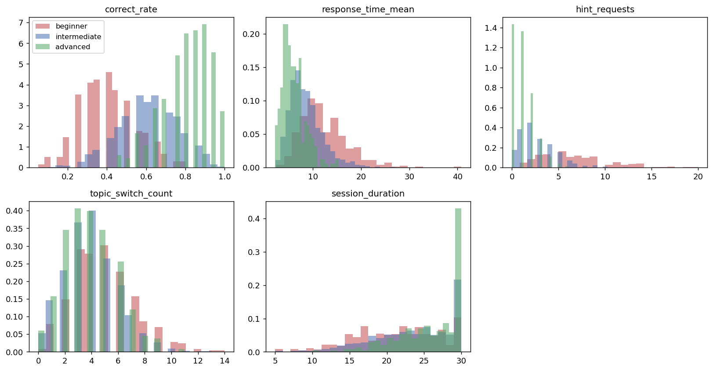

*Figure 1 — Senpai class-conditional feature distributions. `correct_rate`, `hint_requests` and
`response_time_mean` separate the classes; `topic_switch_count` barely does (by design); the
`session_duration` spike at 30 min is the documented session cap.*

**Humanoid trajectories.** 5,000 sequences split 70/15/15 by sequence; 10-step history to 5 future
waypoints.

## 3. Supervised Model Comparison

**Two-phase protocol.** Architecture and hyperparameter decisions are made on the canonical fold
only, with three seeds where a decision needed a spread. The chosen configuration is then locked
and retrained across all seven fold rotations — test = fold k, val = fold (k+1) mod 7, scaler and
class weights refit per rotation, decision threshold re-tuned on that rotation's validation fold —
and the ledger records mean ± std with the per-fold columns. Design exploration and headline
estimation never share a fold.

**Winners need paired tests.** Fold scores are paired across models, so comparisons use paired
t-tests over the seven rotations. The full 15-pair matrix — Week 3 tested five pairs and deferred
the rest — gives four significant results, all Transformer wins: over RandomForest (`p = 0.011`),
1D-CNN (`p = 0.004`), LSTM (`p = 0.047`) and GRU (`p = 0.0498`). Transformer vs MLP is not among
them (`p = 0.34`), and the Week-3 capacity control (a parameter-matched Transformer-S falls to
GRU's level) attributes the edge to parameters, so the defensible summary is a single top
equivalence class {Transformer, MLP} whose membership is explained by capacity, not attention.
Within-class selection is by latency, which is why the MLP is the Rover deployment recommendation
(§8).

**The fragile part is the operating point.** Val-tuned thresholds swing between 0.36 and 0.95
across rotations while AUC stays within 0.963–0.994: discrimination is stable, calibration of the
operating point is not. Threshold-dependent F1 is treated as the noisier of the two headline
metrics throughout (see also §7 on the 1D-CNN), and §8's calibration measurement completes this
picture.

**Learning curves.** Grown by whole blocks (row-level growth would leak a partially included
block), refitting the full protocol at every size — standardisation, class weights, early stopping,
val-tuned threshold.

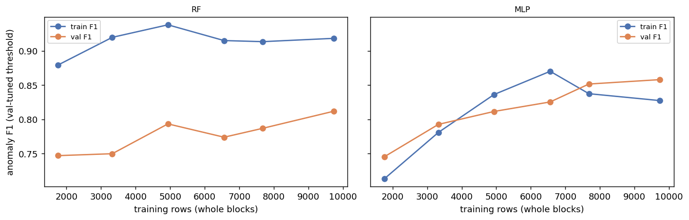

*Figure 2 — Train and validation F1 against training rows, RF (left) and MLP (right).*

The MLP's validation F1 rises monotonically through the final doubling (0.745 at 1.8k rows to
0.858 at 9.7k) with a small train–val gap — low variance, moderate bias, and a curve that has not
flattened: more blocks would still buy performance. The RF carries a persistent 0.10–0.13 gap at
every size — the variance-dominated profile — and its full-data validation score (0.81) is what
the MLP reaches with half the blocks. The compressibility echo from the CNC project: at 18 % of
the training blocks the MLP is already within 0.11 of its full-data score — most of the signal
lives in a small fraction of the data here, as it lived in a small fraction of the features there.

## 4. Explainability — SHAP Across Three Tasks

**The classical model, in the space it splits on.** The deployed RF is a
`Pipeline(scaler → PCA(19) → forest)`, so its Shapley values are computed exactly in the
19-component space, over the full 1,901-row canonical test fold (TreeExplainer; additivity residual
3×10⁻¹⁵ against the model's own probabilities).

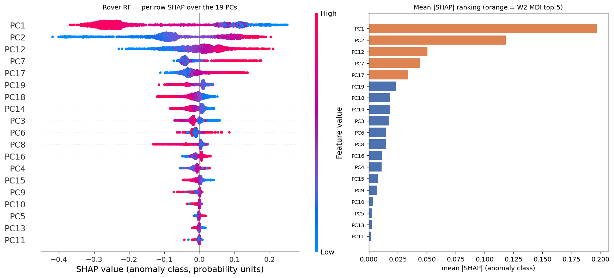

*Figure 3 — Left: per-row SHAP over the 19 PCA components with feature-value colouring. Right:
mean-|SHAP| ranking; orange bars are the Week-2 MDI selection.*

**SHAP's top five components are the Week-2 selection — same set, same order** (PC1, PC2, PC12,
PC7, PC17), and the full 19-component rank correlation between MDI and mean-|SHAP| is Spearman
0.919 (`p = 3×10⁻⁸`). The Week-2 methodology caveat — MDI is biased toward high-variance features,
and PCA components mix sensors — could have made that selection a method artifact; on this model it
is not, and the selection itself is the evidence. MDI's bias and PCA's variance ordering point the
same way, so an artifact of the two would have produced PC1–PC5; the actual set skips PC3–PC6 and
PC8–PC11 to reach components carrying 2.1 % and 1.4 % of the variance, and a second attribution
method with no impurity bias — computed from held-out predictions rather than training-time splits
— independently reproduces that out-of-order set.

Week 2 documented loadings for PC1–PC5 only, so the three high-index selected components are
resolved here from the fitted PCA. Each component is a unit vector over the 40 standardised
features, so 1/√40 ≈ 0.16 is what an evenly spread component would put on each:

| component | variance | top loadings (signed)                                                                                                    |
| --------- | -------- | ------------------------------------------------------------------------------------------------------------------------ |
| PC7       | 3.34 %   | `inter_wheel_std_roll_max` +.43 · `inter_wheel_std_roll_mean` +.42 · `inter_wheel_std` +.37 · `gps_dlat` +.24 |
| PC12      | 2.05 %   | `inter_wheel_std` +.48 · `gps_dlat` −.39 · torque `dom_freq` terms                                              |
| PC17      | 1.39 %   | `inter_wheel_std` +.51 · `torque_3_dom_freq` −.45 · `torque_2_bandwidth` +.43                                   |

All three are dominated by the engineered cross-channel dispersion features, and PC12 shows the
mechanism: `inter_wheel_std` and `gps_dlat` enter with opposite signs, so the component is a
contrast — wheel torques disagreeing while the rover barely advances, which is the mechanical
definition of a stuck or slipping wheel. With PC1/PC2 carrying the torque spectral centroids and
`stall_ratio`, the five selected components tell one story: the classical model's usable signal
concentrates in the features Week-2 engineering added.

**Variance ordering is not relevance ordering**, and here the gap is quantifiable: PC12 and PC17
carry 2.1 % and 1.4 % of the variance yet rank third and fifth in both attributions. The pipeline
keeps 19 components at a 0.95 variance threshold; at 0.90 it would keep 16 and discard PC17
outright. A variance-based reduction placed ahead of a supervised task can drop the directions that
task most depends on, so the retention threshold is a modelling decision rather than a formality.

**The MLP, in its native space.** The MLP consumes the standardised 40-D matrix directly
(bit-identical to the RF pipeline's input space), so DeepExplainer attributes over named features
with no back-projection; background is 200 seed-42 train rows, the full test fold is explained,
additivity residual 2×10⁻⁶ on the anomaly logit.

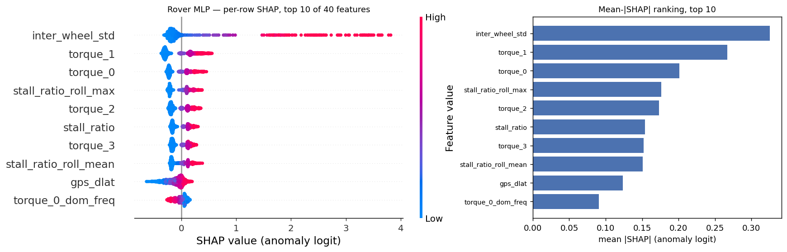

*Figure 4 — MLP SHAP, top 10 of 40 features. High `inter_wheel_std` (red, right tail to +3.8
logits) is the single strongest anomaly driver.*

Top-3: **`inter_wheel_std`, `torque_1`, `torque_0`** — the cross-channel dispersion feature first.
Both model families, trained in different spaces with different inductive biases, select the same
engineered feature as their primary anomaly evidence. A formal rank comparison through a loading
projection (`Σ_k mean|SHAP_k|·|loading_kj|`) gives Spearman 0.18, not significant — but that
projection is magnitude-only and mass-spreading, so it bounds what the comparison can show rather
than contradicting the top-of-ranking agreement that is visible directly.

**Fari and Senpai — the complete feature rankings.** Both tasks carry exactly five features, so the
table below is a full ranking rather than a top-five cut of a longer list. Fari's label comes from a
known linear generator, so its attributions are reported as a share of the total alongside the true
weight share on the same normalised scale; Senpai has no such truth and is reported as mean-|SHAP|
in probability units, per class, ordered by the across-class mean.

| rank | Fari feature        | RF / MLP / true share | Senpai feature         | mean-\|SHAP\| beg / int / adv |
| ---- | ------------------- | --------------------- | ---------------------- | ----------------------------- |
| 1    | `topic_coherence` | 0.351 / 0.309 / 0.289 | `correct_rate`       | 0.145 / 0.118 / 0.150         |
| 2    | `sentiment_score` | 0.256 / 0.252 / 0.237 | `hint_requests`      | 0.123 / 0.071 / 0.081         |
| 3    | `latency_ms`      | 0.216 / 0.217 / 0.211 | `response_time_mean` | 0.074 / 0.064 / 0.070         |
| 4    | `follow_up_rate`  | 0.150 / 0.156 / 0.184 | `session_duration`   | 0.031 / 0.032 / 0.032         |
| 5    | `response_length` | 0.028 / 0.066 / 0.079 | `topic_switch_count` | 0.014 / 0.018 / 0.015         |

The top three carry 82 % of Fari's RF attribution and 86 % of Senpai's.

**Fari — scored against a known truth.** Fari's label is generated from an explicit linear score
(weights `topic_coherence` 1.1, `sentiment_score` 0.9, `latency_ms` −0.8, `follow_up_rate` 0.7,
`response_length` 0.3 on z-scored features), so the true importance ordering exists and SHAP can be
scored rather than compared.

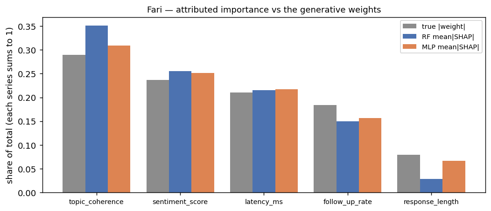

*Figure 5 — Per-feature attribution share for the RF and MLP against the true |weight| share; each
series normalised to sum to 1.*

**Both models recover the true ordering exactly** (Spearman ρ = 1.0; exact-permutation
`p = 0.017` at n = 5) — the attribution pipeline passes the one test where a ground truth exists.
The profiles differ in character: the RF exaggerates the strongest feature (0.35 vs true 0.29) and
nearly zeroes the weakest (0.03 vs 0.08), while the MLP tracks the whole profile including the
tail — trees spend their splits where signal is strong, the small dense network keeps weak features
alive.

**Senpai — the multi-class generalisation check.** The classical model (RF, grid winner 200 trees ×
depth 10, split 1,400/300/300) reaches **test macro-F1 0.667 against the 0.764 ceiling** — about
87 % of the information the features hold — at 8.7 ms per sample (PASS vs the 100 ms
conversational gate).

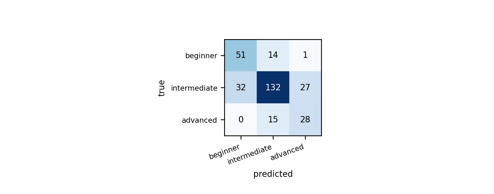

*Figure 6 — Senpai test confusion matrix. The smallest class (advanced, 43 rows) is where the
remaining error concentrates: per-class F1 0.685 / 0.750 / 0.566.*

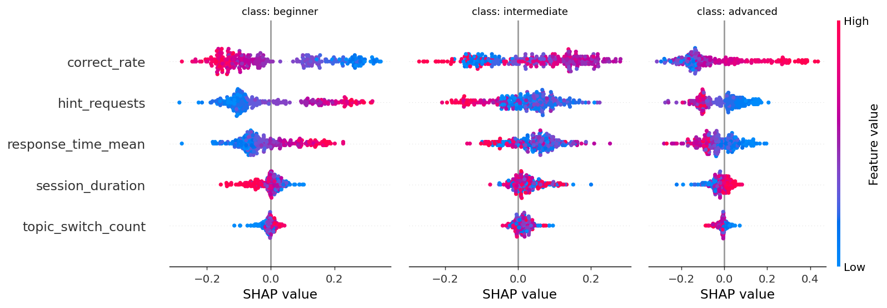

*Figure 7 — Per-class SHAP. High `correct_rate` pushes away from beginner and toward advanced;
hints do the reverse.*

Multi-class SHAP matches the generator's design and adds one asymmetry the design did not state:
`hint_requests` attributes nearly twice as strongly for the beginner class (0.123) as for
intermediate (0.071) — struggle signals identify who needs help more sharply than they separate the
upper levels, which is the asymmetry a differentiation product wants. `topic_switch_count`
attributes almost nothing anywhere, matching its weak class signal by construction; a fielded model
would have to earn its switches from engagement telemetry the synthetic set does not carry.

## 5. Sequence and Attention

Sequence models are compared at matched window length (w = 50) under the same rotation protocol,
with a latency-vs-window sweep (w ∈ {10, 20, 50}) per architecture: the recurrent models scale
linearly and attention quadratically in w, but at these lengths the crossover is thousands of steps
away, so window choice is governed by detection quality alone. Attention is used as an
interpretability lens, not an accuracy argument (§3's capacity control): Week 3 measured median
fault/normal attention selectivity of 5.3× (above 1 in 98 % of 267 eligible anomalous windows)
against 1.15× for the LSTM hidden-state norm, and Week 4's trajectory transformer moves its
attention centre-of-mass from history step 6.7 to 3.1 across the five prediction horizons.

**What attention does on the misses — the week's most surprising result.** Week 3 left two
findings unjoined: attention lands on true fault spans, and detection collapses on stuck-type
faults (39.5 % caught vs 76.2 % for slip). If attention still finds the fault span on the missed
windows, the miss is a decision-boundary failure, not a localisation failure — and the fix is a
different one. Fault type is recovered by Week 3's run-length proxy (slip lives < 40 steps, stuck
up to 80, so runs longer than 40 steps are unambiguously stuck-type); the refit Transformer is
replayed at its canonical 0.87 threshold and reproduces the ledger confusion matrix before any
attention is read.

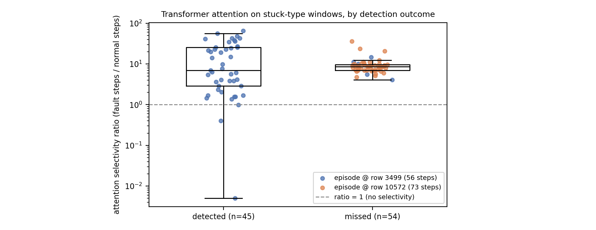

*Figure 8 — Attention selectivity (fault steps / normal steps, log scale) for stuck-type windows by
detection outcome, coloured by fault episode. The 99 eligible windows tile only two independent
episodes — one 90 % detected (blue), one missed entirely (orange) — so the two groups are very
nearly the two episodes.*

The sample structure kills any detected-vs-missed ranking: consecutive windows share 49 of their 50
rows, so the 99 points are not 99 independent samples, and behind them sit only two fault episodes
— the window-level medians 7.0 vs 8.7 compare episode identity, not populations. What stands is the one-sided claim: **in the
fully missed episode, every one of the 49 windows has attention selectivity above 1 (median 8.7×)
while the classification head calls all of them normal.** **The encoder finds the fault span and the
head discards it.** The stuck-type recall ceiling is a property of the decision head under the
training distribution, not of the encoder — which is where a Week-8 fix should start.

## 6. RL Evaluation and What the Policy Reads

**The protocol.** Every learned family trains on 5 seeds and is evaluated deterministically on 10
fixed evaluation worlds at the full 9,600-step patrol horizon; the paired vector for any comparison
is the per-world mean across train seeds. Ten worlds is the minimum that can produce significance:
a two-sided Wilcoxon signed-rank on n pairs cannot return p below 2/2ⁿ, so n = 5 has a floor of
0.0625 and n = 10 of 0.002. Every "A beats B" claim carries that test; near-ties are reported as
not significant by name; option-level and multi-agent artifacts store per-seed-per-world returns so
the same test applies to them. Every table is read against two fixed references on the same worlds
— a deployable rule policy that navigates but cannot alert (floor, 3,931) and a privileged
label-reading expert (ceiling, 11,575) — and privileged policies are excluded from deployment
comparisons. Because episode lengths differ by 3× across policies, return-per-step and
event-conditioned rates lead the tables. Generalisation is part of the protocol: seed-0 policies
are re-evaluated on five held-out map layouts, after Week 6 showed the training layout calling a
tie that every held-out layout decides the other way.

**Value and saliency.** A policy's counterpart to SHAP is two objects: the critic's value of the
state it stands in, and the sensitivity of its action logits to each observation channel. Both are
read on the Week-6 deployable leader (PPO 250k, BC-init, seed 0) against the BC prior it was tuned
from; both reproduce their published world-0 returns to the digit before attribution, and the
analysis runs on one canonical episode — it explains a policy, it does not rank policies. Two
measurement choices make the saliency legible. Gradients are taken on the *normalised* observation:
the raw vector mixes torque in Nm with LiDAR metres and SoC per cent, so a raw-space gradient would
rank channels by their units rather than by their influence. And they are reported as a
within-policy share, because the two networks differ in size and logit scale — only the shape of
the attribution is comparable across them, not the height of the bars.

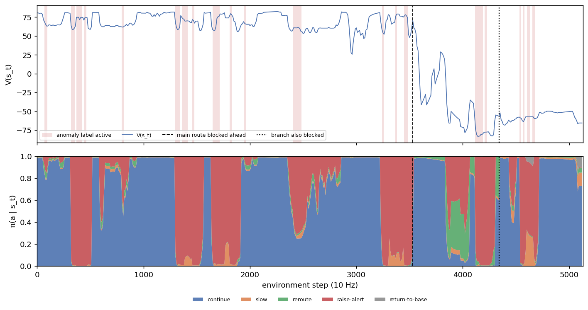

*Figure 9 — Top: critic value V(s) along the episode; shaded spans are active anomaly labels,
vertical markers the main-route and branch blockage onsets. Bottom: the full action distribution
π(a|s) on the same axis.*

The trace shows the mismatch the Week-6 tables measured. The critic prices route state correctly —
V holds 50–85 on normal patrol, collapses at the main-route blockage and settles near −57 in the
dead end — but the actor barely answers: reroute mass appears late and never dominates, and after
the branch also blocks, the policy returns to `continue` at 74 % inside a state its own critic
scores as a dead end, until the stuck timeout ends the episode. Event-conditioned: mean V is 69.7
on normal patrol (modal action `continue` 74 %), 34.6 on anomaly steps (modal `raise-alert` 90 %),
−39.8 on blockage-approach and −56.8 in the dead end — both still modal `continue`. Alert mass
also fires on unshaded stretches: the 241 false alerts per 1,000 normal steps, visible on one
trace.

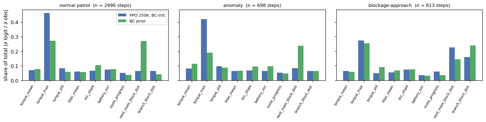

*Figure 10 — Input-gradient saliency as a within-policy share, per event condition, PPO vs the BC
prior. Gradients are taken at each policy's own greedy action on the normalised observation.*

**Fine-tuning reallocated attention in one direction.** BC keeps a standing dual sensitivity —
`torque_max` and `next_main_block_dist` carry comparable gradient in every condition (27 %/27 % on
normal patrol) — while PPO concentrates on `torque_max` (46 % normal, 42 % anomaly) and leaves the
blockage distance under 9 % until a blockage is already inside sensor range, where it recovers to
23 % (third panel). PPO has not stopped reading that channel; it has stopped reading it *early*,
and lead time is exactly what a detour decision needs. That is the
attribution-level form of the Week-6 behaviour trade (reroute 0.84 → 0.34, false alarms 55 → 241):
PPO's updates grew the alert pathway, which pays on every anomaly step, and let the navigation
pathway inherited from BC atrophy. The two policies choose the same greedy action on only 61.7 %
of trace steps — the fine-tuned policy is not a sharpened copy of its prior.

**Figure 10 cannot see the alert head.** It differentiates whichever action the policy actually
took, and on a normal patrol step that action is `continue`, so the heads that decide the rare
events are barely exercised in it. The next view fixes the logit instead of following the choice —
the `raise-alert` logit scored on anomaly steps, the `reroute` logit on blockage-approach steps,
each head examined on the condition it exists for whether or not the policy fires it there. Within
one network the two heads share a logit scale, so these bars are absolute rather than shares.

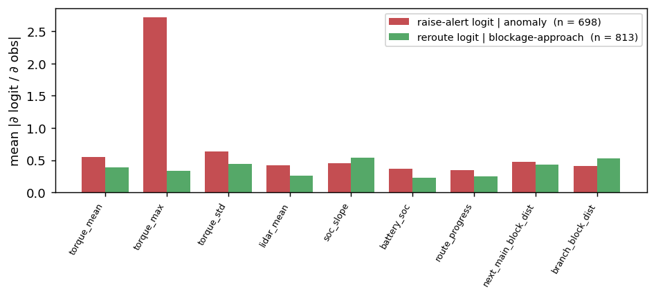

*Figure 11 — One logit per trigger: the raise-alert logit on anomaly steps, the reroute logit on
blockage-approach steps.*

The per-logit view is the sharpest statement. The raise-alert logit is essentially a `torque_max`
detector (43 % of its gradient on one channel — mechanistically consistent, since the world's fault
signature is a torque surge: 21.5 → 44.1 Nm on anomaly steps, point-biserial r = 0.49). The
reroute logit has no feature at all: its largest channel carries 16 % of the gradient against a
uniform 11 %. A head with no sharp input dependence cannot fire reliably — the mechanistic form of
the Week-6 finding that rerouting is what the flat 10 Hz policy cannot learn and the node-level
semi-MDP can (0.34 vs 0.82). The observation-only IRL policy failed for the complementary reason,
so across all three lenses the alert pathway is the learnable part of this task and routing is the
hard part.

## 7. Reproducibility

**Refits against the record.** No Week 2–4 notebook persisted a fitted model, so Week 7 refit all
thirteen from documented configurations (`shared_modules/refit.py`) and verified against the
published metrics before any attribution: twelve reproduce every digit — threshold, F1, AUC,
confusion matrix, epochs run, best epoch — and are saved under `saved_models/` with a manifest
carrying config, metrics and verification deltas; loading a checkpoint returns predictions
identical to the fresh fit over the full test set.

**The thirteenth model is a finding.** The 1D-CNN does not reproduce under its original training
path: cuDNN's convolution backward accumulates gradients atomically, and eight runs of the
unchanged code give test F1 from 0.683 to 0.738 (the published 0.7317 sits near the 75th
percentile) while AUC stays at 0.9585 ± 0.0010. The module pins
`torch.backends.cudnn.deterministic` — which leaves the other seven torch models bit-identical —
and records the pinned result (F1 0.6977) with the spread documented. The general lesson matches
§3: threshold-dependent F1 carries hardware-level run noise that AUC does not, and a reported F1
without a seed/backend statement is only accurate to about ±0.03 for this architecture.

**Seed discipline.** Supervised: 7 fold rotations (design ablations on 3 seeds). Trajectory: 5
training seeds (42–46) per neural model. RL: 5 train seeds per family, 10 evaluation worlds;
behaviour cloning retrains deterministically from the offline table and reproduces its published
per-world returns exactly. Every notebook documents its seed at the top; the harness records
per-run seeds, configs and curves in JSON metas.

## 8. Deployment Feasibility — Pareto, Optimisation, Calibration

**One latency convention.** Recorded latencies came from different weeks on different machine
states (the same MLP measures 0.135 ms in Week 3 and 0.041 ms now; the full RandomForest 7.86 ms
and 8.96 ms), so every family is re-measured from the verified checkpoints under one convention —
single observation, CPU, `timeit` over 2,000 calls, including each model's own preprocessing. No
ranking flips under re-measurement. Scores are not commensurable across tasks (F1, cm error,
patrol return), so each platform task gets its own latency–score panel; the RL score is the
floor–ceiling normalised return, privileged policies excluded; the assembled table is
`data/pareto_points.csv`.

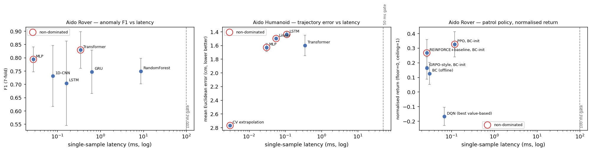

*Figure 12 — Latency (log) against the task score, one panel per platform task; ringed points are
non-dominated; dashed lines are the platform gates.*

**Aido Rover classification: frontier {MLP, Transformer}.** Every other model is dominated —
RandomForest doubly so, 13–220× slower than the neural models at mid-pack F1. With §3's
significance matrix, the top is one equivalence class {Transformer, MLP} and the axes decide
inside it: the MLP is 8.5× faster. **Deployment recommendation: MLP**, Transformer as the
interpretability alternate.

**Aido Humanoid trajectory: frontier {CV, Linear, MLP, LSTM}.** The axes trade smoothly from the
CV floor (0.003 ms, 2.77 cm) to the accuracy end — **LSTM, 1.44 cm at 0.11 ms, the deployment
recommendation** — and the Transformer is the one dominated point, beaten by the LSTM on both
axes: the Week-4 verdict restated geometrically.

**Aido Rover patrol: frontier {REINFORCE+baseline, PPO}, both BC-initialised.** DQN sits below
zero — its return is under the deployable rule-policy floor. PPO leads on the canonical layout
(normalised 0.33 at 0.12 ms) with the Week-6 caveat attached: on all five held-out layouts the
group-relative variant wins, so this frontier ordering is a property of the terrain. Every point
in every panel clears its gate by two or more orders of magnitude — the latency budget prices
model choice on these tasks; it does not constrain it.

**Optimisation under a met constraint.** Nothing misses its gate, so the optimisation experiment
targets the two real framings: cost — the RF is the portfolio's slowest model, and inference cost
is battery on a patrol robot — and the Aido Rover's ≤10 ms breach-detection tier, where the full
forest consumes ~87 % of the budget. That headroom is thinner than one measurement suggests: the
same 200-tree forest measures 8.96 ms in the Pareto cell and 8.73 ms in the reduction cell of the
same notebook, so the distance to the tier is about the width of the run-to-run spread.

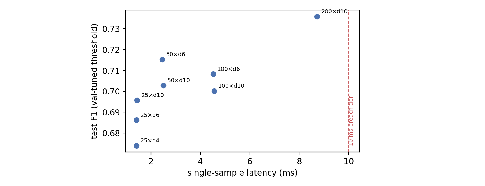

*Figure 13 — Test F1 against latency for eight depth/width-reduced forests, labelled
`n_estimators × d max_depth` (so `50×d6` is 50 trees of depth 6, and `200×d10` is the deployed
configuration); the dashed line is the 10 ms breach tier.*

Three of those eight, with the deployed forest as the reference and the pick in bold:

| config (trees × depth)   | test F1 | AUC    | latency | share of 10 ms tier | SHAP top-5 overlap |
| ------------------------- | ------- | ------ | ------- | ------------------- | ------------------ |
| 200 × d10 (deployed)     | 0.7359  | 0.9668 | 8.73 ms | 87 %                | 5/5 (reference)    |
| **50 × d6** (pick) | 0.7153  | 0.9573 | 2.45 ms | 25 %                | 5/5                |
| 25 × d10                 | 0.6957  | 0.9653 | 1.44 ms | 14 %                | 5/5                |

The pick is 50 trees × depth 6: −0.021 F1 (inside the full model's own ±0.048 fold spread) for a
3.6× speed-up, and the SHAP top-5 components are identical in all eight configurations — the
shrunken model scores like the full one and explains itself with the same features. Depth matters
less than tree count here: at 25 trees, dropping depth 10 → 6 → 4 costs F1 monotonically while
latency barely moves, so the cheap axis is the forest size. The trade is acceptable on both
framings; it does not change the deployment recommendation, which the MLP holds on both axes even
against the 2.5 ms forest.

**Calibration against the STUM target.** The PIC 2.0 STUM class consumes scores through fixed σ
thresholds, so beyond discrimination the deployment question is calibration.

| model       | ECE (raw) | T (val-fitted) | ECE (temperature-scaled) |
| ----------- | --------- | -------------- | ------------------------ |
| MLP         | 0.025     | 1.07           | 0.024                    |
| Transformer | 0.041     | 1.16           | 0.032                    |

Against the class's internal calibration target of ECE 0.031, the **deployment-recommended MLP
meets it with no calibration layer at all** (0.025 raw), while the Transformer misses it raw and
lands just above it after temperature scaling (0.041 → 0.032) — the target is tight enough to
separate the two score producers. Scaling is near-inert for the MLP (T = 1.07) and buys the
Transformer a quarter of its miscalibration. Read together with §3's 0.36–0.95 threshold swings,
the calibration problem on this data is not marginal reliability but between-block transfer of
operating points — which is what per-site calibration exists for.

## 9. Limitations

**The attention-on-misses result rests on two fault episodes.** The one-sided claim (localisation
succeeds in a fully missed episode) is safe; any detected-vs-missed effect size needs more stuck
episodes, which means regenerating test-fold data.

**The RL saliency is one seed on one world** by design: it explains the evaluated policy, it does
not rank methods. The cross-model back-projection for the RF is magnitude-only and correspondingly
weak; the cross-model claim rests on the top-of-ranking agreement, not the projection statistic.

**Senpai is synthetic with an invented class-conditional structure** (documented in the data
card); its external validity is a data-collection question, not a modelling one.

**The learning curves say more data still pays** for the deployment-recommended MLP — the
capstone's "future work" has a measured direction: more blocks, not more capacity. And the
stuck-type recall fix has an address (the decision head, §5).
